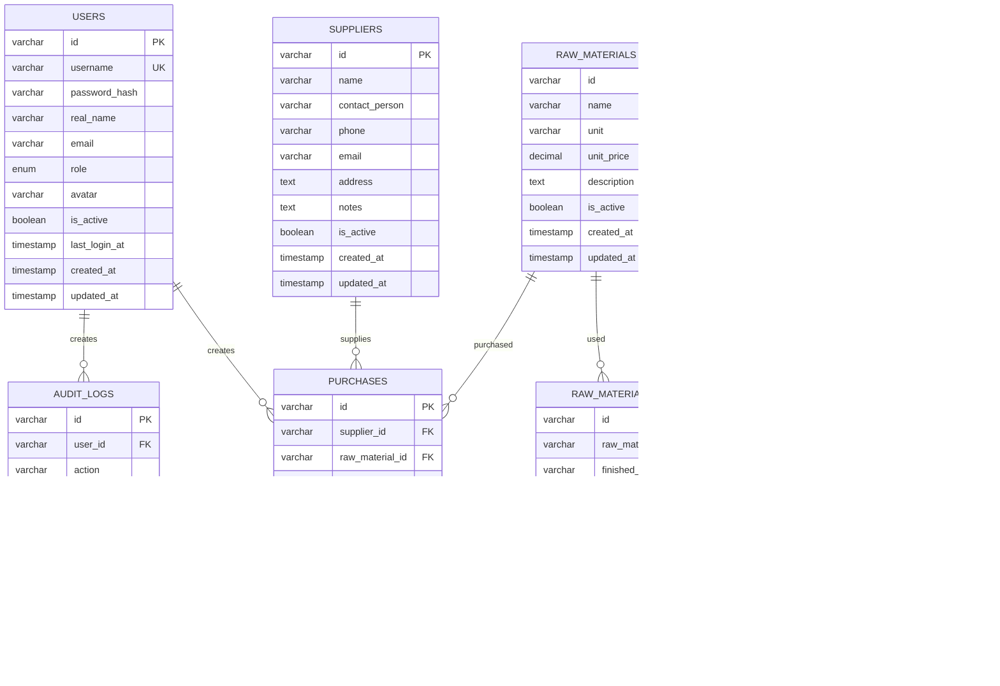

# 数据库设计与数据规则文档（数据层核心）

## 一、文档概述

本文档详细描述了水晶ERP系统的数据库设计，包括表结构、字段定义、索引设计、约束关系等核心内容。

**数据库类型：** MySQL 8.0+
**字符集：** utf8mb4
**排序规则：** utf8mb4\_unicode\_ci
**适用范围：** 数据库管理员、后端开发人员、系统架构师
**版本：** v1.0

## 二、数据库架构设计

### 2.1 整体架构



### 2.2 数据库命名规范

**表命名规范：**

* 使用复数形式（users, suppliers, purchases）

* 使用下划线分隔单词（raw\_materials, audit\_logs）

* 全部小写字母

**字段命名规范：**

* 使用下划线分隔单词（user\_id, created\_at）

* 主键统一使用 `id`

* 外键使用 `表名_id` 格式

* 时间字段使用 `_at` 后缀

* 布尔字段使用 `is_` 前缀

## 三、核心表结构（提取自《数据库设计文档》3章，保留现有字段）

### 1.1 采购表（purchases）核心字段

| 字段名                      | 数据类型          | 约束条件             | 说明                          | 示例值                 |
| ------------------------ | ------------- | ---------------- | --------------------------- | ------------------- |
| id                       | UUID          | PRIMARY KEY      | 主键，自动生成                     | uuid()              |
| purchase\_code           | VARCHAR(50)   | UNIQUE NOT NULL  | 采购编号，格式：CG+日期+6位随机数         | CG20240115123456    |
| product\_name            | VARCHAR(200)  | NOT NULL         | 产品名称                        | 8mm紫水晶手串            |
| product\_type            | ENUM          | NOT NULL         | 产品类型：LOOSE\_BEADS/BRACELET等 | BRACELET            |
| unit\_type               | ENUM          | NOT NULL         | 单位类型：PIECES/STRINGS等        | STRINGS             |
| bead\_diameter           | DECIMAL(5,2)  | NULL             | 珠子直径（mm），散珠和手串必填            | 8.00                |
| specification            | DECIMAL(5,2)  | NULL             | 通用规格字段（mm），饰品配件和成品使用        | 12.00               |
| quantity                 | INT           | NULL             | 手串数量                        | 2                   |
| piece\_count             | INT           | NULL             | 散珠颗数/饰品片数/成品件数              | 108                 |
| min\_stock\_alert        | INT           | NULL             | 最低预警颗数                      | 50                  |
| price\_per\_gram         | DECIMAL(10,2) | NULL，允许0值       | 克价，可为空或0值                   | 15.50               |
| total\_price             | DECIMAL(10,2) | NULL，允许0值       | 总价，可为空或0值                   | 186.00              |
| weight                   | DECIMAL(8,3)  | NULL，允许0值       | 重量（克），可为空或0值                | 12.000              |
| beads\_per\_string       | INT           | NULL             | 每串珠子数量（自动计算）                | 20                  |
| total\_beads             | INT           | NULL             | 总珠子数量（自动计算）                 | 40                  |
| price\_per\_bead         | DECIMAL(10,4) | NULL             | 每颗珠子价格（后端自动计算并存储）           | 4.6500              |
| price\_per\_piece        | DECIMAL(10,4) | NULL             | 每片/件价格（后端自动计算并存储）           | 12.5000             |
| unit\_price              | DECIMAL(10,2) | NULL             | 单价（后端自动计算并存储）               | 93.00               |
| quality                  | ENUM          | NULL             | 品相：AA/A/AB/B/C              | AA                  |
| purchase\_date           | TIMESTAMP     | NOT NULL         | 采购日期                        | 2024-01-15          |
| photos                   | JSON          | NULL             | 图片URL数组                     | \["url1", "url2"]   |
| notes                    | TEXT          | NULL             | 备注                          | 颜色较深，质地不错           |
| natural\_language\_input | TEXT          | NULL             | 自然语言输入                      | 2串8mm紫水晶            |
| ai\_recognition\_result  | JSON          | NULL             | AI识别结果                      | {...}               |
| status                   | ENUM          | DEFAULT 'ACTIVE' | 状态：ACTIVE/INACTIVE          | ACTIVE              |
| created\_at              | TIMESTAMP     | DEFAULT NOW()    | 创建时间                        | 2024-01-15 10:30:00 |
| updated\_at              | TIMESTAMP     | DEFAULT NOW()    | 更新时间                        | 2024-01-15 10:30:00 |
| supplier\_id             | UUID          | FOREIGN KEY      | 供应商ID，关联suppliers表          | uuid()              |
| user\_id                 | UUID          | FOREIGN KEY      | 创建用户ID，关联users表             | uuid()              |

### 1.1.2 价格计算字段存储逻辑（重要架构变更）

**架构变更说明：**

系统已从前端实时计算改为后端计算并存储的架构。所有价格相关的计算字段现在都在后端完成计算并直接存储到数据库中。

**价格计算字段详细规范：**

| 字段名 | 数据类型 | 计算公式 | 计算时机 | 适用产品类型 | 存储说明 |
|--------|----------|----------|----------|-------------|----------|
| `price_per_bead` | DECIMAL(10,4) | total_price ÷ total_beads | 录入/更新时 | 散珠、手串 | 精度4位小数，支持高精度计算 |
| `price_per_piece` | DECIMAL(10,4) | total_price ÷ piece_count | 录入/更新时 | 饰品配件、成品 | 精度4位小数，支持高精度计算 |
| `unit_price` | DECIMAL(10,1) | total_price ÷ quantity | 录入/更新时 | 所有类型 | 精度1位小数，通用单价字段 |

### 3.1.3 采购删除数据完整性约束

**业务约束规则：**

采购记录的删除操作受到严格的业务约束控制，确保数据完整性和业务逻辑的正确性。

**约束检查机制：**

1. **权限约束：** 只有BOSS角色可以删除采购记录
2. **业务约束：** 检查是否有成品使用该采购记录的珠子
3. **数据完整性：** 使用数据库事务确保删除操作的原子性

**约束实现：**

```sql
-- 检查成品使用情况的约束查询
SELECT 
  mu.purchaseId,
  p.name as productName,
  mu.quantityUsedBeads
FROM material_usage mu
JOIN products p ON mu.productId = p.id
WHERE mu.purchaseId = ?;

-- 如果查询结果不为空，则不能删除采购记录
-- 必须先拆散使用该珠子的所有成品
```

**外键约束配置：**

```sql
-- material_usage表的外键约束
ALTER TABLE material_usage 
ADD CONSTRAINT material_usage_purchaseId_fkey 
FOREIGN KEY (purchaseId) REFERENCES purchases(id) 
ON DELETE RESTRICT ON UPDATE CASCADE;

-- 使用RESTRICT确保有成品使用时不能删除采购记录
```

**删除操作事务示例：**

```sql
START TRANSACTION;

-- 1. 检查业务约束
SELECT COUNT(*) as usage_count 
FROM material_usage 
WHERE purchaseId = ?;

-- 2. 如果usage_count > 0，回滚事务并返回错误
-- 3. 如果usage_count = 0，继续删除操作

-- 4. 记录删除日志
INSERT INTO edit_logs (
  id, purchaseId, userId, action, details, changedFields, createdAt
) VALUES (
  ?, ?, ?, 'DELETE', 
  '老板删除了采购记录：产品名称（采购编号）', 
  JSON_OBJECT('deleted', JSON_OBJECT('oldValue', '存在', 'newValue', '已删除')),
  NOW()
);

-- 5. 删除采购记录
DELETE FROM purchases WHERE id = ?;

COMMIT;
```

### 1.2 成品表（products）核心字段

| 字段名                | 数据类型          | 约束条件             | 说明                    | 示例值                 |
| ------------------ | ------------- | ---------------- | --------------------- | ------------------- |
| id                 | UUID          | PRIMARY KEY      | 主键，自动生成               | uuid()              |
| product_code       | VARCHAR(50)   | UNIQUE           | 成品编号，格式：FP+日期+3位序号   | FP20240115001       |
| name               | VARCHAR(200)  | NOT NULL         | 成品名称                  | 紫水晶多宝手串             |
| description        | TEXT          | NULL             | 成品描述                  | 8mm紫水晶配金珠设计款        |
| category           | VARCHAR(100)  | NULL             | 成品分类                  | 手串                  |
| quantity           | INT           | DEFAULT 0        | 成品数量                  | 1                   |
| unit               | VARCHAR(20)   | NOT NULL         | 计量单位                  | 件                   |
| unit_price         | DECIMAL(10,2) | NOT NULL         | 单价（销售价格）              | 128.00              |
| total_value        | DECIMAL(10,2) | NOT NULL         | 总价值                   | 128.00              |
| status             | ENUM          | DEFAULT 'IN_STOCK' | 状态：IN_STOCK/LOW_STOCK/OUT_OF_STOCK/DISCONTINUED | IN_STOCK            |
| location           | VARCHAR(100)  | NULL             | 存放位置                  | A区货架1               |
| notes              | TEXT          | NULL             | 备注信息                  | 限量款，工艺精美            |
| images             | TEXT          | NULL             | 图片URL数组（JSON格式存储）     | ["url1", "url2"]   |
| created_at         | TIMESTAMP     | DEFAULT NOW()    | 创建时间                  | 2024-01-15 10:30:00 |
| updated_at         | TIMESTAMP     | DEFAULT NOW()    | 更新时间                  | 2024-01-15 10:30:00 |
| user_id            | UUID          | FOREIGN KEY      | 创建用户ID，关联users表       | uuid()              |

**成品状态枚举说明：**

| 状态值 | 说明 | 业务含义 |
|--------|------|----------|
| IN_STOCK | 有库存 | 成品可正常销售 |
| LOW_STOCK | 库存不足 | 成品数量较少，需要补充制作 |
| OUT_OF_STOCK | 无库存 | 成品已售完或已销毁 |
| DISCONTINUED | 已停产 | 不再制作此款成品 |

**成品编号生成规则：**

- 格式：`FP + YYYYMMDD + 3位序号`
- 示例：`FP20240115001`（2024年1月15日第1个成品）
- 序号范围：001-999，每日重新计数
- 生成时机：成品创建时自动生成
- 唯一性：通过数据库UNIQUE约束保证

**成品制作业务规则：**

1. **制作模式：**
   - 直接转化模式：单一原材料直接制作成品
   - 组合模式：多种原材料组合制作成品

2. **库存扣减规则：**
   - 制作时立即扣减原材料库存
   - 通过MaterialUsage表记录使用明细
   - 支持部分使用（如一串珠子用20颗）

3. **成本计算：**
   - 原材料成本：自动计算使用的原材料总成本
   - 人工成本：手动输入的制作工费
   - 工艺成本：手动输入的工艺附加费
   - 总成本：原材料成本 + 人工成本 + 工艺成本

### 1.3 原材料使用记录表（material_usage）核心字段

| 字段名                    | 数据类型          | 约束条件             | 说明                      | 示例值                 |
| ---------------------- | ------------- | ---------------- | ----------------------- | ------------------- |
| id                     | UUID          | PRIMARY KEY      | 主键，自动生成                 | uuid()              |
| purchase_id            | UUID          | FOREIGN KEY      | 原材料采购记录ID，关联purchases表  | uuid()              |
| product_id             | UUID          | FOREIGN KEY      | 成品ID，关联products表        | uuid()              |
| quantity_used_beads    | INT           | DEFAULT 0        | 使用的珠子颗数（散珠、手串类型使用）      | 20                  |
| quantity_used_pieces   | INT           | DEFAULT 0        | 使用的片/件数量（饰品配件、成品类型使用）   | 3                   |
| unit_cost              | DECIMAL(10,4) | NULL             | 单位成本（每颗/每片/每件）         | 0.4500              |
| total_cost             | DECIMAL(10,2) | NULL             | 该原材料的总成本                | 9.00                |
| created_at             | TIMESTAMP     | DEFAULT NOW()    | 创建时间                    | 2024-01-15 10:30:00 |
| updated_at             | TIMESTAMP     | DEFAULT NOW()    | 更新时间                    | 2024-01-15 10:30:00 |

**原材料使用逻辑说明：**

1. **使用量记录：** 根据原材料类型记录不同的使用量
   - 散珠、手串：记录 `quantity_used_beads`（颗数）
   - 饰品配件、成品：记录 `quantity_used_pieces`（片数/件数）

2. **成本计算：** 自动计算原材料使用成本
   - `unit_cost` = 原材料的单位成本（从采购记录计算）
   - `total_cost` = `unit_cost` × 使用数量

3. **库存扣减：** 通过此表计算剩余库存
   - 剩余颗数 = 总颗数 - 已使用颗数
   - 剩余片数 = 总片数 - 已使用片数

4. **关联关系：** 支持一个成品使用多种原材料
   - 一条成品记录可对应多条原材料使用记录
   - 支持组合制作模式的复杂成本计算

**外键约束配置：**

```sql
-- 原材料使用记录表的外键约束
ALTER TABLE material_usage 
ADD CONSTRAINT material_usage_purchase_id_fkey 
FOREIGN KEY (purchase_id) REFERENCES purchases(id) 
ON DELETE RESTRICT ON UPDATE CASCADE;

ALTER TABLE material_usage 
ADD CONSTRAINT material_usage_product_id_fkey 
FOREIGN KEY (product_id) REFERENCES products(id) 
ON DELETE RESTRICT ON UPDATE CASCADE;
```

**数据完整性保证：**

1. **删除限制：** 使用RESTRICT确保有使用记录时不能删除原材料或成品
2. **更新级联：** 主表ID更新时自动更新关联记录
3. **业务约束：** 通过应用层确保使用量不超过可用库存

### 1.4 销售记录数据结构设计

**销售记录字段定义（从成品制作转化而来）：**

| 字段名                | 数据类型          | 约束条件             | 说明                    | 示例值                 |
| ------------------ | ------------- | ---------------- | --------------------- | ------------------- |
| id                 | UUID          | PRIMARY KEY      | 销售记录主键，自动生成           | uuid()              |
| product_id         | UUID          | FOREIGN KEY      | 关联的成品ID，关联products表   | uuid()              |
| sale_code          | VARCHAR(50)   | UNIQUE           | 销售编号，格式：SL+日期+3位序号   | SL20240115001       |
| product_name       | VARCHAR(200)  | NOT NULL         | 成品名称（冗余存储，便于查询）       | 紫水晶多宝手串             |
| product_code       | VARCHAR(50)   | NOT NULL         | 成品编号（冗余存储）            | FP20240115001       |
| selling_price      | DECIMAL(10,2) | NOT NULL         | 实际销售价格                | 128.00              |
| original_price     | DECIMAL(10,2) | NOT NULL         | 原定价格（成品制作时的定价）        | 128.00              |
| material_cost      | DECIMAL(10,2) | NOT NULL         | 原材料成本（从MaterialUsage计算） | 45.00               |
| labor_cost         | DECIMAL(10,2) | DEFAULT 0        | 人工成本                  | 20.00               |
| craft_cost         | DECIMAL(10,2) | DEFAULT 0        | 工艺成本                  | 15.00               |
| total_cost         | DECIMAL(10,2) | NOT NULL         | 总成本（自动计算）             | 80.00               |
| profit_amount      | DECIMAL(10,2) | NOT NULL         | 利润金额（自动计算）            | 48.00               |
| profit_margin      | DECIMAL(5,2)  | NOT NULL         | 利润率（自动计算，百分比）         | 37.50               |
| buyer_info         | TEXT          | NULL             | 买家信息                  | 张三，手机：138xxxx     |
| sale_date          | TIMESTAMP     | NOT NULL         | 销售日期                  | 2024-01-15 14:30:00 |
| sale_channel       | VARCHAR(50)   | NULL             | 销售渠道                  | 线下门店                |
| notes              | TEXT          | NULL             | 销售备注                  | 客户很满意，推荐朋友          |
| created_at         | TIMESTAMP     | DEFAULT NOW()    | 创建时间                  | 2024-01-15 14:30:00 |
| updated_at         | TIMESTAMP     | DEFAULT NOW()    | 更新时间                  | 2024-01-15 14:30:00 |
| user_id            | UUID          | FOREIGN KEY      | 销售员ID，关联users表        | uuid()              |

**销售记录业务规则：**

1. **销售转化流程：**
   - 成品制作完成后，状态为IN_STOCK
   - 销售时创建销售记录，成品状态变为OUT_OF_STOCK
   - 销售记录包含完整的成本和利润分析

2. **成本数据继承：**
   - 从MaterialUsage表汇总原材料成本
   - 从成品制作时记录的人工成本和工艺成本
   - 自动计算总成本和利润数据

3. **数据冗余策略：**
   - 冗余存储成品名称和编号，便于销售记录查询
   - 冗余存储成本数据，确保历史销售记录的完整性
   - 即使成品或原材料记录被删除，销售记录仍保持完整

**销售编号生成规则：**

- 格式：`SL + YYYYMMDD + 3位序号`
- 示例：`SL20240115001`（2024年1月15日第1笔销售）
- 序号范围：001-999，每日重新计数
- 生成时机：成品标记为已售出时自动生成
| `beads_per_string` | INT | Math.floor(160 ÷ bead_diameter) | 录入/更新时 | 手串 | 整数，基于160mm标准周长 |
| `total_beads` | INT | quantity × beads_per_string | 录入/更新时 | 手串 | 整数，总颗数计算 |

**计算逻辑实现（后端）：**

```javascript
// 根据产品类型计算价格字段
function calculatePriceFields(data) {
  const { product_type, total_price, quantity, piece_count, bead_diameter } = data
  let pricePerBead, pricePerPiece, unitPrice, beadsPerString, totalBeads

  if (product_type === 'LOOSE_BEADS') {
    // 散珠：按颗计算
    if (piece_count && total_price) {
      pricePerBead = total_price / piece_count
      unitPrice = pricePerBead
    }
  } else if (product_type === 'BRACELET') {
    // 手串：计算每串颗数和总颗数
    if (bead_diameter) {
      beadsPerString = Math.floor(160 / bead_diameter)
    }
    if (quantity && beadsPerString) {
      totalBeads = quantity * beadsPerString
    }
    if (total_price && totalBeads) {
      pricePerBead = total_price / totalBeads
    }
    if (total_price && quantity) {
      unitPrice = total_price / quantity
    }
  } else if (product_type === 'ACCESSORIES' || product_type === 'FINISHED') {
    // 饰品配件/成品：按片/件计算
    if (piece_count && total_price) {
      pricePerPiece = total_price / piece_count
      unitPrice = pricePerPiece
    }
  }

  return { pricePerBead, pricePerPiece, unitPrice, beadsPerString, totalBeads }
}
```

**数据迁移支持：**

系统提供了 `migrate-unit-prices.ts` 脚本来处理历史数据的价格字段计算和更新。

### 1.1.3 产品类型配置规范

**产品类型枚举定义：**

```sql
CREATE TYPE product_type_enum AS ENUM (
  'LOOSE_BEADS',    -- 散珠
  'BRACELET',       -- 手串
  'ACCESSORIES',    -- 饰品配件
  'FINISHED'        -- 成品
);

CREATE TYPE unit_type_enum AS ENUM (
  'PIECES',         -- 颗（散珠）
  'STRINGS',        -- 条（手串）
  'SLICES',         -- 片（饰品配件）
  'ITEMS'           -- 件（成品）
);
```

**产品类型字段配置表：**

| 产品类型 | 英文标识         | 单位类型    | 必填字段                                        | 可选字段                                   | 计算逻辑                                         |
| ---- | ------------ | ------- | ------------------------------------------- | -------------------------------------- | -------------------------------------------- |
| 散珠   | LOOSE\_BEADS | PIECES  | product\_name, bead\_diameter, piece\_count | price\_per\_gram, weight, quality      | total\_beads = piece\_count                  |
| 手串   | BRACELET     | STRINGS | product\_name, bead\_diameter, quantity     | price\_per\_gram, total\_price, weight | beads\_per\_string = total\_beads / quantity |
| 饰品配件 | ACCESSORIES  | SLICES  | product\_name, specification, piece\_count  | quality                                | 无自动计算                                        |
| 成品   | FINISHED     | ITEMS   | product\_name, specification, piece\_count  | quality                                | 无自动计算                                        |

### 1.2 采购列表查询优化设计

**核心查询场景：** 支持多维度筛选、智能排序、分页查询的采购数据检索

#### 1.2.1 索引设计优化

**主要索引配置：**

```sql
-- 主键索引（自动创建）
PRIMARY KEY (id)

-- 唯一索引
UNIQUE KEY uk_purchase_code (purchase_code)

-- 复合索引（筛选优化）
KEY idx_purchases_filter (
  product_type, 
  quality, 
  supplier_id, 
  purchase_date, 
  status
)

-- 排序优化索引
KEY idx_purchases_sort_created (created_at DESC, id)
KEY idx_purchases_sort_price (total_price DESC, id)
KEY idx_purchases_sort_supplier (supplier_id, created_at DESC)

-- 规格筛选索引
KEY idx_purchases_bead_diameter (bead_diameter, product_type)
KEY idx_purchases_specification (specification, product_type)

-- 数量筛选索引
KEY idx_purchases_quantity (quantity, product_type)
KEY idx_purchases_piece_count (piece_count, product_type)

-- 价格筛选索引（处理NULL值）
KEY idx_purchases_price_per_gram (price_per_gram, product_type)

-- 搜索优化索引
FULLTEXT KEY ft_purchases_search (product_name, notes)

-- 外键索引
KEY fk_purchases_supplier (supplier_id)
KEY fk_purchases_user (user_id)
```

#### 1.2.2 智能排序SQL实现

**规格排序（动态字段选择）：**

```sql
-- 根据产品类型动态选择排序字段
SELECT p.*, s.name as supplier_name, u.real_name as user_name
FROM purchases p
LEFT JOIN suppliers s ON p.supplier_id = s.id
LEFT JOIN users u ON p.user_id = u.id
WHERE p.status = 'ACTIVE'
ORDER BY 
  CASE 
    WHEN p.product_type IN ('LOOSE_BEADS', 'BRACELET') 
    THEN p.bead_diameter 
    ELSE p.specification 
  END ASC,
  p.created_at DESC
LIMIT 10 OFFSET 0;
```

**数量排序（动态字段选择）：**

```sql
-- 根据产品类型动态选择数量字段
SELECT p.*, s.name as supplier_name, u.real_name as user_name
FROM purchases p
LEFT JOIN suppliers s ON p.supplier_id = s.id
LEFT JOIN users u ON p.user_id = u.id
WHERE p.status = 'ACTIVE'
ORDER BY 
  CASE 
    WHEN p.product_type = 'BRACELET' 
    THEN p.quantity 
    ELSE p.piece_count 
  END DESC,
  p.created_at DESC
LIMIT 10 OFFSET 0;
```

**克价排序（NULL值处理）：**

```sql
-- 克价排序，NULL值视为0
SELECT p.*, s.name as supplier_name, u.real_name as user_name
FROM purchases p
LEFT JOIN suppliers s ON p.supplier_id = s.id
LEFT JOIN users u ON p.user_id = u.id
WHERE p.status = 'ACTIVE'
ORDER BY 
  COALESCE(p.price_per_gram, 0) DESC,
  p.created_at DESC
LIMIT 10 OFFSET 0;
```

#### 1.2.3 复杂筛选查询实现

**多维度筛选查询：**

```sql
-- 支持产品类型、品相、供应商、规格、价格、日期等多维度筛选
SELECT p.*, s.name as supplier_name, u.real_name as user_name
FROM purchases p
LEFT JOIN suppliers s ON p.supplier_id = s.id
LEFT JOIN users u ON p.user_id = u.id
WHERE p.status = 'ACTIVE'
  -- 产品类型筛选（多选）
  AND (CASE WHEN ? THEN p.product_type IN (?) ELSE TRUE END)
  
  -- 品相筛选（支持NULL值）
  AND (CASE 
    WHEN ? THEN (
      p.quality IN (?) OR 
      (? AND p.quality IS NULL)
    ) 
    ELSE TRUE 
  END)
  
  -- 供应商筛选（支持多选和模糊匹配）
  AND (CASE 
    WHEN ? THEN s.name IN (?)
    WHEN ? THEN s.name LIKE CONCAT('%', ?, '%')
    ELSE TRUE 
  END)
  
  -- 规格范围筛选（动态字段）
  AND (CASE 
    WHEN ? THEN (
      (p.bead_diameter BETWEEN ? AND ?) OR 
      (p.specification BETWEEN ? AND ?)
    )
    ELSE TRUE 
  END)
  
  -- 数量范围筛选（动态字段）
  AND (CASE 
    WHEN ? THEN (
      (p.product_type = 'BRACELET' AND p.quantity BETWEEN ? AND ?) OR
      (p.product_type != 'BRACELET' AND p.piece_count BETWEEN ? AND ?)
    )
    ELSE TRUE 
  END)
  
  -- 克价范围筛选（NULL值处理）
  AND (CASE 
    WHEN ? THEN COALESCE(p.price_per_gram, 0) BETWEEN ? AND ?
    ELSE TRUE 
  END)
  
  -- 总价范围筛选
  AND (CASE WHEN ? THEN p.total_price BETWEEN ? AND ? ELSE TRUE END)
  
  -- 日期范围筛选
  AND (CASE 
    WHEN ? THEN p.purchase_date BETWEEN ? AND ?
    ELSE TRUE 
  END)
  
  -- 搜索关键词（产品名称和备注）
  AND (CASE 
    WHEN ? THEN (
      p.product_name LIKE CONCAT('%', ?, '%') OR
      p.notes LIKE CONCAT('%', ?, '%') OR
      s.name LIKE CONCAT('%', ?, '%')
    )
    ELSE TRUE 
  END)

ORDER BY p.created_at DESC
LIMIT ? OFFSET ?;
```

#### 1.2.4 查询性能优化策略

**分页查询优化：**

```sql
-- 使用游标分页优化大数据量查询
SELECT p.*, s.name as supplier_name, u.real_name as user_name
FROM purchases p
LEFT JOIN suppliers s ON p.supplier_id = s.id
LEFT JOIN users u ON p.user_id = u.id
WHERE p.status = 'ACTIVE'
  AND p.created_at < ?  -- 游标位置
  AND (/* 其他筛选条件 */)
ORDER BY p.created_at DESC, p.id DESC
LIMIT 10;
```

**统计查询优化：**

```sql
-- 分离统计查询，避免影响列表查询性能
SELECT COUNT(*) as total
FROM purchases p
LEFT JOIN suppliers s ON p.supplier_id = s.id
WHERE p.status = 'ACTIVE'
  AND (/* 相同的筛选条件 */);
```

**查询缓存策略：**

* 供应商列表缓存（Redis，30分钟）

* 产品类型枚举缓存（内存，应用启动时加载）

* 品相选项缓存（内存，应用启动时加载）

* 筛选结果缓存（Redis，5分钟，基于筛选条件哈希）

#### 1.2.5 数据库监控和调优

**慢查询监控：**

```sql
-- 启用慢查询日志
SET GLOBAL slow_query_log = 'ON';
SET GLOBAL long_query_time = 1;
SET GLOBAL log_queries_not_using_indexes = 'ON';
```

**索引使用分析：**

```sql
-- 分析查询执行计划
EXPLAIN SELECT p.*, s.name as supplier_name 
FROM purchases p 
LEFT JOIN suppliers s ON p.supplier_id = s.id 
WHERE p.product_type = 'BRACELET' 
AND p.bead_diameter BETWEEN 6 AND 12 
ORDER BY p.created_at DESC 
LIMIT 10;

-- 检查索引使用情况
SHOW INDEX FROM purchases;
SELECT * FROM information_schema.KEY_COLUMN_USAGE 
WHERE TABLE_NAME = 'purchases';
```

\| 散珠 | LOOSE\_BEADS | PIECES | product\_name, bead\_diameter, piece\_count, total\_price, supplier\_name | price\_per\_gram, weight, quality | 按颗数计量，price\_per\_bead = total\_price / piece\_count |
\| 手串 | BRACELET | STRINGS | product\_name, bead\_diameter, quantity, supplier\_name | price\_per\_gram, total\_price, weight（三选二） | 按条数计量，beads\_per\_string = 160 / bead\_diameter, total\_beads = quantity \* beads\_per\_string |
\| 饰品配件 | ACCESSORIES | SLICES | product\_name, specification, piece\_count, total\_price, supplier\_name | quality | 按片数计量，unit\_price = total\_price / piece\_count |
\| 成品 | FINISHED | ITEMS | product\_name, specification, piece\_count, total\_price, supplier\_name | quality | 按件数计量，unit\_price = total\_price / piece\_count |

**字段使用规则：**

* **bead\_diameter：** 仅用于散珠(LOOSE\_BEADS)和手串(BRACELET)

* **specification：** 仅用于饰品配件(ACCESSORIES)和成品(FINISHED)

* **quantity：** 仅用于手串(BRACELET)，表示串数

* **piece\_count：** 用于散珠(颗数)、饰品配件(片数)、成品(件数)

* **price\_per\_gram：** 主要用于手串，可选用于散珠

**自动计算字段：**

```sql
-- 手串每串珠子数量计算
beads_per_string = FLOOR(160 / bead_diameter)

-- 手串总珠子数量计算
total_beads = quantity * beads_per_string

-- 每颗珠子价格计算（散珠和手串）
price_per_bead = CASE 
  WHEN product_type = 'LOOSE_BEADS' THEN total_price / piece_count
  WHEN product_type = 'BRACELET' THEN total_price / total_beads
  ELSE NULL
END

-- 单价计算（所有类型）
unit_price = CASE 
  WHEN product_type = 'LOOSE_BEADS' THEN total_price / piece_count
  WHEN product_type = 'BRACELET' THEN total_price / quantity
  WHEN product_type = 'ACCESSORIES' THEN total_price / piece_count
  WHEN product_type = 'FINISHED' THEN total_price / piece_count
END
```

### 1.1.1 规格字段使用规范

**重要：不同产品类型的规格数据存储规则**

| 产品类型              | 规格字段           | 说明        | 筛选查询规则                  |
| ----------------- | -------------- | --------- | ----------------------- |
| LOOSE\_BEADS（散珠）  | bead\_diameter | 珠子直径，单位mm | 规格筛选需查询bead\_diameter字段 |
| BRACELET（手串）      | bead\_diameter | 珠子直径，单位mm | 规格筛选需查询bead\_diameter字段 |
| ACCESSORIES（饰品配件） | specification  | 通用规格，单位mm | 规格筛选需查询specification字段  |
| FINISHED（成品）      | specification  | 通用规格，单位mm | 规格筛选需查询specification字段  |

**规格筛选查询逻辑：**

```sql
-- 规格范围筛选需要同时查询两个字段（使用OR条件）
WHERE (
  (bead_diameter >= ? AND bead_diameter <= ?) OR
  (specification >= ? AND specification <= ?)
)
```

**注意事项：**

* 散珠和手串的规格数据主要存储在bead\_diameter字段

* 饰品配件和成品的规格数据主要存储在specification字段

* 前端规格筛选功能必须同时查询两个字段以确保完整性

* 避免因字段不一致导致筛选结果不准确的问题

### 1.2 编辑日志表（edit_logs）核心字段

**表名：** `edit_logs`

**功能：** 记录采购记录的所有修改历史，支持详细的字段变更追踪

| 字段名           | 数据类型        | 约束条件             | 说明                    | 示例值                                |
| ------------- | ----------- | ---------------- | --------------------- | ---------------------------------- |
| id            | VARCHAR(191) | PRIMARY KEY      | 主键，自动生成               | cmexofsyh0001630374s4za1c          |
| purchaseId    | VARCHAR(191) | NOT NULL, FK     | 关联的采购记录ID            | purchase_001                       |
| userId        | VARCHAR(191) | NOT NULL, FK     | 执行修改的用户ID            | user_001                           |
| action        | VARCHAR(191) | NOT NULL         | 操作类型（UPDATE/DELETE）   | UPDATE                             |
| details       | TEXT         | NULL             | 人性化的修改描述              | 老板 在 2025-08-30 11:45:30 将总价从 180 改为 186 |
| changedFields | JSON         | NULL             | 详细的字段变更信息（JSON格式）     | [{"field":"total_price","oldValue":180,"newValue":186}] |
| createdAt     | DATETIME(3)  | DEFAULT NOW()    | 创建时间                  | 2025-08-30T03:45:30.000Z           |

**关联关系：**

```sql
-- 外键约束
CONSTRAINT edit_logs_purchaseId_fkey 
  FOREIGN KEY (purchaseId) REFERENCES purchases(id) ON DELETE CASCADE;

CONSTRAINT edit_logs_userId_fkey 
  FOREIGN KEY (userId) REFERENCES users(id) ON DELETE CASCADE;
```

**changedFields JSON结构：**

```typescript
[
  {
    "field": "total_price",           // 字段名（snake_case格式）
    "displayName": "总价",            // 显示名称
    "oldValue": 180,                  // 原始值
    "newValue": 186,                  // 新值
    "timestamp": "2025-08-30T03:45:30.000Z"  // 变更时间戳
  },
  {
    "field": "weight",
    "displayName": "重量",
    "oldValue": 11,
    "newValue": 12,
    "timestamp": "2025-08-30T03:45:30.000Z"
  }
]
```

**索引设计：**

```sql
-- 基础索引
CREATE INDEX idx_edit_logs_purchase_id ON edit_logs(purchaseId);
CREATE INDEX idx_edit_logs_user_id ON edit_logs(userId);
CREATE INDEX idx_edit_logs_created_at ON edit_logs(createdAt);

-- 复合索引（查询优化）
CREATE INDEX idx_edit_logs_purchase_created ON edit_logs(purchaseId, createdAt DESC);
CREATE INDEX idx_edit_logs_user_created ON edit_logs(userId, createdAt DESC);
```

**业务规则：**

1. **自动记录**：每次采购记录更新时自动创建记录
2. **字段映射**：记录所有变更字段的中文显示名称
3. **级联删除**：采购记录删除时，相关编辑日志也会被删除
4. **时间精度**：使用毫秒级时间戳确保记录顺序
5. **权限控制**：所有用户都可以查看修改历史，但只有BOSS可以编辑

### 1.3 销售成品表（finished_products）核心字段

**重要概念澄清：** 此表存储的是通过成品制作流程产生的销售成品，与库存中的原材料成品完全不同。

| 字段名             | 数据类型          | 约束条件             | 权限控制（雇员）   | 说明                          | 示例值                 |
| --------------- | ------------- | ---------------- | ---------- | --------------------------- | ------------------- |
| id              | UUID          | PRIMARY KEY      | 可见         | 销售成品ID                     | uuid()              |
| product\_code   | VARCHAR(50)   | UNIQUE NOT NULL  | 可见         | 成品编号，格式：FP+日期+3位序号         | FP20240131001       |
| product\_name   | VARCHAR(200)  | NOT NULL         | 可见         | 成品名称                        | 紫水晶多宝手串             |
| description     | TEXT          | NULL             | 可见         | 成品描述                        | 8mm紫水晶配南红玛瑙        |
| specification   | VARCHAR(100)  | NULL             | 可见         | 规格说明                        | 手围16cm             |
| photos          | JSON          | NULL             | 可见         | 成品照片URL数组                  | \["url1", "url2"] |
| material\_cost  | DECIMAL(10,2) | NOT NULL         | 隐藏（返回null） | 原材料成本                       | 120.00              |
| labor\_cost     | DECIMAL(10,2) | DEFAULT 0        | 隐藏（返回null） | 人工成本                        | 50.00               |
| craft\_cost     | DECIMAL(10,2) | DEFAULT 0        | 隐藏（返回null） | 工艺成本                        | 20.00               |
| total\_cost     | DECIMAL(10,2) | NOT NULL         | 隐藏（返回null） | 总制作成本                       | 190.00              |
| selling\_price  | DECIMAL(10,2) | NOT NULL         | 可见         | 销售价格                        | 299.00              |
| profit\_margin  | DECIMAL(5,2)  | NULL             | 隐藏（返回null） | 利润率（百分比）                    | 30.50               |
| status          | ENUM          | DEFAULT 'MAKING' | 可见         | 状态：MAKING/AVAILABLE/SOLD/OFFLINE | AVAILABLE           |
| created\_by     | UUID          | NOT NULL         | 可见         | 制作人员ID                     | uuid()              |
| created\_at     | TIMESTAMP     | DEFAULT NOW()    | 可见         | 创建时间                        | 2024-01-31 10:30:00 |
| updated\_at     | TIMESTAMP     | DEFAULT NOW()    | 可见         | 更新时间                        | 2024-01-31 10:30:00 |

**状态枚举值说明：**
- `MAKING`：制作中
- `AVAILABLE`：待售
- `SOLD`：已售出
- `OFFLINE`：下架

**外键约束：**
```sql
CONSTRAINT finished_products_created_by_fkey 
  FOREIGN KEY (created_by) REFERENCES users(id);
```

### 1.4 原材料使用记录表（material_usages）核心字段

**功能：** 记录销售成品制作过程中使用的原材料明细，支持库存扣减和成本计算。

| 字段名                    | 数据类型          | 约束条件         | 说明                    | 示例值                 |
| ---------------------- | ------------- | ------------ | --------------------- | ------------------- |
| id                     | UUID          | PRIMARY KEY  | 主键，自动生成               | uuid()              |
| finished\_product\_id | UUID          | NOT NULL, FK | 销售成品ID               | finished_001        |
| purchase\_id           | UUID          | NOT NULL, FK | 原材料采购记录ID            | purchase_001        |
| quantity\_used\_beads  | INT           | NOT NULL     | 使用的珠子数量               | 20                  |
| quantity\_used\_pieces | INT           | DEFAULT 0    | 使用的片/件数量             | 2                   |
| unit\_cost             | DECIMAL(10,4) | NULL         | 单位成本（每颗/每片/每件）        | 2.5000              |
| total\_cost            | DECIMAL(10,2) | NULL         | 该原材料的总成本              | 50.00               |
| created\_at            | TIMESTAMP     | DEFAULT NOW() | 创建时间                  | 2024-01-31 10:30:00 |

**外键约束：**
```sql
CONSTRAINT material_usages_finished_product_id_fkey 
  FOREIGN KEY (finished_product_id) REFERENCES finished_products(id) ON DELETE CASCADE;

CONSTRAINT material_usages_purchase_id_fkey 
  FOREIGN KEY (purchase_id) REFERENCES purchases(id) ON DELETE RESTRICT;
```

**业务规则：**
- 销售成品删除时，相关的原材料使用记录会被级联删除
- 已被使用的采购记录不能被删除（RESTRICT约束）
- 成本计算：`total_cost = unit_cost × (quantity_used_beads + quantity_used_pieces)`

### 1.3 库存视图（inventory\_view）（核心实时计算逻辑）

```sql
-- 提取自《数据库设计文档》3.6，无物理表，实时计算
CREATE VIEW inventory_view AS
SELECT
  p.id AS purchase_id,
  p.product_name,
  CONCAT(p.product_name, ' ', p.bead_diameter, 'mm ', p.quality, '级') AS bead_type,
  p.bead_diameter,
  p.quality,
  p.total_beads AS original_beads,
  COALESCE(SUM(mu.quantity_used_beads), 0) AS used_beads,
  (p.total_beads - COALESCE(SUM(mu.quantity_used_beads), 0)) AS remaining_beads,
  p.price_per_bead, -- 雇员返回null
  s.supplier_name -- 雇员返回null
FROM purchases p
LEFT JOIN material_usage mu ON p.id = mu.purchase_id
LEFT JOIN suppliers s ON p.supplier_id = s.id
GROUP BY p.id;
```

### 1.4 数据库索引设计（性能优化）

#### 1.4.1 采购表索引

```sql
-- 常用排序字段索引
CREATE INDEX idx_purchases_purchase_date ON purchases(purchaseDate);
CREATE INDEX idx_purchases_product_name ON purchases(productName);
CREATE INDEX idx_purchases_quantity ON purchases(quantity);
CREATE INDEX idx_purchases_price_per_gram ON purchases(pricePerGram);
CREATE INDEX idx_purchases_total_price ON purchases(totalPrice);
CREATE INDEX idx_purchases_bead_diameter ON purchases(beadDiameter);
CREATE INDEX idx_purchases_quality ON purchases(quality);
CREATE INDEX idx_purchases_created_at ON purchases(createdAt);

-- 全文搜索索引
CREATE FULLTEXT INDEX idx_purchases_product_name_fulltext ON purchases(productName);

-- 关联字段索引
CREATE INDEX idx_purchases_supplier_id ON purchases(supplierId);
CREATE INDEX idx_purchases_user_id ON purchases(userId);

-- 复合索引（常用筛选组合）
CREATE INDEX idx_purchases_date_quality ON purchases(purchaseDate, quality);
CREATE INDEX idx_purchases_supplier_date ON purchases(supplierId, purchaseDate);
CREATE INDEX idx_purchases_created_at_id ON purchases(createdAt, id);
```

#### 1.4.2 供应商表索引

```sql
CREATE INDEX idx_suppliers_name ON suppliers(name);
```

#### 1.4.3 索引使用说明

* **单字段索引**：用于单一条件排序和筛选

* **全文索引**：支持产品名称的模糊搜索

* **复合索引**：优化多条件查询和分页性能

* **关联索引**：提升JOIN查询性能

## 二、外键约束与事务规则（提取自《数据库设计文档》3.5、《业务流程文档》6.3）

| 关联表                         | 外键字段         | 约束规则               | 事务要求（成品销毁）                          | 来源文档         |
| --------------------------- | ------------ | ------------------ | ----------------------------------- | ------------ |
| material\_usage → products  | product\_id  | ON DELETE RESTRICT | 先删material\_usage，再删products（事务原子性） | 《数据库设计文档》3.5 |
| material\_usage → purchases | purchase\_id | ON DELETE RESTRICT | 禁止删除已被使用的采购记录                       | 《数据库设计文档》3.5 |

### 2.1 采购删除操作审计日志规范

#### 2.1.1 删除操作日志记录

**日志记录要求：**

采购记录删除操作必须记录详细的审计日志，确保操作的可追溯性和数据安全性。

**edit_logs表删除记录示例：**

```sql
-- 删除操作日志记录
INSERT INTO edit_logs (
  id,
  purchaseId,
  userId,
  action,
  details,
  changedFields,
  createdAt
) VALUES (
  'log_delete_001',
  'purchase_uuid',
  'user_boss_001',
  'DELETE',
  '老板 张三 在 2024-01-15 14:30:25 删除了采购记录：南红老型珠（采购编号：P20240115001）。该操作同时清理了相关库存数据。',
  JSON_OBJECT(
    'deleted', JSON_OBJECT(
      'field', 'deleted',
      'displayName', '删除操作',
      'oldValue', '存在',
      'newValue', '已删除',
      'timestamp', '2024-01-15T14:30:25.000Z'
    ),
    'deletedData', JSON_OBJECT(
      'productName', '南红老型珠',
      'purchaseCode', 'P20240115001',
      'totalPrice', 186.00,
      'supplier', '张氏珠宝'
    )
  ),
  '2024-01-15 14:30:25'
);
```

#### 2.1.2 删除操作事务完整性

**事务执行顺序：**

```sql
START TRANSACTION;

-- 1. 权限验证（应用层处理）
-- 检查用户角色是否为BOSS

-- 2. 业务约束检查
SELECT 
  COUNT(*) as usage_count,
  GROUP_CONCAT(p.name) as used_by_products
FROM material_usage mu
JOIN products p ON mu.productId = p.id
WHERE mu.purchaseId = ?;

-- 如果usage_count > 0，回滚事务并返回业务约束错误

-- 3. 记录删除前的数据快照
SELECT 
  id, productName, purchaseCode, totalPrice, 
  supplier.name as supplierName
FROM purchases 
LEFT JOIN suppliers ON purchases.supplierId = suppliers.id
WHERE purchases.id = ?;

-- 4. 创建删除操作日志
INSERT INTO edit_logs (
  id, purchaseId, userId, action, details, changedFields, createdAt
) VALUES (
  CONCAT('del_', UUID()),
  ?,  -- purchaseId
  ?,  -- userId
  'DELETE',
  CONCAT('老板 ', user.name, ' 在 ', NOW(), ' 删除了采购记录：', 
         purchase.productName, '（采购编号：', purchase.purchaseCode, '）'),
  JSON_OBJECT(
    'deleted', JSON_OBJECT(
      'field', 'deleted',
      'displayName', '删除操作',
      'oldValue', '存在',
      'newValue', '已删除',
      'timestamp', NOW()
    )
  ),
  NOW()
);

-- 5. 执行删除操作
DELETE FROM purchases WHERE id = ?;

-- 6. 提交事务
COMMIT;
```

#### 2.1.3 删除日志查询规范

**查询删除历史：**

```sql
-- 查询特定采购记录的删除日志
SELECT 
  el.id,
  el.action,
  el.details,
  el.changedFields,
  el.createdAt,
  u.name as operatorName,
  u.role as operatorRole
FROM edit_logs el
JOIN users u ON el.userId = u.id
WHERE el.purchaseId = ? 
  AND el.action = 'DELETE'
ORDER BY el.createdAt DESC;

-- 查询所有删除操作（管理员审计）
SELECT 
  el.purchaseId,
  el.details,
  el.createdAt,
  u.name as operatorName,
  JSON_EXTRACT(el.changedFields, '$.deletedData.productName') as productName,
  JSON_EXTRACT(el.changedFields, '$.deletedData.purchaseCode') as purchaseCode
FROM edit_logs el
JOIN users u ON el.userId = u.id
WHERE el.action = 'DELETE'
ORDER BY el.createdAt DESC
LIMIT 100;
```

#### 2.1.4 数据恢复支持

**删除数据恢复机制：**

虽然删除操作不可逆，但通过详细的日志记录，可以支持数据恢复分析：

```sql
-- 从删除日志中提取原始数据
SELECT 
  el.purchaseId,
  JSON_EXTRACT(el.changedFields, '$.deletedData') as originalData,
  el.createdAt as deletedAt,
  u.name as deletedBy
FROM edit_logs el
JOIN users u ON el.userId = u.id
WHERE el.action = 'DELETE'
  AND el.purchaseId = ?;
```

**注意事项：**

* 删除日志永久保留，不会被清理
* 删除操作记录包含完整的原始数据快照
* 支持按时间范围查询删除历史
* 所有删除操作都有明确的操作人员记录

## 三、成品制作数据流转规则

### 3.1 成品制作流程数据变更

**制作流程中的数据操作顺序：**

```sql
-- 成品制作事务流程
START TRANSACTION;

-- 1. 创建成品记录
INSERT INTO products (
  id, product_code, name, description, category,
  quantity, unit, unit_price, total_value, status,
  location, notes, images, user_id, created_at, updated_at
) VALUES (
  UUID(), -- 自动生成ID
  CONCAT('FP', DATE_FORMAT(NOW(), '%Y%m%d'), 
         LPAD((SELECT COUNT(*) + 1 FROM products 
               WHERE DATE(created_at) = CURDATE()), 3, '0')), -- 成品编号
  ?, -- 成品名称
  ?, -- 成品描述
  '手串', -- 成品分类
  1, -- 数量
  '件', -- 单位
  ?, -- 销售价格
  ?, -- 总价值
  'IN_STOCK', -- 状态
  ?, -- 存放位置
  ?, -- 备注
  ?, -- 图片JSON
  ?, -- 创建用户ID
  NOW(), NOW()
);

-- 2. 记录原材料使用明细
INSERT INTO material_usage (
  id, purchase_id, product_id, 
  quantity_used_beads, quantity_used_pieces,
  unit_cost, total_cost, created_at, updated_at
) VALUES (
  UUID(),
  ?, -- 原材料采购ID
  LAST_INSERT_ID(), -- 刚创建的成品ID
  ?, -- 使用的珠子颗数
  ?, -- 使用的片/件数
  ?, -- 单位成本
  ?, -- 总成本
  NOW(), NOW()
);

-- 3. 验证库存充足性（应用层检查）
-- 检查剩余库存 = 总库存 - 已使用库存 >= 本次使用量

COMMIT;
```

### 3.2 库存计算规则

**剩余库存计算逻辑：**

```sql
-- 计算采购记录的剩余库存
SELECT 
  p.id,
  p.product_name,
  p.total_beads,
  p.piece_count,
  COALESCE(SUM(mu.quantity_used_beads), 0) as used_beads,
  COALESCE(SUM(mu.quantity_used_pieces), 0) as used_pieces,
  -- 剩余颗数（散珠、手串）
  CASE 
    WHEN p.product_type IN ('LOOSE_BEADS', 'BRACELET') 
    THEN p.total_beads - COALESCE(SUM(mu.quantity_used_beads), 0)
    ELSE NULL 
  END as remaining_beads,
  -- 剩余片数/件数（饰品配件、成品）
  CASE 
    WHEN p.product_type IN ('ACCESSORIES', 'FINISHED') 
    THEN p.piece_count - COALESCE(SUM(mu.quantity_used_pieces), 0)
    ELSE NULL 
  END as remaining_pieces
FROM purchases p
LEFT JOIN material_usage mu ON p.id = mu.purchase_id
WHERE p.status = 'ACTIVE'
GROUP BY p.id;
```

### 3.3 成品制作业务约束

**制作前库存检查：**

```sql
-- 检查原材料库存是否充足
SELECT 
  p.id,
  p.product_name,
  CASE 
    WHEN p.product_type IN ('LOOSE_BEADS', 'BRACELET') THEN
      p.total_beads - COALESCE(SUM(mu.quantity_used_beads), 0)
    WHEN p.product_type IN ('ACCESSORIES', 'FINISHED') THEN
      p.piece_count - COALESCE(SUM(mu.quantity_used_pieces), 0)
    ELSE 0
  END as available_quantity
FROM purchases p
LEFT JOIN material_usage mu ON p.id = mu.purchase_id
WHERE p.id = ?
GROUP BY p.id
HAVING available_quantity >= ?; -- 需要使用的数量
```

## 四、成品销售数据更新规则

### 4.1 销售记录创建流程

**销售时的数据操作：**

```sql
-- 成品销售事务流程
START TRANSACTION;

-- 1. 更新成品状态为已售出
UPDATE products 
SET 
  status = 'OUT_OF_STOCK',
  updated_at = NOW()
WHERE id = ? AND status = 'IN_STOCK';

-- 2. 创建销售记录
INSERT INTO sales_records (
  id, product_id, sale_code, product_name, product_code,
  selling_price, original_price, material_cost, labor_cost, craft_cost,
  total_cost, profit_amount, profit_margin,
  buyer_info, sale_date, sale_channel, notes,
  user_id, created_at, updated_at
) VALUES (
  UUID(),
  ?, -- 成品ID
  CONCAT('SL', DATE_FORMAT(NOW(), '%Y%m%d'), 
         LPAD((SELECT COUNT(*) + 1 FROM sales_records 
               WHERE DATE(created_at) = CURDATE()), 3, '0')), -- 销售编号
  ?, -- 成品名称
  ?, -- 成品编号
  ?, -- 实际销售价格
  ?, -- 原定价格
  ?, -- 原材料成本（从MaterialUsage汇总）
  ?, -- 人工成本
  ?, -- 工艺成本
  ?, -- 总成本
  ?, -- 利润金额
  ?, -- 利润率
  ?, -- 买家信息
  NOW(), -- 销售日期
  ?, -- 销售渠道
  ?, -- 备注
  ?, -- 销售员ID
  NOW(), NOW()
);

COMMIT;
```

### 4.2 成本和利润计算

**自动计算销售记录中的成本数据：**

```sql
-- 计算成品的原材料总成本
SELECT 
  p.id as product_id,
  p.name as product_name,
  SUM(mu.total_cost) as total_material_cost,
  COUNT(mu.id) as material_count
FROM products p
JOIN material_usage mu ON p.id = mu.product_id
WHERE p.id = ?
GROUP BY p.id;

-- 计算利润数据
-- profit_amount = selling_price - total_cost
-- profit_margin = (profit_amount / selling_price) * 100
-- total_cost = material_cost + labor_cost + craft_cost
```

### 4.3 销售数据查询优化

**销售记录索引设计：**

```sql
-- 销售记录表索引
CREATE INDEX idx_sales_records_sale_date ON sales_records(sale_date DESC);
CREATE INDEX idx_sales_records_product_id ON sales_records(product_id);
CREATE INDEX idx_sales_records_user_id ON sales_records(user_id);
CREATE INDEX idx_sales_records_sale_code ON sales_records(sale_code);
CREATE INDEX idx_sales_records_profit_margin ON sales_records(profit_margin DESC);
CREATE FULLTEXT INDEX idx_sales_records_search ON sales_records(product_name, buyer_info, notes);
```

## 五、完整DDL语句

### 5.1 成品表DDL

```sql
-- 成品表
CREATE TABLE products (
  id VARCHAR(36) PRIMARY KEY,
  product_code VARCHAR(50) UNIQUE,
  name VARCHAR(200) NOT NULL,
  description TEXT,
  category VARCHAR(100),
  quantity INT DEFAULT 0,
  unit VARCHAR(20) NOT NULL,
  unit_price DECIMAL(10,2) NOT NULL,
  total_value DECIMAL(10,2) NOT NULL,
  status ENUM('IN_STOCK', 'LOW_STOCK', 'OUT_OF_STOCK', 'DISCONTINUED') DEFAULT 'IN_STOCK',
  location VARCHAR(100),
  notes TEXT,
  images TEXT,
  created_at TIMESTAMP DEFAULT CURRENT_TIMESTAMP,
  updated_at TIMESTAMP DEFAULT CURRENT_TIMESTAMP ON UPDATE CURRENT_TIMESTAMP,
  user_id VARCHAR(36) NOT NULL,
  
  FOREIGN KEY (user_id) REFERENCES users(id) ON DELETE RESTRICT ON UPDATE CASCADE,
  INDEX idx_products_status (status),
  INDEX idx_products_created_at (created_at DESC),
  INDEX idx_products_user_id (user_id),
  FULLTEXT INDEX idx_products_search (name, description, notes)
) ENGINE=InnoDB DEFAULT CHARSET=utf8mb4 COLLATE=utf8mb4_unicode_ci;
```

### 5.2 原材料使用记录表DDL

```sql
-- 原材料使用记录表
CREATE TABLE material_usage (
  id VARCHAR(36) PRIMARY KEY,
  purchase_id VARCHAR(36) NOT NULL,
  product_id VARCHAR(36) NOT NULL,
  quantity_used_beads INT DEFAULT 0,
  quantity_used_pieces INT DEFAULT 0,
  unit_cost DECIMAL(10,4),
  total_cost DECIMAL(10,2),
  created_at TIMESTAMP DEFAULT CURRENT_TIMESTAMP,
  updated_at TIMESTAMP DEFAULT CURRENT_TIMESTAMP ON UPDATE CURRENT_TIMESTAMP,
  
  FOREIGN KEY (purchase_id) REFERENCES purchases(id) ON DELETE RESTRICT ON UPDATE CASCADE,
  FOREIGN KEY (product_id) REFERENCES products(id) ON DELETE RESTRICT ON UPDATE CASCADE,
  INDEX idx_material_usage_purchase_id (purchase_id),
  INDEX idx_material_usage_product_id (product_id),
  INDEX idx_material_usage_created_at (created_at DESC)
) ENGINE=InnoDB DEFAULT CHARSET=utf8mb4 COLLATE=utf8mb4_unicode_ci;
```

### 5.3 销售记录表DDL

```sql
-- 销售记录表
CREATE TABLE sales_records (
  id VARCHAR(36) PRIMARY KEY,
  product_id VARCHAR(36) NOT NULL,
  sale_code VARCHAR(50) UNIQUE,
  product_name VARCHAR(200) NOT NULL,
  product_code VARCHAR(50) NOT NULL,
  selling_price DECIMAL(10,2) NOT NULL,
  original_price DECIMAL(10,2) NOT NULL,
  material_cost DECIMAL(10,2) NOT NULL,
  labor_cost DECIMAL(10,2) DEFAULT 0,
  craft_cost DECIMAL(10,2) DEFAULT 0,
  total_cost DECIMAL(10,2) NOT NULL,
  profit_amount DECIMAL(10,2) NOT NULL,
  profit_margin DECIMAL(5,2) NOT NULL,
  buyer_info TEXT,
  sale_date TIMESTAMP NOT NULL,
  sale_channel VARCHAR(50),
  notes TEXT,
  created_at TIMESTAMP DEFAULT CURRENT_TIMESTAMP,
  updated_at TIMESTAMP DEFAULT CURRENT_TIMESTAMP ON UPDATE CURRENT_TIMESTAMP,
  user_id VARCHAR(36) NOT NULL,
  
  FOREIGN KEY (product_id) REFERENCES products(id) ON DELETE RESTRICT ON UPDATE CASCADE,
  FOREIGN KEY (user_id) REFERENCES users(id) ON DELETE RESTRICT ON UPDATE CASCADE,
  INDEX idx_sales_records_sale_date (sale_date DESC),
  INDEX idx_sales_records_product_id (product_id),
  INDEX idx_sales_records_user_id (user_id),
  INDEX idx_sales_records_profit_margin (profit_margin DESC),
  FULLTEXT INDEX idx_sales_records_search (product_name, buyer_info, notes)
) ENGINE=InnoDB DEFAULT CHARSET=utf8mb4 COLLATE=utf8mb4_unicode_ci;
```

### 5.4 数据库初始化脚本

```sql
-- 创建数据库
CREATE DATABASE IF NOT EXISTS shuijing_erp 
CHARACTER SET utf8mb4 
COLLATE utf8mb4_unicode_ci;

USE shuijing_erp;

-- 执行上述所有表的DDL语句
-- ...

-- 插入初始数据
INSERT INTO system_configs (id, key, value, description) VALUES
(UUID(), 'product_code_prefix', 'FP', '成品编号前缀'),
(UUID(), 'sale_code_prefix', 'SL', '销售编号前缀'),
(UUID(), 'default_product_category', '手串', '默认成品分类'),
(UUID(), 'default_product_unit', '件', '默认成品单位');
```

