# 文档 05：业务流程详细规范文档

## 一、采购录入业务流程（已修复）

### 1.1 采购录入完整流程（2025年1月修复版）

**修复背景：**
本次修复针对采购录入没有同步到materials表的问题进行了全面修复，包括字段统一、API接口对齐、映射逻辑修复、数据类型处理等核心问题。主要修复内容包括：

1. **采购录入同步问题**：修复了采购录入没有同步到materials表的问题
2. **字段名称统一**：purchase_name替代product_name，确保前后端字段完全一致
3. **类型名称修复**：FINISHED_MATERIAL替代FINISHED，修复成品库存查询问题
4. **数据类型处理**：修复了字符串拼接变数字相加的问题（"16"+"1"="161"变为16+1=17）
5. **表单验证增强**：按采购类型进行差异化验证，提升数据质量
6. **图片处理优化**：支持多文件上传、格式验证、大小限制和错误处理
7. **供应商管理**：支持实时搜索、拼音排序和创建新供应商
8. **自动计算逻辑**：根据类型自动计算相关字段，避免手动计算错误
9. **数据同步机制**：采购数据自动同步到materials表，支持库存管理
10. **错误处理完善**：用户友好的错误提示和重试机制

**流程概述：**
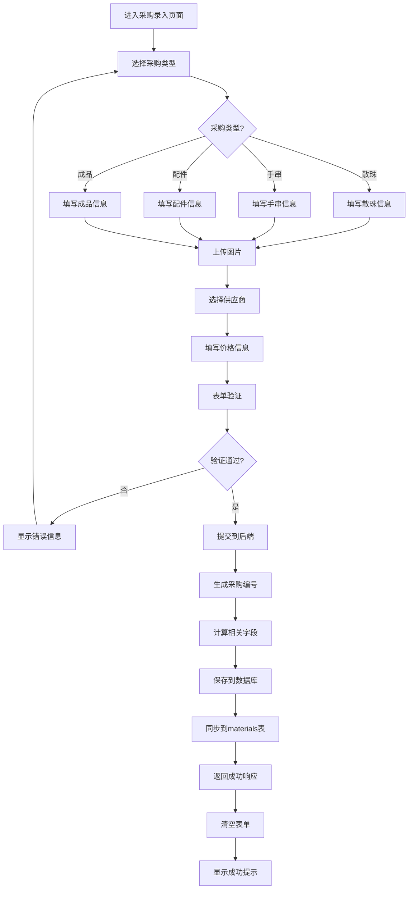

**技术修复要点：**
1. **materials表同步机制**：采购录入后自动同步到materials表，确保库存数据一致性
2. **字段映射修复**：修复了purchase_name到material_name的映射逻辑
3. **数据类型安全处理**：在所有数值计算中使用Number()强制类型转换，避免字符串拼接问题
4. **产品类型枚举修复**：统一使用FINISHED_MATERIAL替代FINISHED，确保查询准确性
5. **库存计算优化**：修复了remaining_quantity的计算逻辑，确保库存数据准确
6. **API接口对齐**：前后端字段名称完全统一，避免映射错误
7. **表单验证增强**：按采购类型进行差异化验证，提升数据质量
8. **错误日志优化**：减少无效的API请求，优化错误处理机制

### 1.2 采购类型差异化处理

**散珠类型（LOOSE_BEADS）：**
- **必填字段**：purchase_name, price_per_gram, weight, bead_diameter, total_price
- **自动计算**：total_beads = weight × 系数（基于直径）, price_per_bead = total_price / total_beads
- **验证规则**：重量>0, 克价>0, 直径>0
- **单位类型**：PIECES（颗）

**手串类型（BRACELET）：**
- **必填字段**：purchase_name, price_per_gram, weight, bead_diameter, beads_per_string, total_price
- **自动计算**：price_per_bead = total_price / (weight × 系数)
- **验证规则**：重量>0, 克价>0, 直径>0, 每串颗数>0
- **单位类型**：STRINGS（串）

**配件类型（ACCESSORIES）：**
- **必填字段**：purchase_name, piece_count, total_price
- **自动计算**：price_per_piece = total_price / piece_count
- **验证规则**：片数>0, 总价>0
- **单位类型**：SLICES（片）或ITEMS（件）

**成品类型（FINISHED_MATERIAL）：**
- **必填字段**：purchase_name, piece_count, total_price
- **自动计算**：price_per_piece = total_price / piece_count
- **验证规则**：件数>0, 总价>0
- **单位类型**：ITEMS（件）

### 1.3 图片上传处理流程

**上传流程：**
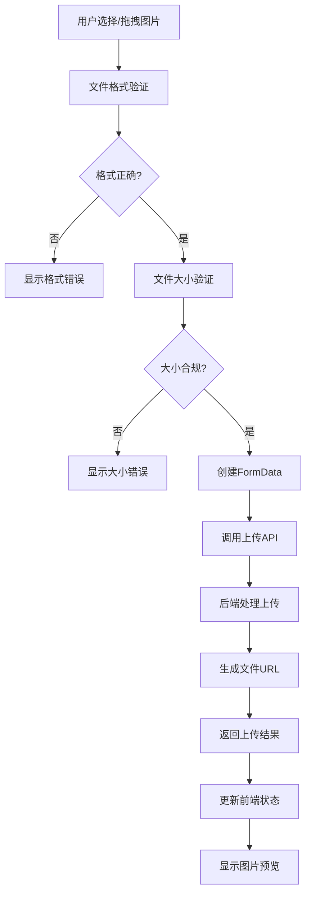

**图片处理规范：**
- **支持格式**：JPEG, PNG, WebP
- **文件大小**：单个文件最大10MB
- **数量限制**：最多5张图片
- **存储格式**：数据库中以JSON数组存储URL
- **URL处理**：使用fixImageUrl函数处理跨域问题

## 二、SKU成品制作业务流程（核心功能）

### 2.1 SKU制作模式概览

**两种制作模式对比：**

| 对比维度 | 直接转化模式 | 组合制作模式 |
|----------|-------------|-------------|
| **业务场景** | 单一原材料直接转化为销售成品 | 多种原材料组合制作复杂成品 |
| **原材料选择** | 单选，每个原材料独立转化 | 多选，多种原材料组合使用 |
| **图片处理** | 自动使用原材料图片 | 需要手动上传成品图片 |
| **规格处理** | 自动使用原材料规格 | 需要手动输入成品规格 |
| **成本计算** | 原材料成本+人工成本+工艺成本 | 多种原材料成本总和+人工成本+工艺成本 |
| **制作数量** | 支持批量制作（受库存限制） | 支持批量制作（受库存限制） |
| **库存验证** | 实时验证单个原材料库存 | 实时验证所有原材料库存 |
| **适用场景** | 简单加工、包装、品质提升 | 复杂工艺、多材料组合 |

### 2.2 直接转化模式业务流程

**流程概述：**
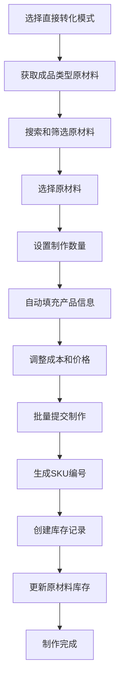

**详细步骤：**

1. **原材料选择阶段**
   - 系统自动筛选`FINISHED_MATERIAL`类型的原材料
   - 支持按名称、供应商、品质等级搜索
   - 显示可用库存数量和单位成本
   - 支持拼音排序和实时搜索

2. **产品信息自动填充**
   ```typescript
   // 自动填充逻辑
   const productInfo = {
     sku_name: material.material_name + '（销售成品）',
     specification: material.specification || '',  // 自动使用原材料规格
     photos: material.photos || [],  // 自动使用原材料图片
     material_cost: material.unit_cost || 0,
     labor_cost: 20,  // 默认人工成本
     craft_cost: 100  // 默认工艺成本
   }
   ```

3. **成本计算和调整**
   - 原材料成本：自动从materials表获取
   - 人工成本：用户可调整，默认20元
   - 工艺成本：用户可调整，默认100元
   - 总成本：自动计算（原材料+人工+工艺）
   - 利润率：根据销售价格自动计算

4. **批量制作处理**
   - 支持同时制作多个不同原材料的成品
   - 每个原材料可设置不同的制作数量
   - 实时验证库存充足性
   - 批量提交，事务处理确保数据一致性

### 2.3 组合制作模式业务流程

**流程概述：**
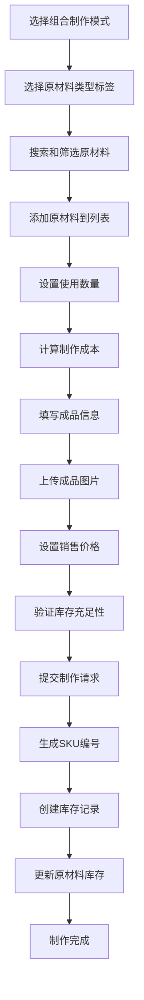

**详细步骤：**

1. **原材料选择阶段**
   - 按类型标签筛选：散珠、手串、配件
   - 支持多种原材料组合使用
   - 实时显示库存状态和可用数量
   - 支持按颗数和片数设置使用量

2. **成本计算流程**
   ```typescript
   // 成本计算API调用
   const materials = formData.selected_materials.map(item => ({
     material_id: item.material.id,
     quantity_used_beads: item.quantity_used_beads * production_quantity,
     quantity_used_pieces: item.quantity_used_pieces * production_quantity
   }))
   
   const response = await finished_product_api.calculate_cost({
     materials,
     labor_cost: formData.labor_cost * production_quantity,
     craft_cost: formData.craft_cost * production_quantity,
     profit_margin: formData.profit_margin
   })
   ```

3. **成品信息填写**
   - SKU名称：必填，用户自定义
   - 成品描述：可选，详细说明
   - 规格信息：必填，如珠径、尺寸等
   - 成品图片：必填，手动上传
   - 销售价格：必填，用户设定

4. **库存验证机制**
   ```typescript
   // 最大制作数量计算
   const calculateMaxProductionQuantity = (materials) => {
     let maxQuantity = Infinity
     
     for (const item of materials) {
       const availableForThisMaterial = Math.floor(
         material.available_quantity / item.quantity_used
       )
       maxQuantity = Math.min(maxQuantity, availableForThisMaterial)
     }
     
     return maxQuantity === Infinity ? 1 : Math.max(1, maxQuantity)
   }
   ```

### 2.4 SKU生成和管理流程

**SKU编号生成规则：**
```typescript
// SKU编号生成算法
const generateSkuCode = (materials) => {
  // 1. 创建原材料组合哈希
  const materialSignature = materials
    .sort((a, b) => a.material_id.localeCompare(b.material_id))
    .map(m => `${m.material_id}:${m.quantity_used_beads}:${m.quantity_used_pieces}`)
    .join('|')
  
  // 2. 生成哈希值
  const hash = crypto.createHash('md5').update(materialSignature).digest('hex').substring(0, 8)
  
  // 3. 生成SKU编号
  const timestamp = new Date().toISOString().slice(0, 10).replace(/-/g, '')
  return `SKU${timestamp}${hash.toUpperCase()}`
}
```

**SKU库存管理：**
- 总库存数量（total_quantity）：制作完成后的总数量
- 可用库存数量（available_quantity）：可销售的数量
- 库存变更日志：记录所有库存变更操作
- 自动库存更新：通过数据库触发器维护一致性

### 2.5 成本计算和利润分析

**成本计算公式：**
```
总成本 = 材料成本 + 人工成本 + 工艺成本

直接转化模式：
材料成本 = 原材料单位成本 × 使用数量

组合制作模式：
材料成本 = Σ(每种原材料的单位成本 × 使用数量)

利润率 = (销售价格 - 总成本) / 销售价格 × 100%
```

**权限控制：**
- BOSS角色：可查看所有成本和利润信息
- EMPLOYEE角色：仅可查看基本信息，成本信息自动过滤

### 2.6 库存同步和一致性保证

**数据同步机制：**
1. **原材料库存扣减**：制作时自动扣减materials表的used_quantity
2. **SKU库存增加**：制作完成后增加product_skus表的库存
3. **使用记录创建**：在material_usages表记录详细使用情况
4. **变更日志记录**：在sku_inventory_logs表记录操作历史

**事务处理保证：**
```typescript
// 事务处理示例
const result = await prisma.$transaction(async (tx) => {
  // 1. 创建SKU记录
  const sku = await tx.productSku.create({ data: skuData })
  
  // 2. 更新原材料库存
  for (const material of materials) {
    await tx.material.update({
      where: { id: material.material_id },
      data: { used_quantity: { increment: material.quantity_used } }
    })
  }
  
  // 3. 创建使用记录
  await tx.materialUsage.createMany({ data: usageRecords })
  
  // 4. 创建库存日志
  await tx.skuInventoryLog.create({ data: logData })
  
  return sku
})
```

## 三、采购管理业务流程（重要更新）

### 2.1 采购录入流程

**流程步骤：**
1. **基础信息录入**
   - 产品名称（必填）
   - 产品类型选择（散珠/手串/配件/成品）
   - 供应商选择（支持新建）
   - 品质等级选择

2. **规格信息录入**
   - 散珠：珠子直径、克价、重量
   - 手串：珠子直径、内径、每串颗数、克价、重量
   - 配件：规格描述、片数/件数、单价
   - 成品：规格描述、件数、单价

3. **图片上传**
   - 支持拖拽上传
   - 最多5张图片
   - 自动压缩和格式转换

4. **AI智能识别（可选）**
   - 自然语言描述输入
   - AI自动解析产品信息
   - 用户确认和修正

5. **数据验证和提交**
   - 前端表单验证
   - 后端数据校验
   - 采购编号自动生成
   - 数据库存储

### 2.2 采购列表管理流程（完整修复版）

**修复成果总结：**
实现了完整的多维度搜索、高级筛选、智能排序和响应式设计，包括搜索功能、筛选器、分页、排序、权限控制等核心功能的实现和优化。

**核心功能流程：**

1. **多维度搜索流程（已修复）**
   - **产品名称搜索**：支持模糊匹配，实时搜索，500ms防抖处理
   - **采购编号搜索**：支持精确匹配和模糊匹配，独立搜索框
   - **组合搜索**：支持同时使用产品名称和采购编号搜索
   - **防抖处理**：使用useMemo和debounce优化搜索性能

2. **表头筛选器系统流程（新增）**
   - **多选筛选器**：品质、产品类型、供应商支持多选
   - **范围筛选器**：珠径、规格、价格支持最小值-最大值筛选
   - **日期筛选器**：采购日期范围筛选
   - **搜索筛选器**：产品名称和采购编号的独立搜索
   - **筛选器定位**：智能计算筛选器位置，防止超出视口
   - **筛选器类型映射**：根据字段类型自动选择合适的筛选器

3. **智能排序系统流程（增强）**
   - **多字段排序**：支持按日期、编号、名称、价格等排序
   - **规格动态排序**：根据产品类型自动选择对应规格字段
   - **升序/降序切换**：点击列头切换排序方向
   - **默认排序**：采购日期倒序排列（最新的在前）
   - **规格字段映射**：LOOSE_BEADS→bead_diameter, BRACELET→bracelet_inner_diameter等

4. **分页管理系统流程（完善）**
   - **自定义分页**：支持10/20/50/100条每页
   - **页码跳转**：支持直接跳转到指定页码
   - **响应式分页**：手机端和桌面端不同的分页显示
   - **分页信息**：显示当前页码、总页数、总记录数
   - **分页组件**：统一的分页组件实现

5. **权限控制系统流程（强化）**
   - **角色检查**：根据用户角色显示不同内容
   - **敏感数据过滤**：EMPLOYEE角色自动隐藏价格信息
   - **操作权限**：编辑和删除按钮根据权限显示
   - **数据脱敏**：敏感字段在前端和后端双重过滤
   - **权限控制逻辑**：should_show_sensitive_data()和should_show_edit_actions()函数

6. **响应式设计流程（新增）**
   - **桌面端表格**：完整的表格布局，支持所有筛选功能
   - **移动端卡片**：卡片式布局，优化触摸操作
   - **移动端筛选器**：专门的移动端筛选界面
   - **自适应布局**：根据屏幕尺寸自动调整布局
   - **响应式断点**：移动端(<767px)、平板端(768-1023px)、桌面端(≥1024px)

7. **性能优化流程（重要）**
   - **数据缓存**：使用TanStack Query进行数据缓存，5分钟缓存时间
   - **防抖搜索**：500ms防抖处理，减少API调用
   - **虚拟滚动**：处理大量数据时使用虚拟滚动
   - **图片懒加载**：使用Intersection Observer实现图片懒加载
   - **组件优化**：使用useMemo和useCallback优化渲染性能

**业务规则（更新）：**
- 采购列表按采购日期倒序排列（最新的在前）
- 筛选条件保持在URL参数中，支持书签和分享
- 搜索和筛选结果实时更新，无需手动刷新
- 移动端优化：提供专门的移动端筛选界面
- 数据缓存：相同筛选条件下避免重复请求
- 权限控制：EMPLOYEE角色自动过滤敏感价格字段
- 性能指标：页面加载<2秒，搜索响应<500ms，筛选响应<300ms

**技术实现亮点：**
- 表头筛选器系统：智能定位、类型映射、多选支持
- 规格动态排序：根据产品类型自动选择对应规格字段
- 防抖搜索：500ms防抖处理，优化用户体验
- 响应式设计：桌面端表格、移动端卡片、自适应布局
- 权限控制：前后端双重过滤，确保数据安全

### 1.1 采购列表查询流程（新增搜索功能）

**流程概述：**
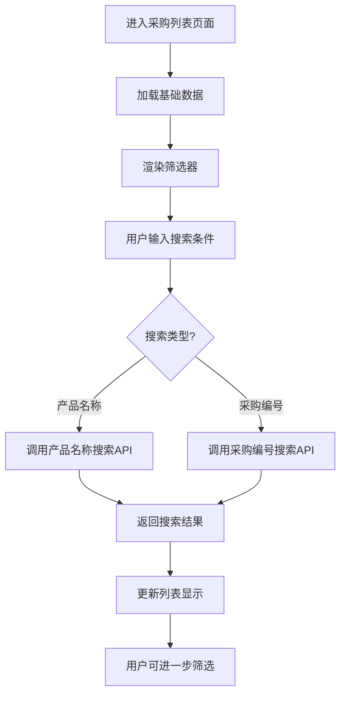

**核心功能更新：**
1. **采购编号搜索**：支持采购编号的模糊匹配搜索
2. **产品名称搜索**：原有的产品名称搜索功能
3. **组合搜索**：支持同时使用多种搜索条件
4. **实时搜索**：输入时实时显示搜索建议
5. **搜索历史**：记录用户常用的搜索条件

**搜索功能详细规范：**

| 搜索类型 | 字段名 | 匹配方式 | 示例 | 说明 |
|----------|--------|----------|------|------|
| 采购编号搜索 | purchase_code_search | 模糊匹配 | "PUR2024" | 支持部分编号搜索 |
| 产品名称搜索 | search | 模糊匹配 | "紫水晶" | 搜索产品名称关键词 |
| 品质筛选 | quality | 精确匹配 | "AA" | 按品质等级筛选 |
| 产品类型筛选 | product_type | 精确匹配 | "LOOSE_BEADS" | 按产品类型筛选 |
| 供应商筛选 | supplier_id | 精确匹配 | "supplier_001" | 按供应商筛选 |

**前端实现要点：**
```typescript
// 搜索状态管理
interface SearchState {
  productNameSearch: string    // 产品名称搜索
  purchaseCodeSearch: string   // 采购编号搜索（新增）
  qualityFilter: string        // 品质筛选
  typeFilter: string          // 类型筛选
  supplierFilter: string      // 供应商筛选
}

// 搜索API调用
const performSearch = async (searchParams: SearchState) => {
  const params = {
    search: searchParams.productNameSearch,
    purchase_code_search: searchParams.purchaseCodeSearch, // 新增参数
    quality: searchParams.qualityFilter,
    product_type: searchParams.typeFilter,
    supplier_id: searchParams.supplierFilter
  }
  
  const response = await purchaseApi.list(params)
  return response.data.purchases
}
```

### 1.2 采购编号生成规则

**编号格式：** `PUR + YYYYMMDD + 001`

**生成流程：**
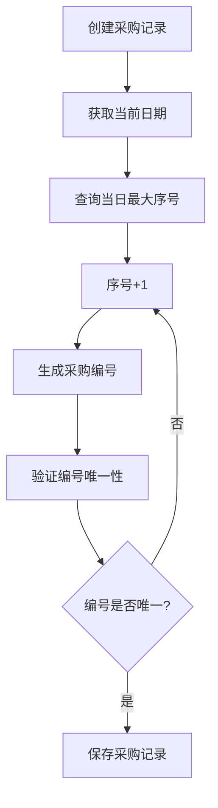

**业务规则：**
- 每日序号从001开始递增
- 支持跨日期的连续编号
- 删除记录不影响序号连续性
- 编号一旦生成不可修改

## 二、拼音排序业务流程（新增功能）

### 2.1 拼音排序应用场景

**适用组件：**
1. **ProductEntry组件**：散珠和手串的A-Z排序
2. **AccessoriesProductGrid组件**：配饰原材料的A-Z排序
3. **FinishedProductGrid组件**：成品列表的A-Z排序
4. **供应商选择组件**：供应商名称的A-Z排序

**排序流程：**
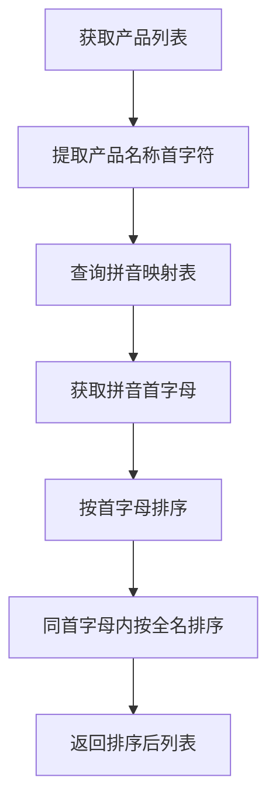

### 2.2 拼音映射表维护

**核心字符映射（已完善）：**
```typescript
const PINYIN_MAPPINGS = {
  // 水晶类
  '紫': 'Z', '水': 'S', '晶': 'J', '玛': 'M', '瑙': 'N',
  '翡': 'F', '翠': 'C', '和': 'H', '田': 'T', '玉': 'Y',
  
  // 有机宝石类（重要更新）
  '蜜': 'M', // 修复蜜蜡排序问题
  '蜡': 'L', '琥': 'H', '珀': 'P', '珊': 'S', '瑚': 'H',
  
  // 金属类（重要更新）
  '镀': 'D', // 修复镀金排序问题
  '金': 'J', '银': 'Y', '铜': 'T', '铁': 'T', '钢': 'G'
}
```

**维护规则：**
- 新增产品时检查首字符是否在映射表中
- 缺失字符自动使用字符本身的大写形式
- 定期审查和完善映射表
- 支持多音字的主要读音映射

### 2.3 排序一致性保证

**问题解决：**
- **问题**：蜜蜡隔珠排在镀金隔片前面
- **原因**：缺少"蜜"和"镀"字的拼音映射
- **解决**：添加映射 "蜜"→"M"，"镀"→"D"
- **结果**：镀金隔片(D)正确排在蜜蜡隔珠(M)前面

**验证流程：**
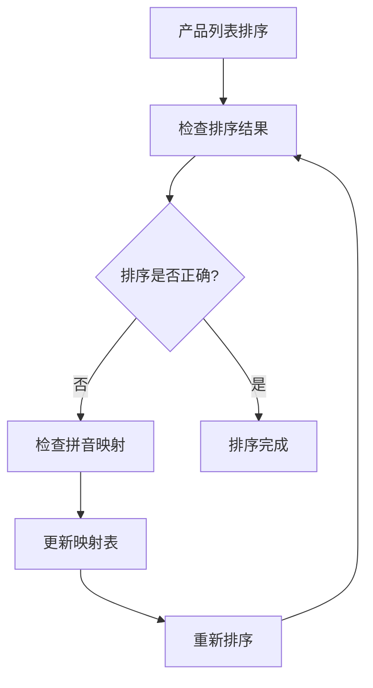

## 三、成品制作业务流程

### 3.1 成品制作成本计算业务规则（重要更新）

**成本计算核心公式：**
```
原材料成本 = Σ(使用数量 × 单位成本)
总成本 = 原材料成本 + 人工成本 + 工艺成本
利润率 = (销售价格 - 总成本) / 销售价格 × 100%
```

**原材料成本计算规则：**
1. **散珠/手串**：使用颗数 × 每颗价格 (pricePerBead)
2. **配件/成品**：使用片数/件数 × 每片/每件价格 (pricePerPiece)
3. **备选方案**：如果专用价格字段为空，使用unitPrice或totalPrice

**成本计算流程：**
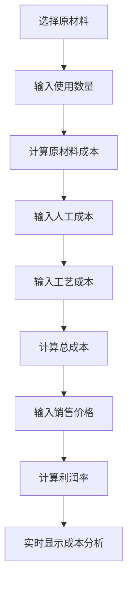

**业务验证规则：**
- 原材料库存充足性验证
- 成本字段非负数验证
- 销售价格必须大于0
- 利润率建议范围：10%-50%
- 低于10%利润率显示警告

**CG编码映射规则：**
```typescript
const PRODUCT_TYPE_MAPPING = {
  'LOOSE_BEADS': {
    cgCode: 'LB',
    displayName: '散珠',
    unitType: 'PIECES',
    costCalculation: 'per_bead',
    priceField: 'pricePerBead'
  },
  'BRACELET': {
    cgCode: 'BR',
    displayName: '手串',
    unitType: 'STRINGS',
    costCalculation: 'per_string',
    priceField: 'pricePerBead'
  },
  'ACCESSORIES': {
    cgCode: 'AC',
    displayName: '配饰',
    unitType: 'PIECES',
    costCalculation: 'per_piece',
    priceField: 'pricePerPiece'
  },
  'FINISHED_MATERIAL': {
    cgCode: 'FP',
    displayName: '成品原材料',
    unitType: 'ITEMS',
    costCalculation: 'per_item',
    priceField: 'pricePerPiece'
  }
}
```

### 3.2 直接转化模式业务流程

**适用场景：**
- 单一原材料直接转化为销售成品
- 简单加工、包装、品质提升
- 批量处理多个相同类型的原材料

**业务流程：**
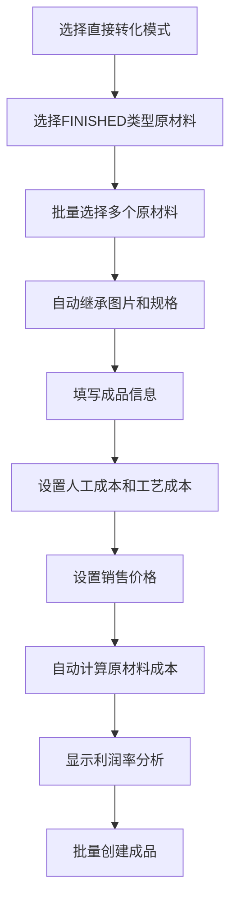

**自动化特点：**
- 图片自动继承：不传则使用原材料图片
- 规格自动继承：从beadDiameter或specification推导
- 成本自动计算：根据产品类型选择pricePerBead或pricePerPiece
- 库存自动验证：每个原材料只能转化1件成品

### 3.3 组合制作模式业务流程

**适用场景：**
- 多种原材料组合制作复杂成品
- 需要精确控制每种原材料的使用量
- 复杂工艺、多材料组合

**业务流程：**
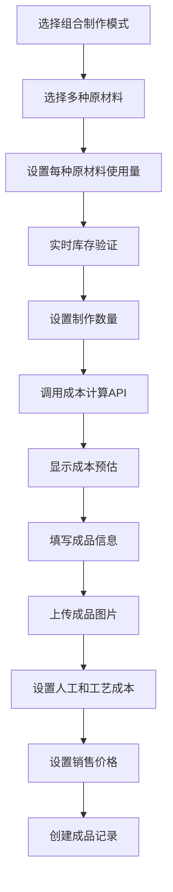

**精确控制特点：**
- 使用量精确控制：支持散珠颗数和配件片数混合
- 实时成本预估：调用POST /products/cost接口
- 库存动态验证：根据使用量实时计算最大制作数量
- 手动信息填写：需要手动上传图片和填写规格

## 四、数据类型处理规范

### 4.1 数值类型安全处理

**问题案例：库存消耗分析显示"161"而不是"17"**

**根本原因：**
- 后端reduce计算时发生字符串拼接："16" + "1" = "161"
- 前端未对API返回数据进行类型验证

**解决方案：**
```typescript
// 后端：强制数字类型转换
const totalConsumption = consumptionData.reduce((sum, item) => {
  return sum + Number(item.total_consumed) // 强制转换为数字
}, 0)

// 前端：防护性类型转换
const displayValue = Number(data.total_consumption).toLocaleString()
```

**预防措施：**
1. **后端计算**：所有数值计算使用Number()转换
2. **前端显示**：显示前进行Number()转换
3. **SQL查询**：使用CAST()确保返回正确类型
4. **类型验证**：API接口添加数据类型验证

### 4.2 字段一致性保证

**purchase_code字段添加：**
- **数据库**：添加purchase_code字段和索引
- **API接口**：支持purchase_code_search参数
- **前端类型**：更新所有相关接口定义
- **组件使用**：确保所有组件正确访问字段

**类型定义更新清单：**
```typescript
// 需要添加purchase_code字段的接口
interface Purchase { purchase_code: string }
interface AvailableMaterial { purchase_code?: string }
interface AccessoryProduct { purchase_code?: string }
interface FinishedProduct { purchase_code?: string }
interface BatchData { purchase_code?: string }
```

## 五、错误处理和调试规范

### 5.1 TypeScript错误修复流程

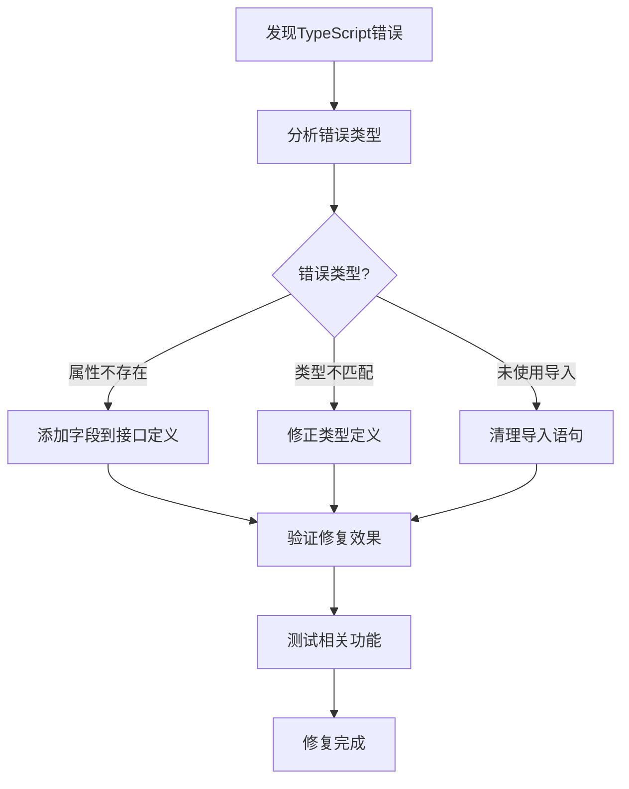

### 5.2 调试最佳实践

**调试原则：**
1. **先查文档**：遇到问题先查看相关文档
2. **字段对齐**：优先检查API、接口、数据库字段是否一致
3. **类型安全**：确保TypeScript类型定义正确
4. **渐进修复**：分步骤修复，避免大范围改动
5. **测试验证**：每次修复后进行功能测试

**常见问题排查：**
- **API连接失败**：检查IP地址是否硬编码
- **数据显示异常**：检查数据类型转换
- **排序不正确**：检查拼音映射表
- **字段访问错误**：检查接口类型定义

## 六、原材料库存查询业务流程（基于materials表架构）

### 6.1 库存查询核心业务流程

#### 6.1.1 materials表核心业务流程

**数据流向：**
1. **采购录入** → purchases表（原始采购数据）
2. **触发器自动转换** → materials表（库存数据）
3. **库存查询** → 直接读取materials表
4. **原材料使用** → 更新materials.used_quantity
5. **库存状态** → 自动计算remaining_quantity和stock_status

**核心优势：**
- 采购数据与库存数据分离，职责清晰
- 库存查询不需要复杂的JOIN和计算
- 转换后的数据持久化，避免重复计算
- 便于后续添加库存相关的业务逻辑

#### 6.1.2 purchase到material映射规则

**字段映射规则：**
| 原字段名（purchase） | 映射字段名（material） | 业务含义 |
|---------------------|----------------------|----------|
| purchase_name | material_name | 产品名称 |
| purchase_type | material_type | 产品类型 |
| purchase_code | material_code | 产品编号 |
| purchase_id | material_id | 产品ID |
| purchase_date | material_date | 采购日期 |

**数量转换规则：**
- **散珠（LOOSE_BEADS）**：按珠径计算总颗数
  - 4mm: 重量 × 25
  - 6mm: 重量 × 11
  - 8mm: 重量 × 6
  - 10mm: 重量 × 4
  - 12mm: 重量 × 3
- **手串（BRACELET）**：使用total_beads或按重量计算
- **配件（ACCESSORIES）**：使用piece_count
- **成品原材料（FINISHED_MATERIAL）**：使用piece_count

**库存单位映射：**
- LOOSE_BEADS, BRACELET → PIECES（颗）
- ACCESSORIES → SLICES（片）
- FINISHED_MATERIAL → ITEMS（件）

#### 6.1.3 数据类型安全处理规则

**问题背景：**
- 库存消耗分析显示"161"而不是"17"
- 后端reduce计算时发生字符串拼接："16" + "1" = "161"
- 前端未对API返回数据进行类型验证

**解决方案：**
1. **后端强制类型转换**：所有数值计算使用Number()转换
2. **前端防护性转换**：显示前进行Number()转换
3. **SQL类型转换**：使用CAST确保返回数字类型
4. **API响应验证**：前端对数值字段进行类型检查

**实施规范：**
```typescript
// 后端计算规范
const total_consumption = converted_data.reduce((sum, item) => {
  return sum + Number(item.total_consumed) // 强制数字转换
}, 0)

// 前端显示规范
const display_value = Number(data.total_consumption).toLocaleString()

// 数值字段安全处理
const safe_number_conversion = (value: any): number => {
  if (value === null || value === undefined) return 0
  const num = Number(value)
  return isNaN(num) ? 0 : num
}
```

**流程概述：**
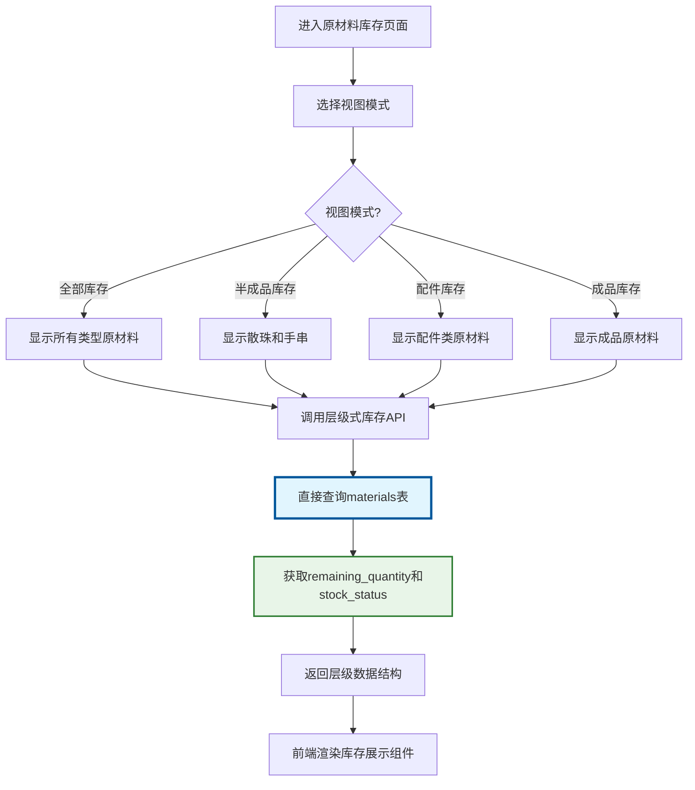

**核心优势：**
- **性能优化**：直接查询materials表，避免复杂的purchase表计算
- **数据一致性**：库存数据统一来源，确保准确性
- **实时更新**：触发器机制保证数据实时同步

### 6.2 materials表核心业务规则

**架构核心原理：**
1. **数据分层设计**：purchases表存储原始采购数据，materials表存储转换后的库存数据
2. **触发器同步**：purchase表变更自动同步到materials表
3. **库存专用字段**：materials表包含库存管理专用字段
4. **业务逻辑内置**：数据库层面实现库存状态自动计算

**数据转换规则：**
| 业务概念 | 采购阶段字段 | 库存阶段字段 | 转换逻辑 |
|----------|-------------|-------------|----------|
| 产品名称 | purchase_name | material_name | 直接复制 |
| 产品类型 | purchase_type | material_type | 直接复制 |
| 产品编号 | purchase_code | material_code | 直接复制 |
| 采购日期 | purchase_date | material_date | 转换为DATE类型 |
| 原始数量 | total_beads/piece_count | original_quantity | 根据类型转换 |
| 库存单位 | - | inventory_unit | 根据类型自动设置 |
| 单位成本 | price_per_bead/price_per_piece | unit_cost | 根据类型选择 |
| 库存状态 | - | stock_status | 自动计算 |

**业务状态计算（数据库触发器自动执行）：**
```typescript
// 库存状态业务规则
interface MaterialBusinessRules {
  inventory_unit: string        // 库存单位（颗/片/件）
  usage_rate: number           // 使用率 = used_quantity / original_quantity * 100%
  remaining_rate: number       // 剩余率 = 100% - usage_rate
  stock_status: 'sufficient' | 'low' | 'out'  // 库存状态
}

// 库存状态判断规则
if (remaining_quantity <= 0) {
  stock_status = 'out'  // 缺货
} else if (min_stock_alert && remaining_quantity <= min_stock_alert) {
  stock_status = 'low'  // 低库存
} else {
  stock_status = 'sufficient'  // 库存充足
}
```

```sql
-- 库存状态自动计算触发器逻辑
CASE 
  WHEN remaining_quantity = 0 THEN 'OUT_OF_STOCK'
  WHEN remaining_quantity <= 10 THEN 'LOW'
  ELSE 'SUFFICIENT'
END as stock_status

-- 触发器自动更新示例
CREATE TRIGGER update_material_stock_status
AFTER UPDATE ON materials
FOR EACH ROW
BEGIN
  UPDATE materials 
  SET stock_status = CASE 
    WHEN NEW.remaining_quantity = 0 THEN 'OUT_OF_STOCK'
    WHEN NEW.remaining_quantity <= 10 THEN 'LOW'
    ELSE 'SUFFICIENT'
  END
  WHERE material_id = NEW.material_id;
END;
```

### 6.3 半成品库存业务流程（基于materials表）

**半成品定义：**
- **散珠（LOOSE_BEADS）**：单颗珠子，按颗计量（inventory_unit = 'BEADS'）
- **手串（BRACELET）**：串装珠子，按颗计量（inventory_unit = 'ITEMS'）

**半成品库存矩阵展示：**
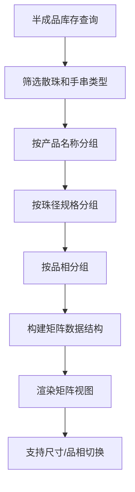

**业务特点：**
- **矩阵展示**：产品名称 × 珠径规格 × 品相的三维矩阵
- **库存状态**：基于materials表的stock_status字段，颜色编码显示库存充足/低库存/缺货状态
- **拼音排序**：产品名称按拼音首字母排序
- **权限控制**：EMPLOYEE角色隐藏价格信息
- **数据来源**：直接从materials表查询remaining_quantity和unit_cost，无需复杂计算

### 6.4 配件库存业务流程

**配件定义（基于materials表）：**
- **配件（ACCESSORIES）**：吊坠、挂件、饰品等，按片计量
- **库存单位**：inventory_unit = 'PIECES'
- **数据来源**：直接从materials表查询remaining_quantity和unit_cost

**配件库存卡片展示：**
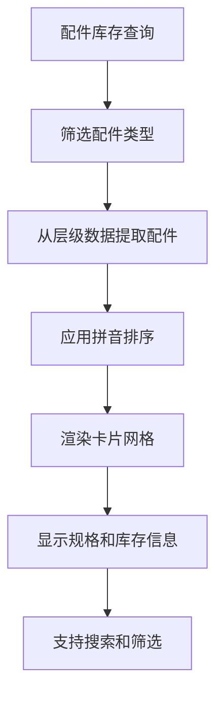

**业务特点：**
- **卡片展示**：每个配件一张卡片，显示图片、规格、库存
- **规格显示**：显示配件的具体规格信息
- **库存预警**：基于stock_status字段的低库存配件特殊标识
- **图片展示**：支持多图片轮播
- **实时状态**：materials表触发器保证库存状态实时更新

### 6.5 成品原材料库存业务流程

**成品原材料定义（基于materials表）：**
- **成品原材料（FINISHED_MATERIAL）**：可直接销售的成品，按件计量
- **库存单位**：inventory_unit = 'ITEMS'
- **数据来源**：直接从materials表查询，避免复杂计算

**成品库存卡片展示：**
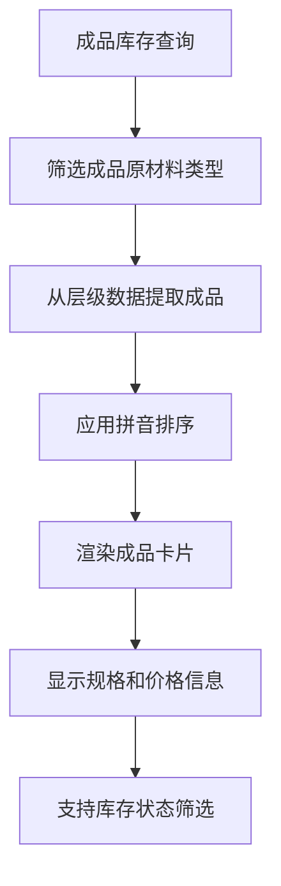

**业务特点：**
- **成品展示**：显示成品的完整信息，包括规格、价格、库存
- **价格显示**：BOSS角色可查看unit_cost和总价
- **库存管理**：基于stock_status支持低库存筛选和预警
- **销售准备**：为后续销售环节提供数据基础
- **性能优化**：materials表架构提供更快的查询响应

### 6.6 数据类型安全业务规则（materials表架构）

**核心数据类型设计：**
1. **materials表数量字段**：
   - `original_quantity`: DECIMAL(10,2) - 原始数量
   - `remaining_quantity`: DECIMAL(10,2) - 剩余数量
   - `used_quantity`: DECIMAL(10,2) - 已使用数量

2. **价格字段精度保证**：
   - `unit_cost`: DECIMAL(10,2) - 统一单位成本
   - 避免浮点数精度丢失
   - 数据库层面保证精度

3. **业务计算安全**：
   - 库存计算在数据库层面执行
   - 触发器保证数据一致性
   - 避免前端计算的精度问题
   - 枚举类型保证数据完整性

**实施标准（materials表架构优势）：**
- 数据库层面保证数据类型一致性
- 触发器自动维护数据完整性
- 枚举类型约束确保数据有效性
- API直接返回materials表数据，减少转换错误

```typescript
// 业务数据处理标准
const process_business_data = (raw_data: any) => {
  return {
    total_consumption: Number(raw_data.total_consumption) || 0,
    remaining_quantity: Number(raw_data.remaining_quantity) || 0,
    price_per_unit: Number(raw_data.price_per_unit) || 0,
    usage_rate: Math.round(Number(raw_data.usage_rate) || 0)
  }
}
```

### 6.7 错误处理和调试规范（materials表架构）

**架构优势带来的错误减少：**
1. **数据一致性**：触发器保证purchase和materials数据同步
2. **类型安全**：数据库约束防止类型错误
3. **计算准确性**：数据库层面计算避免精度丢失
4. **状态自动化**：stock_status自动计算，减少人为错误

**调试方法（针对materials表）：**
1. **数据源验证**：检查materials表数据是否正确同步
2. **触发器日志**：监控触发器执行情况
3. **状态一致性**：验证stock_status计算是否正确
4. **API响应检查**：确认返回的是materials表字段

## 七、系统维护和优化

### 7.1 文档同步机制

**三位一体原则：**
- **文档**：业务规范和技术规范
- **代码**：前后端实现代码
- **数据库**：表结构和数据

**同步流程：**
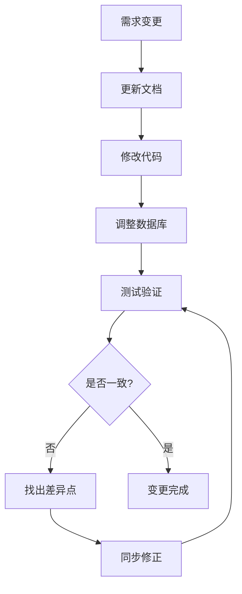

### 6.2 持续改进机制

**改进方向：**
1. **性能优化**：查询效率、响应速度
2. **用户体验**：界面友好性、操作便捷性
3. **数据准确性**：计算精度、类型安全
4. **功能完善**：业务覆盖度、异常处理
5. **代码质量**：可维护性、可扩展性

## 2. SKU数据结构

### 2.1 核心字段
- **图片**：JSON数组格式存储多张图片URL
- **编号**：SKU编号（SKU+YYYYMMDD+3位序号）
- **名称**：SKU名称
- **数量**：总数量和可售数量
- **规格**：直径等规格信息
- **成本价**：原材料成本、人工成本、工艺成本
- **售价**：销售价格
- **利润率**：自动计算的利润率
- **创建日期**：SKU创建时间
- **销售日期**：最后销售时间
- **溯源信息**：关联的原材料和采购记录

## 3. SKU业务流程

### 3.1 SKU创建流程

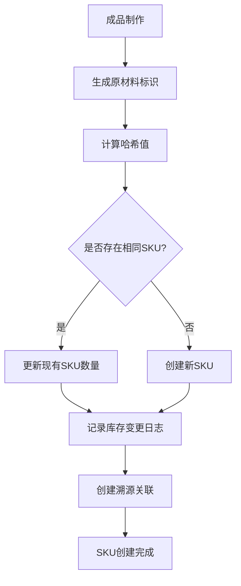

### 3.2 SKU销售确认流程

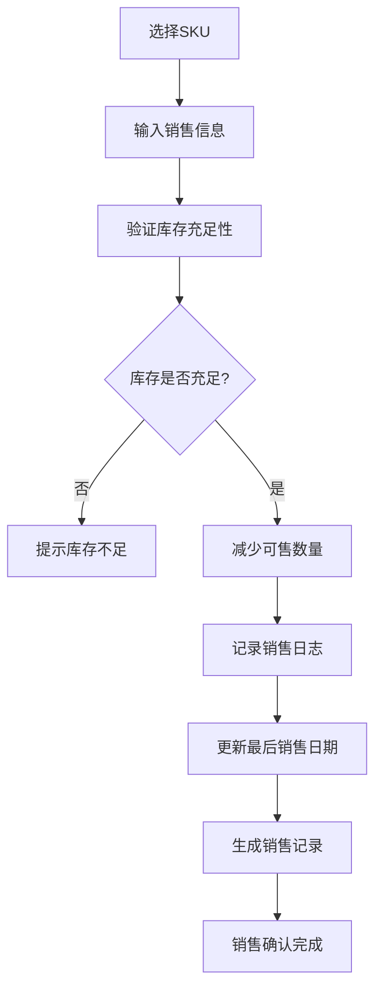

**业务规则：**
- 销售数量不能超过可售数量
- 支持部分销售（数量可小于总库存）
- 自动更新最后销售日期
- 记录买家信息和销售渠道

### 3.3 SKU销毁流程

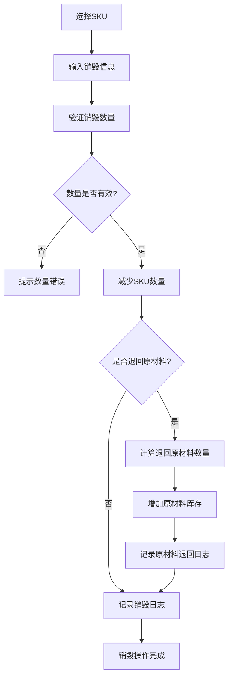

**业务规则：**
- 销毁数量不能超过可售数量
- 支持选择是否退回原材料库存
- 退回原材料按比例计算
- 记录详细的销毁原因

### 3.4 SKU库存调整流程

```mermaid
flowchart TD
    A[选择SKU] --> B[输入新库存数量]
    B --> C[验证调整权限]
    C --> D{权限是否充足?}
    D -->|否| E[提示权限不足]
    D -->|是| F[计算调整差值]
    F --> G[更新SKU数量]
    G --> H[记录调整日志]
    H --> I[库存调整完成]
```

**业务规则：**
- 只有管理员可以进行库存调整
- 必须提供调整原因
- 记录调整前后的数量变化

## 4. SKU溯源管理

### 4.1 溯源数据结构
- **SKU信息**：基本信息和当前状态
- **原材料使用记录**：每种原材料的使用数量和成本
- **采购记录关联**：关联的采购记录详情
- **供应商信息**：原材料供应商信息

### 4.2 溯源查询流程

```mermaid
flowchart TD
    A[选择SKU] --> B[查询溯源关联表]
    B --> C[获取原材料使用记录]
    C --> D[查询采购记录详情]
    D --> E[获取供应商信息]
    E --> F[组装溯源数据]
    F --> G[返回完整溯源信息]
```

## 5. 权限控制

### 5.1 角色权限矩阵

| 操作 | BOSS | EMPLOYEE |
|------|------|----------|
| 查看SKU列表 | ✅ | ✅ |
| 查看SKU详情 | ✅ | ✅ |
| 查看价格信息 | ✅ | ❌ |
| 销售确认 | ✅ | ❌ |
| 销毁操作 | ✅ | ❌ |
| 库存调整 | ✅ | ❌ |
| 查看溯源信息 | ✅ | ✅ |

### 5.2 数据过滤规则
- **EMPLOYEE角色**：隐藏成本价、售价、利润率等敏感信息
- **BOSS角色**：可查看所有信息
- **操作权限**：只有BOSS可以进行销售和销毁操作

## 6. 数据完整性约束

### 6.1 库存一致性
- SKU总数量 = 可售数量 + 已售数量
- 销售操作后自动更新可售数量
- 销毁操作后同时减少总数量和可售数量

### 6.2 溯源完整性
- 每个SKU必须有对应的原材料使用记录
- 原材料使用记录必须关联有效的采购记录
- 删除采购记录时检查SKU关联

### 6.3 成本计算规则
- 总成本 = 原材料成本 + 人工成本 + 工艺成本
- 利润率 = (售价 - 总成本) / 售价 × 100%
- 成本信息在SKU创建时计算并存储

## 7. 异常处理

### 7.1 库存异常
- **库存不足**：销售数量超过可售数量
- **负库存**：调整后库存为负数
- **数据不一致**：总数量与明细不匹配

### 7.2 溯源异常
- **溯源缺失**：SKU没有对应的原材料记录
- **采购记录删除**：关联的采购记录被删除
- **数据损坏**：溯源数据格式错误

### 7.3 操作异常
- **权限不足**：用户无权限进行操作
- **并发冲突**：多用户同时操作同一SKU
- **参数错误**：输入参数格式或范围错误

## 8. 性能优化

### 8.1 查询优化
- 使用索引优化SKU列表查询
- 分页查询避免大数据量加载
- 缓存热门SKU信息

### 8.2 操作优化
- 使用数据库事务保证操作原子性
- 批量操作减少数据库访问次数
- 异步处理非关键操作

## 9. 监控和日志

### 9.1 操作日志
- 记录所有SKU操作的详细信息
- 包括操作用户、时间、参数、结果
- 支持按时间、用户、操作类型查询

### 9.2 业务监控
- 监控SKU库存变化趋势
- 统计销售和销毁操作频率
- 预警低库存和异常操作

## 10. 系统集成

### 十、SKU成品制作流程规范

### 10.1 制作模式选择流程

**流程概述：**
SKU成品制作支持两种模式：直接转化模式和组合制作模式，用户需要根据实际需求选择合适的制作模式。

**业务规则：**
1. **直接转化模式**：适用于将单一原材料（成品类型）直接转化为销售SKU
2. **组合制作模式**：适用于多种原材料组合制作复杂SKU
3. 模式选择后不可更改，需要重新开始制作流程
4. 不同模式对应不同的原材料筛选规则
5. 支持批量制作和单个制作
6. 实时成本计算和利润率显示

**操作流程：**
```mermaid
graph TD
    A[进入成品制作页面] --> B[选择制作模式]
    B --> C{模式类型}
    C -->|直接转化| D[筛选成品类型原材料]
    C -->|组合制作| E[筛选散珠/手串/配件]
    D --> F[批量选择原材料]
    E --> G[逐个添加原材料]
    F --> H[批量配置产品信息]
    G --> I[设置制作数量]
    H --> J[实时成本计算]
    I --> K[填写SKU信息]
    J --> L[提交批量制作]
    K --> M[上传成品图片]
    M --> N[实时成本计算]
    N --> O[提交单个制作]
    L --> P[生成多个SKU]
    O --> Q[生成单个SKU]
    P --> R[更新原材料库存]
    Q --> R
    R --> S[创建库存变更日志]
    S --> T[制作完成]
```

### 10.2 直接转化模式详细流程

**适用场景：**
- 单一原材料直接转化为销售成品
- 简单加工、包装、品质提升
- 批量制作相同类型的成品

**操作步骤：**
1. **原材料筛选**：系统自动筛选FINISHED_MATERIAL类型的原材料
2. **批量选择**：支持同时选择多个不同的原材料
3. **数量设置**：为每个原材料设置制作数量（受库存限制）
4. **信息自动填充**：自动使用原材料的名称、规格、图片
5. **成本配置**：设置人工成本和工艺成本
6. **价格设置**：设置销售价格，自动计算利润率
7. **批量提交**：一次性创建多个SKU

### 10.3 组合制作模式详细流程

**适用场景：**
- 多种原材料组合制作复杂成品
- 复杂工艺、多材料组合
- 需要自定义成品信息

**操作步骤：**
1. **分类选择**：按散珠、手串、配件分类选择原材料
2. **逐个添加**：逐个添加需要的原材料到制作列表
3. **用量设置**：为每种原材料设置使用的颗数或片数
4. **成品信息**：手动填写SKU名称、描述、规格
5. **图片上传**：上传成品图片（支持拍照和文件上传）
6. **成本计算**：系统自动计算总原材料成本
7. **价格设置**：设置销售价格和利润率
8. **单个提交**：创建单个SKU

## 十一、SKU销售管理流程规范（2025年1月修复版）

### 11.1 SKU销售列表查看流程（已修复）

**修复背景：**
本次修复针对SKU销售列表功能进行了全面优化，主要解决了以下问题：

1. **销售功能修复**：修复了销售操作的字段映射问题，确保销售记录正确创建
2. **库存变动功能完善**：完善了SKU详情页面的库存变动日志显示和筛选功能
3. **退货处理修复**：修复了退货导致的累计制作错误问题，确保库存计算准确
4. **字段名称统一**：统一使用蛇形命名规则（如customer_name、customer_phone等）
5. **权限控制优化**：完善了不同角色的权限控制和敏感信息隐藏
6. **API接口对齐**：修复了前后端接口字段不匹配的问题
7. **错误处理增强**：优化了错误提示和用户体验

**流程概述：**
SKU销售列表页面提供完整的SKU管理功能，包括查看、筛选、排序、销售、销毁、退货等操作。

**业务规则（已更新）：**
1. 只有状态为ACTIVE且库存大于0的SKU才能进行销售
2. 价格信息仅BOSS角色可见，EMPLOYEE角色隐藏成本和利润率
3. 销毁操作需要BOSS或MANAGER权限
4. 退货操作支持部分退货和全额退货
5. 支持移动端和桌面端响应式布局
6. 图片支持预览功能和错误处理
7. 支持多维度筛选和排序
8. 实时显示库存状态和价值信息
9. 库存变动日志支持详细筛选和分页

**页面访问流程：**
```mermaid
graph TD
    A[用户登录] --> B[检查认证状态]
    B -->|未认证| C[显示登录提示]
    B -->|已认证| D[加载SKU列表]
    C --> E[跳转登录页面]
    D --> F[应用权限控制]
    F --> G[显示SKU列表]
    G --> H[支持筛选排序]
    H --> I[响应式布局适配]
    I --> J[支持批量操作]
    J --> K[实时状态更新]
```

**筛选功能（已优化）：**
- **搜索筛选**：按SKU名称或编号搜索，支持模糊匹配
- **状态筛选**：活跃/停用状态筛选，实时更新
- **价格范围**：最低价格到最高价格筛选（BOSS角色可见）
- **利润率范围**：最低利润率到最高利润率筛选（BOSS角色可见）
- **库存状态**：有库存/无库存状态筛选
- **排序功能**：按创建时间、价格、库存、利润率排序
- **库存变动筛选**：按操作类型（销售、销毁、调整、退货）筛选

**权限控制（已修复）：**
- **BOSS角色**：查看所有信息（包括material_cost、total_cost、profit_margin），执行所有操作
- **EMPLOYEE角色**：隐藏敏感信息（成本相关字段），只能查看基本信息和执行销售操作
- **字段显示控制**：根据角色动态显示/隐藏相关字段和操作按钮
- **API权限验证**：后端接口根据用户角色过滤返回数据

### 11.2 SKU销售操作流程

**流程概述：**
用户可以对符合条件的SKU进行销售操作，系统会自动减少库存并记录销售信息。

**业务规则：**
1. 销售数量不能超过可用库存
2. 必须填写客户姓名和电话
3. 支持实际成交价格（优惠价格）
4. 自动生成销售记录和库存变更日志
5. 更新SKU的最后销售时间

**销售操作流程：**
```mermaid
graph TD
    A[选择SKU] --> B[检查销售权限]
    B -->|无权限| C[显示权限错误]
    B -->|有权限| D[检查SKU状态]
    D -->|状态异常| E[显示状态错误]
    D -->|状态正常| F[检查库存]
    F -->|库存不足| G[显示库存错误]
    F -->|库存充足| H[打开销售表单]
    H --> I[填写销售信息]
    I --> J[验证表单数据]
    J -->|验证失败| K[显示验证错误]
    J -->|验证成功| L[提交销售请求]
    L --> M[减少SKU库存]
    M --> N[创建销售记录]
    N --> O[记录库存变更日志]
    O --> P[更新最后销售时间]
    P --> Q[刷新列表显示]
    Q --> R[显示成功提示]
```

### 11.3 SKU销毁操作流程

**流程概述：**
对于有质量问题或其他原因需要销毁的SKU，系统支持销毁操作并可选择返还原材料到库存。

**业务规则：**
1. 销毁操作需要BOSS或MANAGER权限
2. 销毁数量不能超过可用库存
3. 支持选择是否返还原材料到库存
4. 返还原材料时可自定义返还数量
5. 详细记录销毁原因和返还原材料信息
6. 在库存变动日志中记录返还原材料详情

**销毁操作流程：**
```mermaid
graph TD
    A[选择SKU] --> B[检查销毁权限]
    B -->|无权限| C[显示权限错误]
    B -->|有权限| D[检查SKU状态]
    D -->|状态异常| E[显示状态错误]
    D -->|状态正常| F[检查库存]
    F -->|库存不足| G[显示库存错误]
    F -->|库存充足| H[打开销毁表单]
    H --> I[填写销毁信息]
    I --> J[选择是否返还原材料]
    J -->|不返还| K[直接销毁]
    J -->|返还| L[选择返还原材料]
    L --> M[设置返还数量]
    M --> N[验证表单数据]
    N -->|验证失败| O[显示验证错误]
    N -->|验证成功| P[提交销毁请求]
    P --> Q[减少SKU库存]
    Q --> R[返还原材料到库存]
    R --> S[创建销毁记录]
    S --> T[记录库存变更日志]
    T --> U[记录返还原材料信息]
    U --> V[刷新列表显示]
    V --> W[显示成功提示]
    K --> Q
```

**返还原材料信息记录格式：**
- **notes字段格式**："销毁原因：[用户输入原因]。返还原材料：[材料名称] [数量][单位]，[材料名称] [数量][单位]..."
- **前端解析逻辑**：使用正则表达式解析notes字段中的返还原材料信息
- **显示格式**：🔄 返还原材料：[材料名称] [数量][单位]，...

### 11.4 SKU库存调整流程

**流程概述：**
支持手动调整SKU库存数量，用于处理盘点差异、损耗等情况。

**业务规则：**
1. 库存调整需要BOSS权限
2. 支持增加和减少两种调整类型
3. 必须填写调整原因
4. 支持成本调整（可选）
5. 记录详细的调整日志

**调整操作流程：**
```mermaid
graph TD
    A[选择SKU] --> B[检查调整权限]
    B -->|无权限| C[显示权限错误]
    B -->|有权限| D[打开调整表单]
    D --> E[选择调整类型]
    E --> F[输入调整数量]
    F --> G[填写调整原因]
    G --> H[设置成本调整]
    H --> I[验证表单数据]
    I -->|验证失败| J[显示验证错误]
    I -->|验证成功| K[提交调整请求]
    K --> L[更新SKU库存]
    L --> M[创建调整记录]
    M --> N[记录库存变更日志]
    N --> O[刷新列表显示]
    O --> P[显示成功提示]
```

**销毁操作流程：**
```mermaid
graph TD
    A[选择SKU] --> B[检查销毁权限]
    B -->|无权限| C[显示权限错误]
    B -->|有权限| D[检查库存]
    D -->|库存不足| E[显示库存错误]
    D -->|库存充足| F[打开销毁表单]
    F --> G[填写销毁信息]
    G --> H[选择是否返还原材料]
    H -->|不返还| I[直接销毁]
    H -->|返还| J[选择返还原材料]
    J --> K[设置返还数量]
    K --> L[验证返还数量]
    L -->|验证失败| M[显示验证错误]
    L -->|验证成功| N[提交销毁请求]
    I --> N
    N --> O[减少SKU库存]
    O --> P{是否返还原材料}
    P -->|是| Q[增加原材料库存]
    P -->|否| R[记录销毁日志]
    Q --> S[记录返还信息]
    S --> R
    R --> T[刷新列表显示]
    T --> U[显示成功提示]
```

### 11.4 SKU库存调整流程

**流程概述：**
支持对SKU库存进行手动调整，包括增加和减少操作，用于处理盘点差异等情况。

**业务规则：**
1. 库存调整需要BOSS或MANAGER权限
2. 必须填写调整原因
3. 减少库存时不能超过当前可用库存
4. 支持成本调整（可选）
5. 记录详细的调整日志

**调整操作流程：**
```mermaid
graph TD
    A[选择SKU] --> B[检查调整权限]
    B -->|无权限| C[显示权限错误]
    B -->|有权限| D[打开调整表单]
    D --> E[选择调整类型]
    E --> F[输入调整数量]
    F --> G[填写调整原因]
    G --> H[验证调整数据]
    H -->|验证失败| I[显示验证错误]
    H -->|验证成功| J[提交调整请求]
    J --> K[更新SKU库存]
    K --> L[记录调整日志]
    L --> M[刷新列表显示]
    M --> N[显示成功提示]
```

### 11.5 SKU筛选和排序流程

**流程概述：**
SKU销售列表支持多维度筛选和排序，帮助用户快速找到目标SKU。

**筛选维度：**
1. **搜索**：SKU名称、编号模糊搜索
2. **状态**：活跃/停用状态筛选
3. **价格范围**：最低价格到最高价格
4. **利润率范围**：最低利润率到最高利润率

**排序维度：**
1. **创建时间**：默认按创建时间降序
2. **SKU编号**：按编号升序/降序
3. **SKU名称**：按名称拼音排序
4. **销售价格**：按价格升序/降序
5. **可用库存**：按库存数量升序/降序

**筛选排序流程：**
```mermaid
graph TD
    A[进入SKU列表] --> B[显示默认列表]
    B --> C[用户输入筛选条件]
    C --> D[实时应用筛选]
    D --> E[用户选择排序方式]
    E --> F[应用排序规则]
    F --> G[更新列表显示]
    G --> H[保持筛选状态]
    H --> I[支持重置筛选]
```

## 十二、系统集成

### 12.1 与成品系统集成
- 成品创建时自动生成或更新SKU
- 成品状态变更同步到SKU
- 支持从成品页面跳转到SKU详情

### 12.2 与采购系统集成
- SKU溯源信息关联采购记录
- 采购记录变更影响SKU成本计算
- 支持从SKU页面查看原材料采购历史

## 十三、客户管理业务流程（2025年1月修复版）

### 13.1 客户管理页面修复概述

**修复背景：**
本次修复针对客户管理页面进行了全面的认证状态管理、字段命名统一、数据计算优化等工作。主要解决了页面刷新时的网络连接错误、字段映射不一致、客户分析数据计算错误等核心问题。

**核心修复内容：**
1. **认证状态管理优化**：修复页面刷新时的认证状态初始化时序问题
2. **字段命名统一**：客户"购买记录"改为"销售记录"，避免与采购功能混淆
3. **数据显示修复**：客户销售历史正确显示SKU编号、规格、销售时间
4. **计算逻辑优化**：平均毛利率和平均订单价值计算排除退货订单
5. **组件错误修复**：修复CustomerDetailModal组件的导入错误
6. **API接口对齐**：统一客户相关的字段映射和接口规范
7. **表单验证增强**：完善客户管理的表单验证和错误处理
8. **认证状态管理**：优化客户数据的认证状态管理
9. **退货功能完善**：完善退货功能和客户购买历史功能
10. **数据计算修复**：修复平均毛利率和平均订单价值的计算问题

### 13.2 客户管理核心业务流程

**客户管理主流程：**
```mermaid
flowchart TD
    A[进入客户管理页面] --> B[认证状态检查]
    B --> C{认证有效?}
    C -->|否| D[跳转登录页面]
    C -->|是| E[加载客户列表]
    E --> F[加载客户分析数据]
    F --> G[显示客户统计信息]
    G --> H[支持客户操作]
    H --> I[查看客户详情]
    H --> J[反向销售录入]
    H --> K[客户退货处理]
    I --> L[显示销售历史]
    I --> M[显示客户备注]
    J --> N[更新客户数据]
    K --> O[处理退货逻辑]
```

**认证状态管理流程：**
```mermaid
flowchart TD
    A[页面加载] --> B[检查认证状态]
    B --> C{认证状态存在?}
    C -->|否| D[等待认证初始化]
    D --> E[重新检查认证状态]
    E --> F{认证有效?}
    F -->|否| G[跳转登录页面]
    F -->|是| H[加载客户数据]
    C -->|是| I[验证Token有效性]
    I --> J{Token有效?}
    J -->|否| G
    J -->|是| H
    H --> K[显示客户管理界面]
```

### 13.3 客户分析数据计算流程

**数据计算规范：**
1. **平均订单价值**：只计算有效订单（排除已退货订单）
   ```typescript
   // 修复后的计算逻辑
   const active_purchases = purchases.filter(p => p.status === 'ACTIVE')
   const totalActiveSalesAmount = active_purchases.reduce((sum, p) => sum + p.total_price, 0)
   const average_order_value = active_purchases.length > 0 
     ? totalActiveSalesAmount / active_purchases.length : 0
   ```

2. **平均毛利率**：基于有效销售记录计算
   ```typescript
   // 修复后的毛利率计算
   const total_priceAmount = active_purchases.reduce((sum, purchase) => {
     const unitCost = purchase.product_skus?.total_cost || 0
     const quantity = purchase.quantity || 0
     return sum + (unitCost * quantity)
   }, 0)
   
   const average_profit_margin = totalActiveSalesAmount > 0 
     ? ((totalActiveSalesAmount - total_priceAmount) / totalActiveSalesAmount) * 100 : 0
   ```

3. **退货率计算**：已退货记录数 / 总订单数 * 100%
   ```typescript
   const total_refunds = purchases.filter(p => p.status === 'REFUNDED').length
   const refund_rate = currentPurchases > 0 
     ? (total_refunds / currentPurchases) * 100 : 0
   ```

4. **客户分类统计**：
   ```typescript
   // 新客户：只有一次购买记录的客户
   const new_customers = customers.filter(c => c.purchase_count === 1).length
   
   // 回头客：有多次购买记录的客户
   const repeat_customers = customers.filter(c => c.purchase_count > 1).length
   
   // VIP客户：购买金额超过阈值的客户
   const vip_customers = customers.filter(c => c.total_spent >= VIP_THRESHOLD).length
   
   // 活跃客户：最近30天有购买记录的客户
   const active_customers = customers.filter(c => {
     const lastPurchase = new Date(c.last_purchase_date)
     const thirtyDaysAgo = new Date(Date.now() - 30 * 24 * 60 * 60 * 1000)
     return lastPurchase >= thirtyDaysAgo
   }).length
   ```

### 13.4 客户销售历史管理

**销售记录显示规范：**
- **字段映射**：使用product_skus字段访问SKU信息
- **时间字段**：统一使用purchase_date作为销售时间
- **状态管理**：区分ACTIVE和REFUNDED状态
- **退货处理**：显示退货时间、原因和备注

**销售记录数据结构：**
```typescript
interface CustomerSale {
  id: string
  customer_id: string
  product_skus: {
    sku_code: string
    sku_name: string
    specification: string
    total_cost: number
  }
  quantity: number
  total_price: number
  purchase_date: string
  status: 'ACTIVE' | 'REFUNDED'
  refund_date?: string
  refund_reason?: string
  refund_notes?: string
  notes?: string
}
```

**销售历史显示流程：**
```mermaid
flowchart TD
    A[点击客户详情] --> B[获取客户销售记录]
    B --> C[按时间倒序排列]
    C --> D[渲染销售记录列表]
    D --> E[显示SKU信息]
    E --> F[显示销售状态]
    F --> G[支持退货操作]
    G --> H[支持查看详情]
```

### 13.5 客户退货业务流程

**退货处理流程：**
```mermaid
flowchart TD
    A[选择退货记录] --> B[填写退货信息]
    B --> C[选择退货原因]
    C --> D[填写退货备注]
    D --> E[确认退货操作]
    E --> F[更新销售记录状态]
    F --> G[恢复SKU库存]
    G --> H[记录退货日志]
    H --> I[更新客户统计]
    I --> J[发送退货通知]
```

**退货原因标准化：**
- 质量问题
- 尺寸不合适
- 颜色差异
- 客户不满意
- 其他原因

**退货数据更新：**
```typescript
// 退货处理逻辑
const processRefund = async (saleId, refundData) => {
  await prisma.$transaction(async (tx) => {
    // 1. 更新销售记录状态
    await tx.customerPurchase.update({
      where: { id: saleId },
      data: {
        status: 'REFUNDED',
        refund_date: new Date(),
        refund_reason: refundData.reason,
        refund_notes: refundData.notes
      }
    })
    
    // 2. 恢复SKU库存
    await tx.productSku.update({
      where: { id: refundData.sku_id },
      data: {
        available_quantity: { increment: refundData.quantity }
      }
    })
    
    // 3. 记录库存变更日志
    await tx.skuInventoryLog.create({
      data: {
        sku_id: refundData.sku_id,
        operation_type: 'REFUND',
        quantity_change: refundData.quantity,
        notes: `客户退货：${refundData.reason}`
      }
    })
  })
}
```

### 13.6 客户详情模态框管理

**组件导入修复：**
```typescript
// 修复前（错误的导入）
import CustomerDetailModal from '../components/CustomerDetailModal'

// 修复后（正确的导入）
import { CustomerDetailModal } from '../components/CustomerDetailModal'
```

**模态框状态管理：**
```typescript
const [selectedCustomer, setSelectedCustomer] = useState(null)
const [isModalOpen, setIsModalOpen] = useState(false)

const handleCustomerClick = (customer) => {
  setSelectedCustomer(customer)
  setIsModalOpen(true)
}

const handleModalClose = () => {
  setIsModalOpen(false)
  setSelectedCustomer(null)
}
```

### 13.7 反向销售录入流程

**反向销售概念：**
从客户管理页面发起的销售录入，自动关联到指定客户，简化销售流程。

**反向销售流程：**
```mermaid
flowchart TD
    A[选择客户] --> B[点击销售录入]
    B --> C[打开销售表单]
    C --> D[自动填充客户信息]
    D --> E[选择SKU产品]
    E --> F[填写销售数量]
    F --> G[确认销售价格]
    G --> H[提交销售记录]
    H --> I[更新SKU库存]
    I --> J[更新客户统计]
    J --> K[刷新客户列表]
```

**表单验证规则：**
- 客户信息：自动填充，不可修改
- SKU选择：必选，验证库存充足性
- 销售数量：必填，正整数，不超过可用库存
- 销售价格：必填，正数，可自定义
- 销售备注：可选，最多200字符

### 13.8 客户管理权限控制

**权限级别：**
1. **BOSS**：完整的客户管理权限
   - 查看所有客户信息
   - 查看成本和利润数据
   - 执行退货操作
   - 修改客户信息

2. **MANAGER**：部分客户管理权限
   - 查看客户基本信息
   - 执行销售录入
   - 查看销售历史
   - 处理客户退货

3. **EMPLOYEE**：基础客户查看权限
   - 查看客户列表
   - 查看基本销售信息
   - 成本信息自动过滤

**权限验证流程：**
```typescript
const checkCustomerPermission = (user, operation) => {
  const permissions = {
    'view_customers': ['BOSS', 'MANAGER', 'EMPLOYEE'],
    'view_cost_data': ['BOSS'],
    'process_refund': ['BOSS', 'MANAGER'],
    'edit_customer': ['BOSS', 'MANAGER'],
    'create_sale': ['BOSS', 'MANAGER', 'EMPLOYEE']
  }
  
  return permissions[operation]?.includes(user.role) || false
}
```

### 13.9 客户数据同步和一致性

**数据同步机制：**
1. **实时统计更新**：销售/退货操作后自动更新客户统计
2. **缓存刷新**：关键操作后刷新客户列表缓存
3. **状态同步**：客户状态变更实时同步到相关组件

**一致性保证：**
```typescript
// 事务处理确保数据一致性
const updateCustomerStats = async (customerId) => {
  await prisma.$transaction(async (tx) => {
    // 1. 重新计算客户统计
    const stats = await calculateCustomerStats(customerId, tx)
    
    // 2. 更新客户记录
    await tx.customer.update({
      where: { id: customerId },
      data: stats
    })
    
    // 3. 更新缓存
    await refreshCustomerCache(customerId)
  })
}
```

### 13.10 错误处理和用户体验优化

**错误处理策略：**
1. **网络错误**：自动重试机制，最多3次
2. **认证错误**：自动跳转登录页面
3. **权限错误**：友好的权限提示信息
4. **数据错误**：详细的验证错误提示

**用户体验优化：**
1. **加载状态**：数据加载时显示骨架屏
2. **操作反馈**：成功/失败操作的即时反馈
3. **数据刷新**：操作完成后自动刷新相关数据
4. **响应式设计**：适配不同屏幕尺寸

**错误处理示例：**
```typescript
const handleApiError = (error, operation) => {
  if (error.status === 401) {
    // 认证错误，跳转登录
    router.push('/login')
  } else if (error.status === 403) {
    // 权限错误，显示提示
    toast.error('您没有权限执行此操作')
  } else if (error.status >= 500) {
    // 服务器错误，显示重试选项
    toast.error('服务器错误，请稍后重试')
  } else {
    // 其他错误，显示具体信息
    toast.error(error.message || '操作失败')
  }
}
```