# 业务流程详细规范文档（基于现有流程）

## 一、文档概述

本文档定义了水晶ERP系统的核心业务流程，包括用户认证、采购管理、库存管理、生产管理等关键业务场景的标准化流程。

**适用范围：** 产品经理、业务分析师、开发人员、测试人员
**更新频率：** 随业务需求变更实时更新
**版本：** v1.0

## 二、用户认证业务流程

### 2.1 用户登录流程

#### 2.1.1 业务场景描述

**业务目标：** 确保只有授权用户能够访问ERP系统，保障数据安全
**参与角色：** 系统用户（BOSS/EMPLOYEE）
**前置条件：** 用户已拥有有效的账户信息
**后置条件：** 用户获得系统访问权限，进入主界面

#### 2.1.2 详细流程步骤

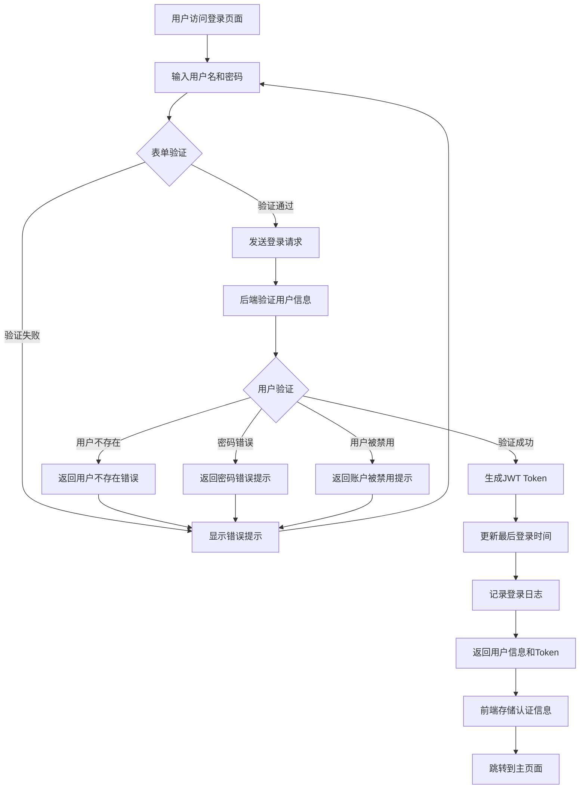

#### 2.1.3 业务规则定义

**输入验证规则：**

* 用户名：必填，不能为空或仅包含空格

* 密码：必填，不能为空或仅包含空格

* 输入长度限制：用户名最大50字符，密码最大100字符

**安全规则：**

* 密码使用bcrypt加密存储

* JWT Token有效期为24小时

* 登录失败不显示具体失败原因（统一显示"用户名或密码错误"）

* 记录所有登录尝试的审计日志

**权限规则：**

* BOSS角色：拥有所有功能权限

* EMPLOYEE角色：拥有基础操作权限，部分功能受限

* 用户状态为inactive时禁止登录

#### 2.1.4 异常处理流程

**网络异常：**

1. 前端检测网络连接失败
2. 显示"网络连接失败，请检查网络设置"提示
3. 提供重试按钮
4. 记录前端错误日志

**服务器异常：**

1. 后端返回500错误
2. 前端显示"服务器暂时不可用，请稍后重试"提示
3. 记录错误日志到后端
4. 可选择自动重试机制

**Token过期：**

1. 检测到Token过期
2. 自动清除本地存储
3. 重定向到登录页面
4. 显示"登录已过期，请重新登录"提示

### 2.2 用户登出流程

#### 2.2.1 业务场景描述

**业务目标：** 安全地结束用户会话，清除认证信息
**参与角色：** 已登录的系统用户
**前置条件：** 用户已成功登录系统
**后置条件：** 用户会话结束，返回登录页面

#### 2.2.2 详细流程步骤

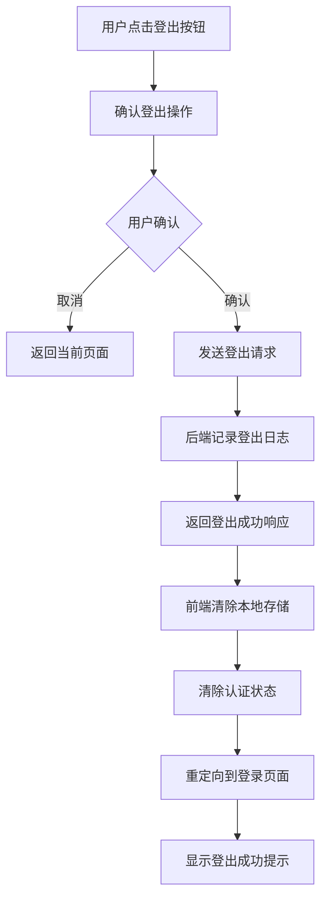

#### 2.2.3 业务规则定义

**登出规则：**

* 清除localStorage中的token和user信息

* 重置前端认证状态

* 记录登出操作的审计日志

* 即使后端接口失败，前端也要清除本地认证信息

### 2.3 Token验证流程

#### 2.3.1 业务场景描述

**业务目标：** 验证用户Token的有效性，确保会话安全
**触发时机：** 页面刷新、路由切换、API请求前
**参与角色：** 系统自动执行

#### 2.3.2 详细流程步骤

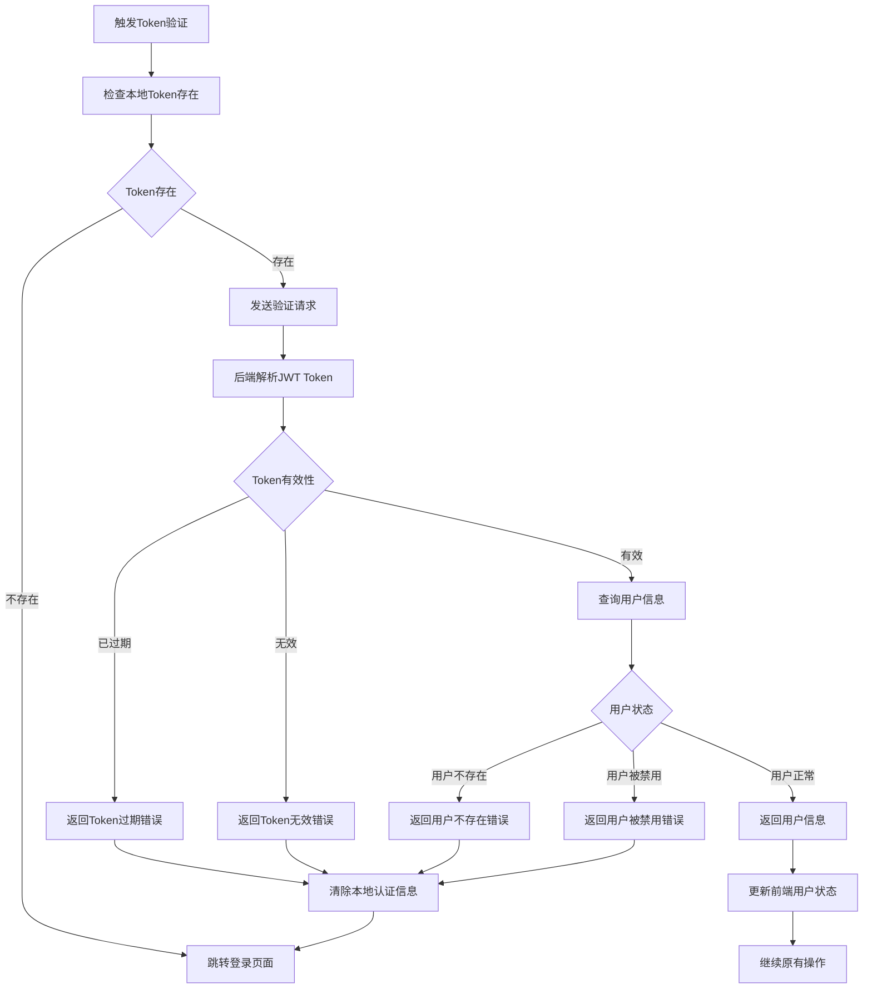

## 三、核心业务流程（复用现有Mermaid图，无修改）

### 3.1 采购录入流程（完整版）

**流程概述：** 用户通过采购录入页面创建新的采购记录，支持相机拍照、AI识别、供应商管理等功能

**参与角色：** 所有用户（BOSS、EMPLOYEE）

**前置条件：** 用户已登录系统

**技术依赖：**

* react-html5-camera-photo（相机功能）

* react-dropzone（文件上传）

* 豆包AI API（智能识别）

* 供应商管理API

**流程步骤：**

### 3.2 采购记录删除流程（业务约束验证）

#### 3.2.1 业务场景描述

**业务目标：** 安全地删除采购记录，确保数据完整性和业务约束
**参与角色：** 仅BOSS角色
**前置条件：** 用户已登录且具有BOSS权限
**后置条件：** 采购记录被删除，相关库存数据同步更新

#### 3.2.2 详细流程步骤

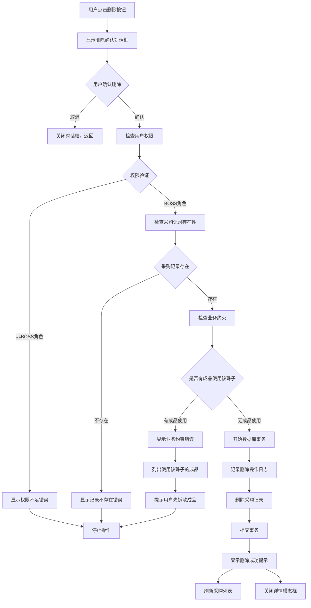

#### 3.2.3 业务规则定义

**权限规则：**

* 只有BOSS角色可以删除采购记录
* EMPLOYEE角色尝试删除时显示权限不足错误

**业务约束规则：**

* 如果采购记录的珠子被任何成品使用，则不能删除
* 系统会检查materialUsages表中的关联关系
* 必须先拆散使用该珠子的所有成品，使珠子回退到库存

**数据完整性规则：**

* 使用数据库事务确保删除操作的原子性
* 删除操作会同时清理相关库存数据
* 记录详细的审计日志，包括删除时间、操作人员、删除原因

**用户体验规则：**

* 删除前必须显示确认对话框
* 确认对话框显示采购记录的关键信息（产品名称、采购编号）
* 错误提示要清晰明确，告知用户具体的解决方案

#### 3.2.4 异常处理流程

**权限不足异常：**

1. 检测到非BOSS角色尝试删除
2. 返回403错误和权限不足提示
3. 前端显示"只有老板可以删除采购记录"错误
4. 记录权限违规尝试日志

**业务约束冲突异常：**

1. 检测到采购记录被成品使用
2. 返回400错误和详细的约束冲突信息
3. 前端显示友好的错误提示，包含：
   - 使用该珠子的成品列表
   - 每个成品使用的珠子数量
   - 解决方案指导（先拆散成品）
4. 错误提示持续8秒，确保用户有足够时间阅读

**系统错误异常：**

1. 数据库操作失败或其他系统错误
2. 回滚数据库事务
3. 返回500错误和通用错误提示
4. 记录详细的错误日志供技术人员排查

#### 3.2.5 前端错误处理优化

**避免重复提示机制：**

* errorHandler已经自动处理API错误并显示toast提示
* 组件的catch块只处理非HTTP响应错误（如网络连接问题）
* 避免在catch块中重复显示相同的错误信息

**错误提示分类：**

* 权限错误：显示权限相关的友好提示
* 业务约束错误：显示详细的业务规则说明和解决方案
* 网络错误：显示网络连接相关的提示和重试建议
* 系统错误：显示通用的系统错误提示

#### 3.1.1 页面初始化

* 用户点击导航栏"采购录入"按钮

* 系统加载采购录入表单

* 初始化表单默认值

* 检查相机兼容性和权限

* 加载供应商列表（如有权限）

* 从localStorage恢复未完成的表单数据

#### 3.1.2 图片采集（多种方式）

**方式一：相机拍照**

```typescript
// 相机兼容性检查流程
1. 检查浏览器是否支持getUserMedia
2. 检查HTTPS环境（生产环境必需）
3. 开发环境下放宽HTTPS限制
4. 显示相机错误边界组件（如不支持）

// 拍照上传流程
1. 点击"拍照"按钮启动相机
2. 用户拍照获得dataUri
3. 将dataUri转换为Blob对象
4. 构建FormData并调用上传API
5. 上传成功后更新photos状态
6. 自动关闭相机界面
```

**方式二：文件上传**

```typescript
// Dropzone配置
- 支持格式：image/jpeg, image/jpg, image/png, image/webp
- 最大文件大小：10MB
- 最多上传：10张图片
- 文件验证：类型检查、大小限制
```

### 3.2 采购列表查询与筛选流程

#### 3.2.1 业务场景描述

**业务目标：** 为用户提供高效的采购数据查询和筛选功能，支持多维度筛选、智能排序、跨页状态保持
**参与角色：** 所有用户（BOSS、EMPLOYEE），权限控制敏感字段显示
**前置条件：** 用户已登录系统，存在采购数据
**后置条件：** 用户获得符合条件的采购数据列表

#### 3.2.2 页面初始化流程

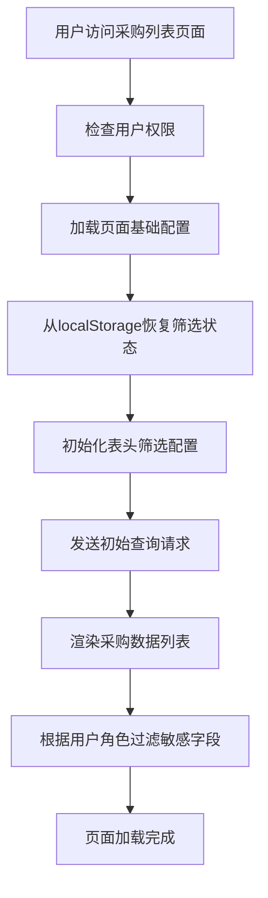

**初始化步骤详解：**

1. **权限检查**：验证用户登录状态和角色权限
2. **配置加载**：加载产品类型、品相等枚举配置
3. **状态恢复**：从localStorage恢复上次的筛选条件
4. **筛选器初始化**：配置6种筛选类型的表头筛选器
5. **数据查询**：使用默认或恢复的筛选条件查询数据
6. **权限过滤**：根据用户角色隐藏敏感价格字段

#### 3.2.3 表头筛选操作流程

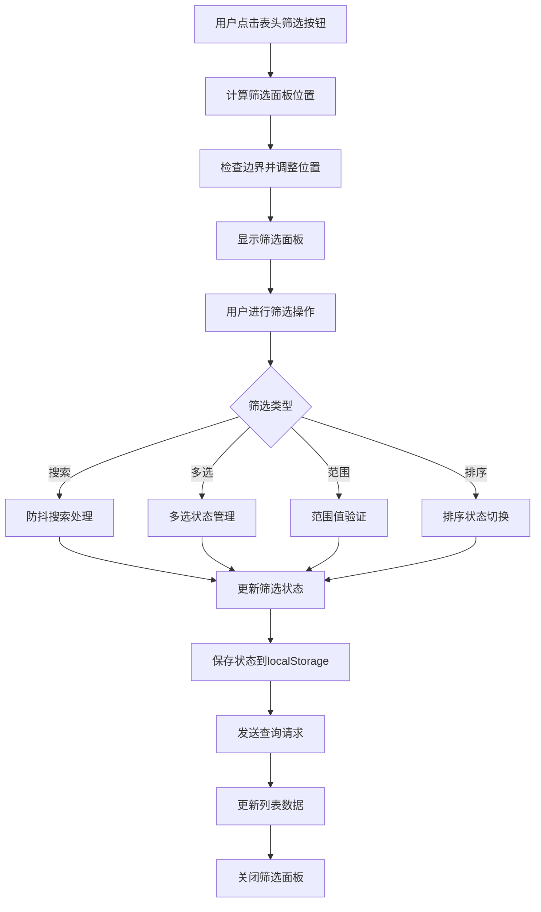

**筛选类型处理逻辑：**

| 筛选类型         | 处理逻辑      | 特殊处理              |
| ------------ | --------- | ----------------- |
| search       | 300ms防抖搜索 | 搜索产品名称、供应商、备注     |
| multiSelect  | 多选状态管理    | 空数组表示全选状态         |
| range        | 范围值验证     | 最小值不能大于最大值        |
| sort         | 排序状态切换    | asc/desc/none三态切换 |
| select       | 单选状态管理    | 支持清空选择            |
| sortAndRange | 复合筛选      | 同时支持排序和范围筛选       |

#### 3.2.4 多维度筛选业务规则

**产品类型筛选：**

* 支持多选：LOOSE\_BEADS、BRACELET、ACCESSORIES、FINISHED

* 空数组表示显示所有类型（全选状态）

* 前端UI正确显示全选/部分选择状态

**品相筛选：**

* 支持多选：AA、A、AB、B、C、未知

* "未知"选项映射为数据库null值

* 查询逻辑：`quality IN ('AA', 'AB') OR quality IS NULL`

**供应商筛选：**

* 支持多选和模糊搜索

* 基于全部数据而非当前页数据

* 单选时使用模糊匹配：`LIKE '%keyword%'`

* 多选时使用精确匹配：`IN (list)`

**规格筛选：**

* 同时应用到bead\_diameter和specification字段

* 查询逻辑：`(bead_diameter BETWEEN min AND max) OR (specification BETWEEN min AND max)`

* 确保所有产品类型都能被正确筛选

**数量筛选：**

* 根据产品类型动态选择字段

* 手串使用quantity字段，其他使用piece\_count字段

* 查询逻辑：`(product_type = 'BRACELET' AND quantity BETWEEN min AND max) OR (product_type != 'BRACELET' AND piece_count BETWEEN min AND max)`

**价格筛选：**

* 克价筛选：null值视为0处理

* 查询逻辑：`COALESCE(price_per_gram, 0) BETWEEN min AND max`

* 总价筛选：标准范围查询

**日期筛选：**

* 开始日期自动设置为当天00:00:00

* 结束日期自动设置为当天23:59:59

* 支持日期范围选择

#### 3.2.5 智能排序业务流程

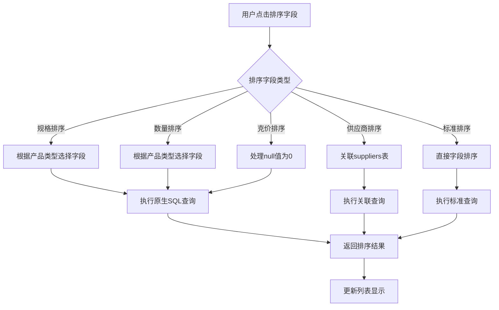

**智能排序规则：**

* **规格排序**：散珠/手串按bead\_diameter，饰品配件/成品按specification

* **数量排序**：手串按quantity，其他按piece\_count

* **克价排序**：使用COALESCE(price\_per\_gram, 0)处理null值

* **供应商排序**：JOIN suppliers表按name排序

#### 3.2.6 跨页筛选状态保持

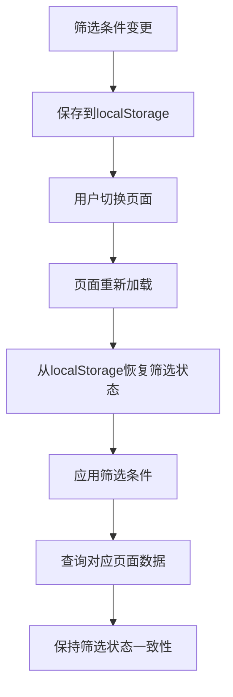

### 3.3 采购记录编辑业务流程

#### 3.3.1 业务场景描述

**业务目标：** 允许授权用户修改已录入的采购记录，确保数据准确性和完整性
**参与角色：** BOSS角色（具有编辑权限），EMPLOYEE角色（仅查看权限）
**前置条件：** 用户已登录系统，采购记录已存在
**后置条件：** 采购记录更新成功，生成修改历史记录

**核心功能：**
- 支持所有产品类型的字段编辑
- 实时字段变更检测
- 自动记录修改历史
- 供应商自动创建
- 派生字段自动计算
- 权限控制和字段验证

#### 3.3.2 编辑权限验证流程

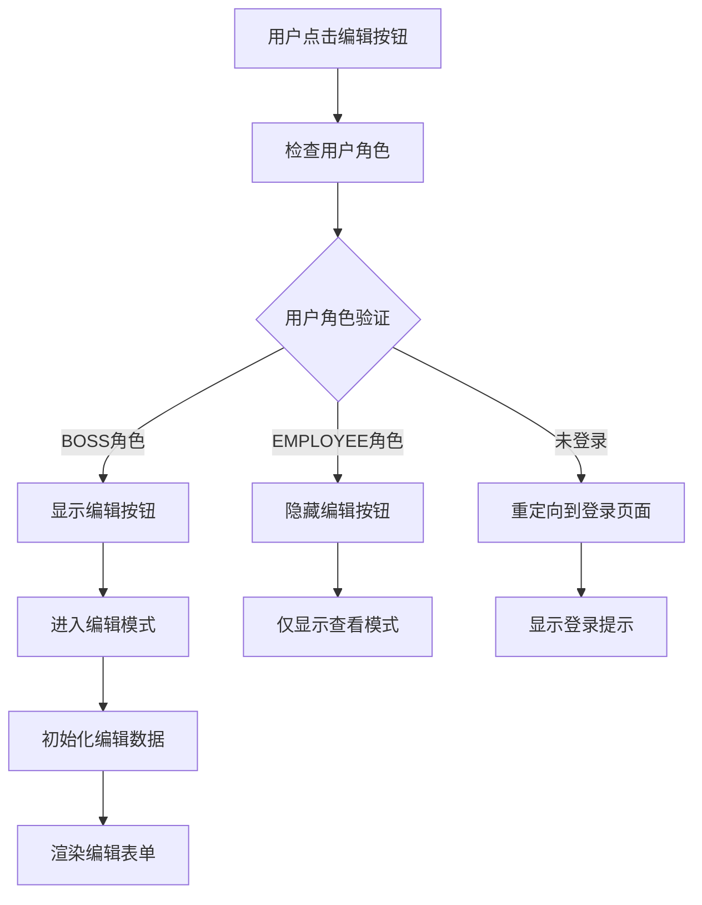

**权限控制规则：**
- **BOSS角色**：拥有完整编辑权限，可修改所有字段
- **EMPLOYEE角色**：仅查看权限，敏感价格字段显示为"-"
- **未登录用户**：自动重定向到登录页面

#### 3.3.3 编辑模式初始化流程

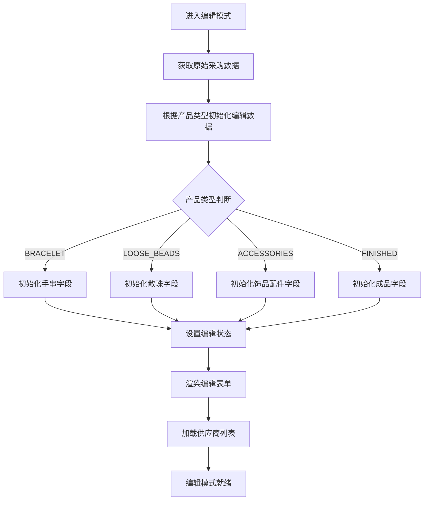

**编辑数据初始化逻辑：**

```typescript
// 基础数据初始化
const baseData = {
  product_name: purchase.product_name || '',
  quality: purchase.quality || '',
  price_per_gram: purchase.price_per_gram || 0,
  total_price: purchase.total_price || 0,
  weight: purchase.weight || 0,
  supplier_name: purchase.supplier?.name || '',
  notes: purchase.notes || ''
};

// 根据产品类型添加特定字段
if (purchase.product_type === 'BRACELET') {
  // 手串：quantity, bead_diameter, beads_per_string, total_beads
  editData = {
    ...baseData,
    quantity: purchase.quantity || undefined,
    bead_diameter: purchase.bead_diameter || undefined,
    beads_per_string: purchase.beads_per_string || undefined,
    total_beads: purchase.total_beads || undefined
  };
} else {
  // 其他类型：piece_count + 对应规格字段
  editData = {
    ...baseData,
    piece_count: purchase.piece_count || undefined
  };
  
  if (purchase.product_type === 'LOOSE_BEADS') {
    editData.bead_diameter = purchase.bead_diameter || undefined;
  } else if (['ACCESSORIES', 'FINISHED'].includes(purchase.product_type)) {
    editData.specification = purchase.specification || undefined;
  }
}
```

#### 3.3.4 字段变更检测与验证流程

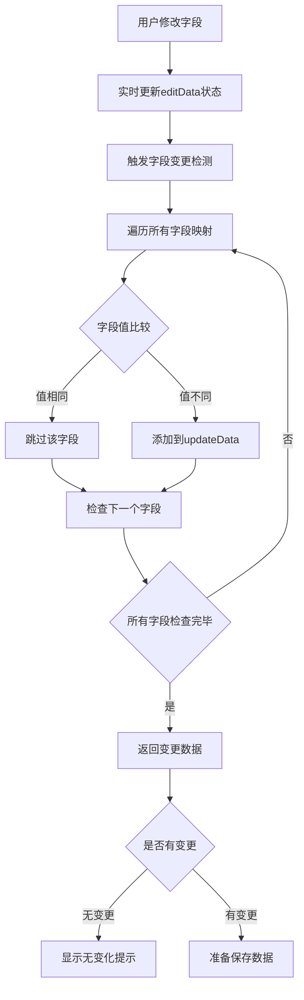

**字段变更检测逻辑：**

```typescript
const detectFieldChanges = (editData: any, originalPurchase: Purchase) => {
  const updateData: any = {};
  
  // 字段映射配置
  const fieldMappings = [
    { edit: 'product_name', original: 'product_name' },
    { edit: 'quantity', original: 'quantity' },
    { edit: 'piece_count', original: 'piece_count' },
    { edit: 'bead_diameter', original: 'bead_diameter' },
    { edit: 'specification', original: 'specification' },
    { edit: 'quality', original: 'quality' },
    { edit: 'price_per_gram', original: 'price_per_gram' },
    { edit: 'total_price', original: 'total_price' },
    { edit: 'weight', original: 'weight' },
    { edit: 'beads_per_string', original: 'beads_per_string' },
    { edit: 'total_beads', original: 'total_beads' },
    { edit: 'notes', original: 'notes' },
    { edit: 'supplier_name', original: (p: Purchase) => p.supplier?.name || '' }
  ];
  
  // 检测变更
  fieldMappings.forEach(({ edit, original }) => {
    if (editData[edit] !== undefined) {
      const originalValue = typeof original === 'function' 
        ? original(originalPurchase) 
        : originalPurchase[original];
      
      if (editData[edit] !== originalValue) {
        updateData[edit] = editData[edit];
      }
    }
  });
  
  return updateData;
};
```

#### 3.3.5 后端数据处理流程

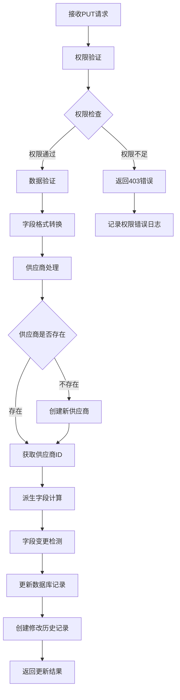

**后端处理关键步骤：**

1. **权限验证**：确保只有BOSS角色可以执行更新操作
2. **数据验证**：使用Zod schema验证请求数据格式
3. **字段转换**：snake_case转换为camelCase
4. **供应商处理**：自动查找或创建供应商记录
5. **派生字段计算**：自动计算totalBeads、pricePerBead、unitPrice等
6. **变更检测**：记录具体的字段变更内容
7. **历史记录**：创建详细的修改历史记录

#### 3.3.6 派生字段自动计算逻辑（重要架构变更）

**架构变更说明：**

系统已从前端实时计算改为后端计算并存储的架构。所有价格相关的派生字段现在都在后端完成计算并直接存储到数据库中。

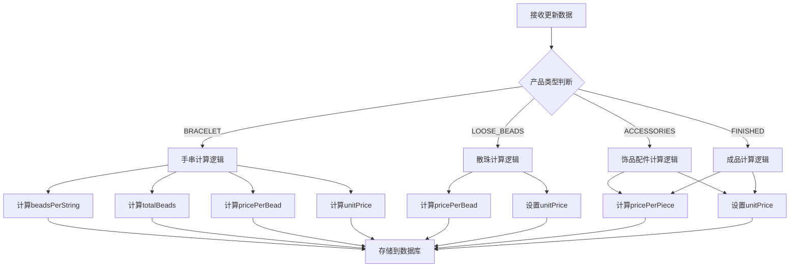

**详细计算规则：**

**手串类型（BRACELET）计算逻辑：**

```typescript
if (product_type === 'BRACELET') {
  // 1. 计算每串颗数（基于160mm标准周长）
  if (bead_diameter) {
    beadsPerString = Math.floor(160 / bead_diameter);
  }
  
  // 2. 计算总颗数
  if (quantity && beadsPerString) {
    totalBeads = quantity * beadsPerString;
  }
  
  // 3. 计算每颗价格
  if (total_price && totalBeads) {
    pricePerBead = total_price / totalBeads;
  }
  
  // 4. 计算每串单价
  if (total_price && quantity) {
    unitPrice = total_price / quantity;
  }
}
```

**散珠类型（LOOSE_BEADS）计算逻辑：**

```typescript
if (product_type === 'LOOSE_BEADS') {
  // 1. 计算每颗价格
  if (piece_count && total_price) {
    pricePerBead = total_price / piece_count;
    unitPrice = pricePerBead; // 散珠的单价就是每颗价格
  }
}
```

**饰品配件类型（ACCESSORIES）计算逻辑：**

```typescript
if (product_type === 'ACCESSORIES') {
  // 1. 计算每片价格
  if (piece_count && total_price) {
    pricePerPiece = total_price / piece_count;
    unitPrice = pricePerPiece; // 饰品配件的单价就是每片价格
  }
}
```

**成品类型（FINISHED）计算逻辑：**

```typescript
if (product_type === 'FINISHED') {
  // 1. 计算每件价格
  if (piece_count && total_price) {
    pricePerPiece = total_price / piece_count;
    unitPrice = pricePerPiece; // 成品的单价就是每件价格
  }
}
```

**计算字段存储规范：**

| 字段名 | 数据类型 | 精度 | 计算时机 | 存储说明 |
|--------|----------|------|----------|----------|
| `pricePerBead` | DECIMAL(10,4) | 4位小数 | 录入/更新时 | 每颗价格，适用于散珠和手串 |
| `pricePerPiece` | DECIMAL(10,4) | 4位小数 | 录入/更新时 | 每片/件价格，适用于饰品配件和成品 |
| `unitPrice` | DECIMAL(10,1) | 1位小数 | 录入/更新时 | 通用单价字段，所有类型都有 |
| `beadsPerString` | INT | 整数 | 录入/更新时 | 每串颗数，仅手串类型 |
| `totalBeads` | INT | 整数 | 录入/更新时 | 总颗数，仅手串类型 |

**架构优势：**

1. **数据一致性**：避免前端计算误差，确保数据准确性
2. **性能提升**：减少前端计算负担，提高页面响应速度
3. **数据完整性**：计算结果持久化存储，不会因页面刷新丢失
4. **查询效率**：支持基于计算字段的排序和筛选操作
5. **维护便利**：计算逻辑集中在后端，便于统一维护和更新    C --> E[计算totalBeads]
    E --> F[计算pricePerBead]
    F --> G[计算unitPrice]
    D --> H[计算unitPrice]
    G --> I[保存计算结果]
    H --> I
    I --> J[返回完整数据]
```

**total_beads字段特殊处理：**

```typescript
// 优先级处理逻辑
let totalBeads;
if (validatedData.total_beads !== undefined) {
  // 1. 优先使用用户手动设置的值
  totalBeads = validatedData.total_beads;
} else if (existingPurchase.totalBeads !== null) {
  // 2. 保持数据库现有值
  totalBeads = existingPurchase.totalBeads;
} else if (validatedData.quantity && validatedData.beads_per_string) {
  // 3. 自动计算：数量 × 每串珠子数
  totalBeads = validatedData.quantity * validatedData.beads_per_string;
} else {
  totalBeads = null;
}
```

#### 3.3.7 修改历史记录生成流程

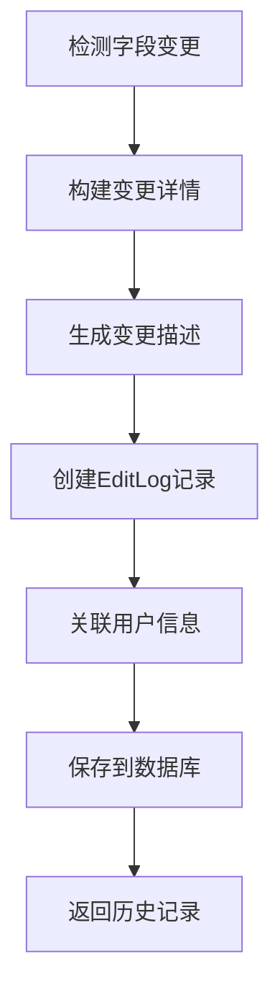

**修改历史记录结构：**

```typescript
interface EditLog {
  id: string;
  purchaseId: string;     // 关联的采购记录ID
  userId: string;         // 操作用户ID
  action: string;         // 操作类型：'UPDATE'
  details: string;        // 变更详情描述
  changedFields: any;     // 变更字段的JSON数据
  createdAt: Date;        // 创建时间
  
  // 关联数据
  user: {
    id: string;
    name: string;
    username: string;
  };
}
```

**变更详情生成逻辑：**

```typescript
// 生成人性化的变更描述
const generateChangeDetails = (fieldChanges: any, userName: string) => {
  const changes = [];
  
  Object.entries(fieldChanges).forEach(([field, change]: [string, any]) => {
    const fieldName = getFieldDisplayName(field);
    const oldValue = formatFieldValue(field, change.oldValue);
    const newValue = formatFieldValue(field, change.newValue);
    
    changes.push(`${fieldName}：${oldValue} → ${newValue}`);
  });
  
  return `${userName} 修改了 ${changes.join('、')}`;
};
```

#### 3.3.8 前端保存处理流程

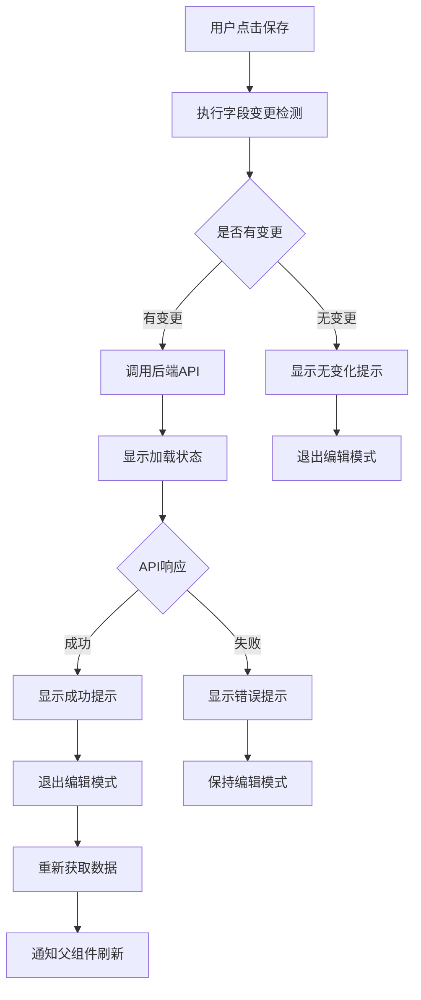

**保存处理关键步骤：**

1. **变更检测**：比较editData与原始数据的差异
2. **数据验证**：前端基础验证（必填字段、数据格式等）
3. **API调用**：发送PUT请求到后端
4. **状态管理**：管理loading、error等状态
5. **成功处理**：提示成功、退出编辑模式、刷新数据
6. **错误处理**：显示具体错误信息、保持编辑状态

#### 3.3.9 错误处理与异常流程

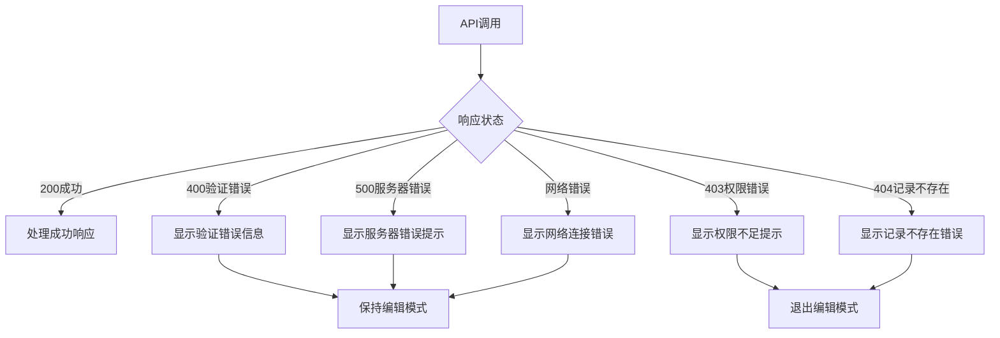

**错误处理策略：**

```typescript
// 错误处理逻辑
try {
  const response = await purchaseApi.update(purchase.id, updateData);
  if (response.success) {
    // 成功处理
    toast.success('保存成功');
    setIsEditMode(false);
    await fetchPurchaseDetail();
    onSave?.();
  } else {
    // 业务错误
    toast.error(response.message || '保存失败');
  }
} catch (error: any) {
  // 网络或系统错误
  if (error.response?.status === 403) {
    toast.error('权限不足，无法编辑此记录');
    setIsEditMode(false);
  } else if (error.response?.status === 404) {
    toast.error('采购记录不存在');
    setIsEditMode(false);
  } else if (error.response?.data?.message) {
    toast.error(error.response.data.message);
  } else {
    toast.error('保存失败，请重试');
  }
}
```

#### 3.3.10 业务规则与约束

**数据完整性约束：**
- 产品名称不能为空
- 总价必须大于0
- 珠子直径范围：4-50mm
- 供应商名称不能为空

**业务逻辑约束：**
- 只有BOSS角色可以编辑采购记录
- 编辑操作必须记录修改历史
- 供应商不存在时自动创建
- 派生字段自动计算更新

**数据一致性保证：**
- 使用数据库事务确保数据一致性
- 字段变更检测确保只更新实际变化的字段
- 修改历史记录与主记录更新在同一事务中

**性能优化策略：**
- 只传输变更的字段数据
- 前端防抖处理用户输入
- 后端批量处理相关计算
- 缓存供应商列表减少查询

**状态保持规则：**

* 筛选条件保存到localStorage

* 页面刷新后自动恢复筛选状态

* 分页切换保持筛选条件不变

* 清除筛选时同步清除localStorage

#### 3.2.7 权限控制流程

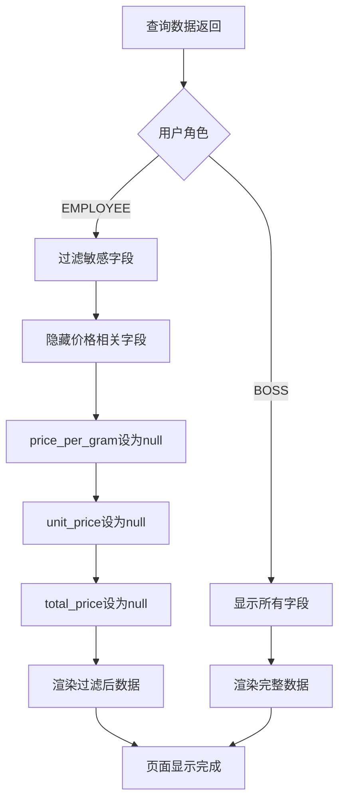

**权限控制规则：**

* **BOSS角色**：可查看所有字段，包括价格信息

* **EMPLOYEE角色**：隐藏敏感价格字段

* **敏感字段**：price\_per\_gram、unit\_price、total\_price

* **过滤方式**：后端API响应时根据用户角色过滤字段

#### 3.2.8 性能优化流程

**防抖搜索：**

* 搜索输入300ms防抖处理

* 避免频繁API请求

* 提供搜索清除功能

**分页优化：**

* 默认每页10条，最大100条

* 支持游标分页优化大数据量

* 分离统计查询避免性能影响

**缓存策略：**

* 供应商列表缓存30分钟

* 枚举配置内存缓存

* 筛选结果缓存5分钟

#### 3.2.9 异常处理流程

**网络异常：**

1. 检测网络连接失败
2. 显示网络错误提示
3. 提供重试按钮
4. 保持当前筛选状态

**数据异常：**

1. API返回错误响应
2. 显示具体错误信息
3. 记录错误日志
4. 提供刷新页面选项

**筛选异常：**

1. 筛选参数验证失败
2. 重置为默认筛选条件
3. 显示参数错误提示
4. 清除localStorage中的异常状态

* 文件大小限制：10MB

* 最大文件数：10张

* 支持拖拽和点击上传

// 上传处理流程

1. 文件验证（格式、大小）
2. 读取文件为Base64格式
3. 存储到fileDataList状态
4. 转换为Blob并上传
5. 更新photos状态显示预览
6. 错误处理和状态清理

````

#### 3.1.3 AI智能识别（可选）

**豆包AI识别流程：**
```typescript
// 输入处理
1. 用户输入自然语言采购描述
2. 验证输入不为空
3. 设置aiParsing状态为true

// AI调用
1. 调用aiApi.parse_crystal_purchase接口
2. 传递description参数
3. 等待AI解析结果

// 结果处理
1. 接收AI返回的结构化数据
2. 执行字段映射（camelCase -> snake_case）：
   - productName -> product_name
   - productType -> product_type
   - beadDiameter -> bead_diameter
   - pricePerGram -> price_per_gram
   - totalPrice -> total_price
   - supplierName -> supplier_name
   等等...
3. 自动填充表单字段
4. 触发价格计算逻辑
5. 显示识别成功提示
````

**AI识别字段映射表：**

| AI字段          | 表单字段             | 说明       |
| ------------- | ---------------- | -------- |
| productName   | product\_name    | 产品名称     |
| productType   | product\_type    | 产品类型     |
| unitType      | unit\_type       | 单位类型     |
| beadDiameter  | bead\_diameter   | 珠子直径     |
| specification | specification    | 规格       |
| quantity      | quantity         | 数量（串数）   |
| pieceCount    | piece\_count     | 颗数/片数/件数 |
| pricePerGram  | price\_per\_gram | 克价       |
| totalPrice    | total\_price     | 总价       |
| weight        | weight           | 重量       |
| quality       | quality          | 品相       |
| supplierName  | supplier\_name   | 供应商名称    |
| notes         | notes            | 备注       |

#### 3.1.4 产品信息录入

**产品类型配置：**

```typescript
// 产品类型枚举
type ProductType = 'LOOSE_BEADS' | 'BRACELET' | 'ACCESSORIES' | 'FINISHED';

// 单位类型映射
const unitTypeMapping = {
  LOOSE_BEADS: 'PIECES',    // 散珠 -> 颗
  BRACELET: 'STRINGS',      // 手串 -> 条
  ACCESSORIES: 'SLICES',    // 饰品配件 -> 片
  FINISHED: 'ITEMS'         // 成品 -> 件
};
```

**字段显示规则：**

* **散珠（LOOSE\_BEADS）**：

  * 必填：product\_name, bead\_diameter, piece\_count, total\_price, supplier\_name

  * 可选：price\_per\_gram, weight, quality

  * 计算：price\_per\_bead = total\_price / piece\_count

* **手串（BRACELET）**：

  * 必填：product\_name, bead\_diameter, quantity, supplier\_name

  * 价格：price\_per\_gram, total\_price, weight（三选二）

  * 计算：beads\_per\_string = 160 / bead\_diameter, total\_beads = quantity \* beads\_per\_string

* **饰品配件（ACCESSORIES）**：

  * 必填：product\_name, specification, piece\_count, total\_price, supplier\_name

  * 可选：quality

  * 计算：unit\_price = total\_price / piece\_count

* **成品（FINISHED）**：

  * 必填：product\_name, specification, piece\_count, total\_price, supplier\_name

  * 可选：quality

  * 计算：unit\_price = total\_price / piece\_count

#### 3.1.5 价格计算逻辑

**自动计算规则：**

```typescript
// 三选二计算逻辑（主要用于手串）
function calculateMissingValue(pricePerGram, totalPrice, weight) {
  if (pricePerGram && totalPrice && !weight) {
    // 已知克价和总价，计算重量
    weight = totalPrice / pricePerGram;
  } else if (pricePerGram && weight && !totalPrice) {
    // 已知克价和重量，计算总价
    totalPrice = pricePerGram * weight;
  } else if (totalPrice && weight && !pricePerGram) {
    // 已知总价和重量，计算克价
    pricePerGram = totalPrice / weight;
  }
}

// 防抖计算（300ms延迟）
const debouncedCalculate = debounce(calculateMissingValue, 300);
```

#### 3.1.6 供应商管理流程

**供应商加载：**

```typescript
// 权限检查
if (user?.role === 'BOSS') {
  // 加载完整供应商列表
  loadSuppliers();
} else {
  // 员工角色限制访问
  console.log('员工角色无法访问供应商功能');
}

// 数据去重逻辑
const uniqueSuppliers = suppliers.reduce((acc, current) => {
  const existingIndex = acc.findIndex(item => {
    if (current.id && item.id) {
      return item.id === current.id; // 按ID去重
    }
    return item.name === current.name; // 按名称去重
  });
  
  if (existingIndex === -1) {
    acc.push(current);
  }
  return acc;
}, []);
```

**供应商选择交互：**

```typescript
// 输入处理（防抖搜索）
const handleSupplierInputChange = useCallback(
  debounce((value: string) => {
    const filtered = suppliers.filter(supplier =>
      supplier.name.toLowerCase().includes(value.toLowerCase())
    );
    setFilteredSuppliers(filtered);
    setShowDropdown(value.length > 0 && filtered.length > 0);
  }, 300),
  [suppliers]
);

// 下拉框延迟隐藏
const handleSupplierBlur = () => {
  setTimeout(() => {
    setShowDropdown(false);
  }, 300);
};
```

**新供应商创建：**

```typescript
// 创建流程
1. 检测输入的供应商名称不在现有列表中
2. 调用supplierApi.create创建新供应商
3. 更新本地suppliers状态
4. 自动选择新创建的供应商
5. 显示创建成功提示
```

#### 3.1.7 表单验证与提交

**验证规则：**

```typescript
// 通用验证
const validateCommonFields = () => {
  if (!formData.product_name?.trim()) {
    return '请输入产品名称';
  }
  if (photos.length === 0) {
    return '请至少上传一张图片';
  }
  if (!formData.supplier_name?.trim()) {
    return '请输入供应商名称';
  }
  return null;
};

// 产品类型特定验证
const validateByProductType = (productType) => {
  switch (productType) {
    case 'LOOSE_BEADS':
      return validateLooseBeads();
    case 'BRACELET':
      return validateBracelet();
    case 'ACCESSORIES':
    case 'FINISHED':
      return validateAccessoriesOrFinished();
    default:
      return '请选择产品类型';
  }
};
```

**提交流程：**

```typescript
// 提交前检查
1. 执行表单验证
2. 检查供应商是否存在，不存在则先创建
3. 确认所有图片上传完成
4. 设置submitting状态

// 数据构建
1. 收集表单数据
2. 添加图片URL数组
3. 添加AI识别结果（如有）
4. 添加用户ID和时间戳

// API调用
1. 调用purchaseApi.create接口
2. 传递完整的采购数据
3. 处理响应结果

// 成功处理
1. 显示成功提示
2. 重置表单状态
3. 清除图片数据
4. 清理localStorage
5. 可选择继续录入或返回列表
```

#### 3.1.8 状态管理与持久化

**关键状态：**

```typescript
interface PurchaseEntryState {
  // 表单数据
  formData: PurchaseFormData;
  
  // 图片相关
  photos: string[];
  fileDataList: FileData[];
  
  // 加载状态
  uploading: boolean;
  aiParsing: boolean;
  submitting: boolean;
  loadingSuppliers: boolean;
  creatingSupplier: boolean;
  
  // 供应商相关
  suppliers: Supplier[];
  supplierInput: string;
  showSupplierDropdown: boolean;
  filteredSuppliers: Supplier[];
  
  // 相机相关
  cameraActive: boolean;
  cameraSupported: boolean;
}
```

**本地存储策略：**

```typescript
// 防抖保存到localStorage
const debouncedSaveToStorage = useCallback(
  debounce((photos: string[]) => {
    if (photos.length > 0) {
      localStorage.setItem('purchase_entry_photos', JSON.stringify(photos));
    } else {
      localStorage.removeItem('purchase_entry_photos');
    }
  }, 500),
  []
);

// 页面加载时恢复数据
useEffect(() => {
  const savedPhotos = localStorage.getItem('purchase_entry_photos');
  if (savedPhotos) {
    try {
      const parsedPhotos = JSON.parse(savedPhotos);
      setPhotos(parsedPhotos);
    } catch (error) {
      console.error('恢复图片数据失败:', error);
    }
  }
}, []);
```

**异常处理策略：**

* **网络异常**：智能重试机制，最多3次

* **相机权限拒绝**：降级到文件上传模式

* **AI识别失败**：提示手动输入，不阻断流程

* **图片上传失败**：显示具体错误，支持重新上传

* **供应商创建失败**：提示错误，允许重试

* **表单提交失败**：保留表单数据，支持重新提交

### 3.1.9 采购录入流程图

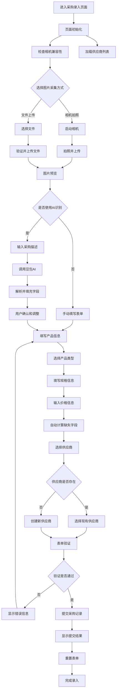

### 3.1.10 原有采购录入流程（简化版）

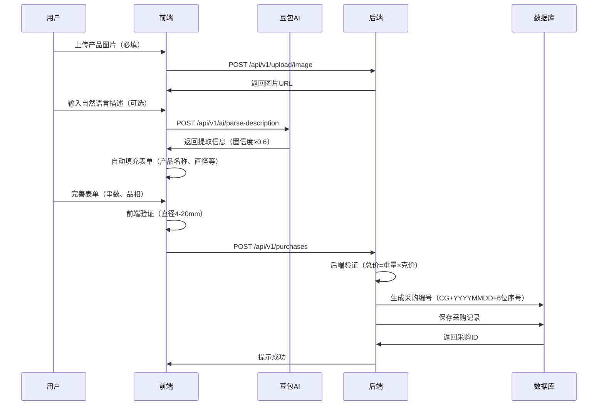

### 3.2 成品销毁流程（提取自《业务流程文档》6.3）

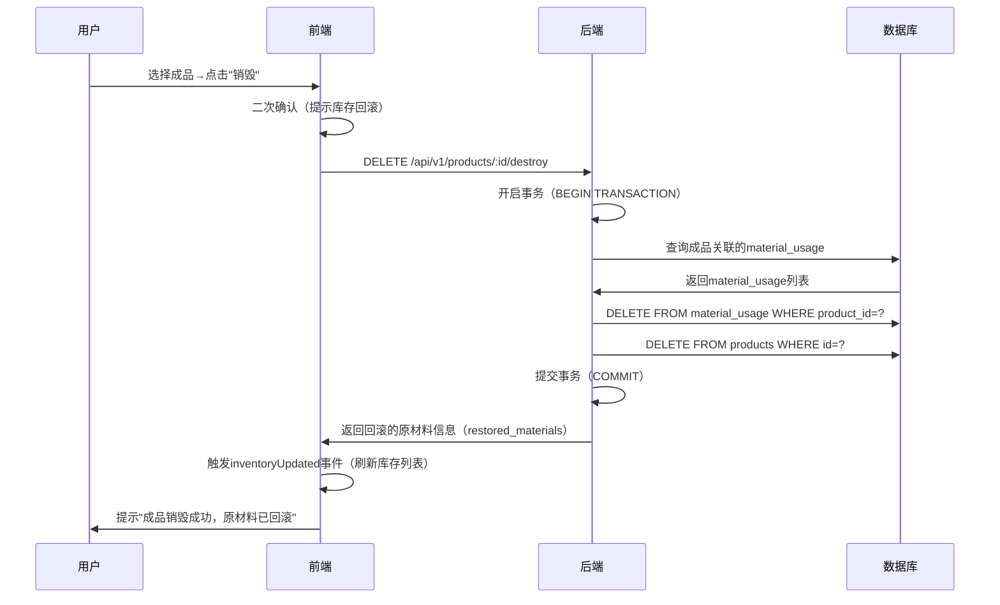

## 二、核心业务规则（提取自《业务流程文档》11章）

### 2.1 采购编号生成规则

* **格式**：CG + YYYYMMDD + 6位序号（如 CG20241001000001）

* **序号**：每日重置（从 000001 开始）

* **生成逻辑**：数据库函数generate\_purchase\_code()（提取自《数据库设计文档》6.2）

### 2.2 库存计算规则

* **核心公式**：剩余颗数 = 采购总颗数（total\_beads） - 已使用颗数（SUM(material\_usage.quantity\_used\_beads)）

* **触发时机**：采购创建、成品制作、成品销毁

* **单位统一**：库存仅显示 "颗数"，串数需通过 "颗数 ÷ 每串颗数" 换算（提取自《业务流程文档》5.1）

### 2.3 权限规则（统一现有逻辑）

| 业务操作   | 老板权限           | 雇员权限              | 来源文档           |
| ------ | -------------- | ----------------- | -------------- |
| 采购录入   | 可查看成本字段（克价、总价） | 不可查看成本字段，仅能录入基础信息 | 《业务流程文档》1.2    |
| 批量导入   | 支持（采购/成品）      | 禁止                | 《业务流程文档》1.2    |
| 供应商管理  | 查看/编辑/统计       | 完全不可见             | 《业务流程文档》4.2    |
| 库存查看   | 查看供应商名称、每颗单价   | 隐藏供应商名称、每颗单价      | 《API接口规范文档》5.1 |
| AI助理对话 | 可使用业务洞察功能      | 仅可使用基础对话功能        | 《API接口规范文档》2.4 |
| 智能识别   | 完整功能           | 完整功能              | 《API接口规范文档》2.4 |

## 三、新增业务流程

### 3.1 供应商管理流程（权限控制）

#### 3.1.1 供应商权限验证流程

```mermaid
sequenceDiagram
    participant U as 用户
    participant F as 前端
    participant B as 后端
    participant D as 数据库
    
    U->>F: 访问采购录入页面
    F->>F: 检查用户权限（useAuth）
    F->>B: GET /api/v1/suppliers
    
    alt 用户角色为BOSS
        B->>D: 查询所有供应商（limit=1000）
        D->>B: 返回完整供应商列表
        B->>F: 返回供应商数据
        F->>F: 显示供应商下拉框
        F->>U: 允许选择和创建供应商
    else 用户角色为EMPLOYEE
        B->>F: 返回403权限不足
        F->>F: 隐藏供应商相关功能
        F->>U: 显示权限提示信息
    end
```

#### 3.1.2 供应商信息录入

* 供应商基本信息填写

* 联系方式验证

* 信用评级设置

#### 3.1.3 供应商选择交互优化

* 输入供应商名称实时筛选（300ms防抖）

* 显示匹配的供应商列表

* 点击选择供应商自动填充表单

* 隐藏下拉框（300ms延迟）

### 3.2 数据验证流程

#### 3.2.1 采购数据验证

* 供应商信息验证

* 产品规格验证

* 价格合理性检查

* 重复采购检测

#### 3.2.2 成品数据验证

* 原料库存充足性验证

* 成品规格合理性检查

* 制作数量限制验证

#### 3.2.3 供应商数据一致性验证流程

```mermaid
sequenceDiagram
    participant F as 前端
    participant B as 后端
    participant D as 数据库
    
    F->>B: POST /api/v1/suppliers
    B->>B: 验证供应商名称格式
    B->>D: 检查名称唯一性（忽略大小写）
    
    alt 名称已存在
        D->>B: 返回重复记录
        B->>F: 返回400错误（DUPLICATE_SUPPLIER_NAME）
        F->>F: 显示错误提示
    else 名称唯一
        B->>D: 创建新供应商记录
        D->>B: 返回供应商ID
        B->>F: 返回创建成功
        F->>F: 刷新供应商列表
        F->>F: 记录数据一致性日志
    end
    
    Note over F,D: 数据去重逻辑
    F->>F: 按供应商ID去重（优先）
    F->>F: ID为空时按名称去重
    F->>F: 记录去重统计信息
```

### 3.3 AI智能识别流程

```mermaid
sequenceDiagram
    participant U as 用户
    participant F as 前端
    participant AI as 豆包AI服务
    participant B as 后端
    
    U->>F: 输入自然语言描述
    F->>F: 验证输入长度（≤2000字符）
    F->>B: POST /api/v1/ai/parse-description
    B->>AI: 调用豆包AI API
    AI->>B: 返回解析结果（含置信度）
    B->>B: 验证置信度（≥0.6）
    
    alt 置信度足够
        B->>F: 返回结构化数据
        F->>F: 自动填充表单字段
        F->>U: 显示识别结果，用户确认
    else 置信度不足
        B->>F: 返回错误信息
        F->>U: 提示"识别置信度较低，请手动填写"
    end
```

### 3.2 AI助理对话流程

```mermaid
sequenceDiagram
    participant U as 用户
    participant F as 前端
    participant B as 后端
    participant AI as 豆包AI服务
    participant D as 数据库
    
    U->>F: 输入业务问题
    F->>B: POST /api/v1/assistant/chat
    B->>B: 检查用户权限
    
    alt 基础对话（所有用户）
        B->>AI: 发送对话请求
        AI->>B: 返回回复内容
        B->>F: 返回助理回复
    else 业务洞察（仅老板）
        B->>D: 查询业务数据
        D->>B: 返回统计数据
        B->>AI: 发送数据分析请求
        AI->>B: 返回分析结果
        B->>F: 返回洞察报告
    end
    
    F->>U: 显示AI助理回复
```

### 3.3 网络环境自适应流程

```mermaid
sequenceDiagram
    participant F as 前端应用
    participant N as 网络检测
    participant API1 as 主API服务器
    participant API2 as 备用API服务器
    
    F->>N: 启动网络检测
    N->>N: 检测当前网络环境
    
    alt 公网环境
        N->>API1: 测试api.dorblecapital.com连通性
        API1->>N: 返回连接状态
        N->>F: 使用公网API地址
    else 局域网环境
        N->>N: 获取局域网IP
        N->>API2: 测试局域网IP:3001连通性
        API2->>N: 返回连接状态
        N->>F: 使用局域网API地址
    else 连接失败
        N->>N: 启动重试机制（最多2次）
        N->>N: 切换到备用IP地址
        N->>F: 更新API配置
    end
    
    F->>F: 缓存工作的IP地址

## 四、库存查询多视图业务流程（新增）

### 4.1 库存查询页面总体流程

#### 4.1.1 业务场景描述

**业务目标：** 提供多维度、多视图的库存查询功能，满足不同业务场景的查询需求
**参与角色：** 所有用户（BOSS、EMPLOYEE）
**前置条件：** 用户已登录系统，系统中存在库存数据
**后置条件：** 用户获得所需的库存信息，支持数据导出和进一步操作

#### 4.1.2 多视图切换流程

```mermaid
flowchart TD
    A[进入库存查询页面] --> B[页面初始化]
    B --> C[默认显示层级式视图]
    C --> D[用户选择视图类型]
    
    D --> E{视图类型选择}
    E -->|层级式视图| F[加载HierarchicalInventoryView]
    E -->|分组列表| G[加载GroupedInventoryView]
    E -->|半成品矩阵| H[加载SemiFinishedMatrixView]
    E -->|饰品配件| I[加载AccessoriesProductGrid]
    E -->|成品卡片| J[加载FinishedProductGrid]
    E -->|库存仪表盘| K[加载InventoryDashboard]
    
    F --> L[应用筛选条件]
    G --> L
    H --> L
    I --> L
    J --> L
    K --> L
    
    L --> M[调用对应API接口]
    M --> N[渲染视图内容]
    N --> O[用户交互操作]
    O --> P{是否切换视图}
    P -->|是| D
    P -->|否| Q[继续当前视图操作]
    Q --> O
```

### 4.2 层级式库存视图流程

#### 4.2.1 业务场景描述

**业务目标：** 以树形结构展示库存数据，支持按产品类型、品相、供应商等维度分层查看
**适用场景：** 需要了解库存整体结构和分布情况
**核心功能：** 节点展开/折叠、层级导航、统计信息展示

#### 4.2.2 层级式视图详细流程

```mermaid
sequenceDiagram
    participant U as 用户
    participant F as 前端
    participant B as 后端
    participant D as 数据库
    
    U->>F: 选择层级式视图
    F->>F: 设置默认筛选条件
    F->>B: GET /api/v1/inventory/hierarchical
    
    B->>D: 查询库存数据（按层级分组）
    D->>B: 返回分层数据结构
    B->>B: 构建树形数据结构
    B->>F: 返回hierarchical_data
    
    F->>F: 渲染树形组件
    F->>U: 显示层级式库存视图
    
    U->>F: 点击展开/折叠节点
    F->>F: 更新节点展开状态
    F->>F: 重新渲染子节点
    
    U->>F: 点击节点查看详情
    F->>F: 显示节点详细信息
    F->>U: 弹出详情面板
```

#### 4.2.3 层级数据结构规范

**数据层级定义：**
- **第一层**：产品类型（手串、散珠、饰品配件、成品）
- **第二层**：品相等级（AAA、AA、A、AB、B、未知）
- **第三层**：供应商名称
- **第四层**：具体库存项目

**节点状态管理：**
```typescript
interface HierarchicalNode {
  id: string;                    // 节点唯一标识
  name: string;                  // 显示名称
  type: 'category' | 'group' | 'item';  // 节点类型
  level: number;                 // 层级深度（0-3）
  expanded: boolean;             // 展开状态
  children?: HierarchicalNode[]; // 子节点
  data?: {
    quantity: number;            // 数量统计
    totalValue: number;          // 总价值
    lowStock: boolean;           // 低库存标识
  };
}
```

### 4.3 分组库存列表流程

#### 4.3.1 业务场景描述

**业务目标：** 按指定字段对库存进行分组展示，便于分类管理和统计
**适用场景：** 需要按特定维度查看库存分布和统计信息
**核心功能：** 动态分组、组内排序、分组统计

#### 4.3.2 分组视图详细流程

```mermaid
sequenceDiagram
    participant U as 用户
    participant F as 前端
    participant B as 后端
    participant D as 数据库
    
    U->>F: 选择分组库存视图
    F->>F: 显示分组方式选择器
    
    U->>F: 选择分组字段（产品类型/品相/供应商）
    F->>B: GET /api/v1/inventory/grouped?group_by=product_type
    
    B->>D: 执行分组查询（GROUP BY product_type）
    D->>B: 返回分组统计数据
    B->>B: 计算分组内统计信息
    B->>F: 返回grouped_data
    
    F->>F: 渲染分组列表组件
    F->>U: 显示分组结果
    
    U->>F: 点击分组标题
    F->>F: 展开/折叠分组内容
    
    U->>F: 修改分组方式
    F->>B: 重新请求分组数据
    B->>F: 返回新的分组结果
    F->>U: 更新显示内容
```

#### 4.3.3 分组配置规范

**支持的分组字段：**
- **product_type**：按产品类型分组（手串、散珠、饰品配件、成品）
- **quality**：按品相等级分组（AAA、AA、A、AB、B、未知）
- **supplier_name**：按供应商分组

**分组统计信息：**
```typescript
interface GroupedData {
  group_key: string;        // 分组键值
  group_name: string;       // 分组显示名称
  total_quantity: number;   // 分组内总数量
  total_value: number;      // 分组内总价值
  item_count: number;       // 分组内项目数量
  items: InventoryItem[];   // 分组内具体项目
}
```

### 4.4 半成品矩阵视图流程

#### 4.4.1 业务场景描述

**业务目标：** 以矩阵形式展示半成品库存（散珠、手串），支持按尺寸或品相两种维度查看
**适用场景：** 需要快速了解不同规格和品相的库存分布情况
**核心功能：** 矩阵切换、产品筛选、库存状态可视化、批次详情查看

#### 4.4.2 半成品矩阵视图详细流程

```mermaid
sequenceDiagram
    participant U as 用户
    participant F as 前端
    participant B as 后端
    participant D as 数据库
    
    U->>F: 选择半成品矩阵视图
    F->>F: 设置默认矩阵模式（按尺寸）
    F->>B: GET /api/v1/inventory/hierarchical?product_types=LOOSE_BEADS,BRACELET
    
    B->>D: 查询半成品库存数据
    D->>B: 返回散珠和手串库存数据
    B->>B: 构建矩阵数据结构
    B->>F: 返回matrix_data
    
    F->>F: 渲染矩阵表格
    F->>U: 显示半成品矩阵视图
    
    U->>F: 切换矩阵模式（尺寸/品相）
    F->>F: 重新组织矩阵数据
    F->>F: 更新矩阵表格显示
    F->>U: 显示新的矩阵布局
    
    U->>F: 点击矩阵单元格
    F->>F: 显示单元格详情弹窗
    F->>U: 展示批次详细信息
    
    U->>F: 设置产品筛选条件
    F->>F: 过滤矩阵数据
    F->>U: 更新矩阵显示
```

#### 4.4.3 矩阵数据结构规范

**矩阵视图模式：**
- **按尺寸视图**：横轴为珠子直径规格，纵轴为产品名称
- **按品相视图**：横轴为品相等级（AA/A/AB/B/C），纵轴为产品名称

**矩阵单元格数据：**
```typescript
interface MatrixCell {
  productType: string;        // 产品类型（LOOSE_BEADS/BRACELET）
  productName: string;        // 产品名称
  size: number;              // 尺寸规格
  quality?: string;          // 品相等级
  totalQuantity: number;     // 总库存数量
  avgPrice: number;          // 平均价格
  priceUnit: string;         // 价格单位
  qualityDistribution: { [key: string]: number }; // 品相分布
  qualityPrices: { [key: string]: number };       // 各品相价格
  isLowStock: boolean;       // 低库存标识
  batches: BatchData[];      // 批次详情
}
```

**库存状态颜色编码：**
- **红色**：低库存（≤50颗）或已标记低库存
- **黄色**：中等库存（51-200颗）
- **绿色**：充足库存（>200颗）

### 4.5 饰品配件专用视图流程

#### 4.5.1 业务场景描述

**业务目标：** 专门展示饰品配件类库存，提供配件特有的查询和管理功能
**适用场景：** 配件采购、配件库存管理、配件使用统计
**核心功能：** 网格布局、材质筛选、规格查询、图片预览

#### 4.5.2 饰品配件视图详细流程

```mermaid
sequenceDiagram
    participant U as 用户
    participant F as 前端
    participant B as 后端
    participant D as 数据库
    
    U->>F: 选择饰品配件视图
    F->>F: 设置配件专用筛选器
    F->>B: GET /api/v1/inventory/accessories
    
    B->>D: 查询配件类库存（product_type='ACCESSORIES'）
    D->>B: 返回配件库存数据
    B->>B: 格式化配件信息（材质、规格、分类）
    B->>F: 返回accessories数据
    
    F->>F: 渲染网格布局
    F->>U: 显示配件卡片网格
    
    U->>F: 设置材质筛选条件
    F->>B: 重新请求筛选后数据
    B->>F: 返回筛选结果
    F->>U: 更新网格显示
    
    U->>F: 点击配件卡片
    F->>F: 显示配件详情弹窗
    F->>U: 展示配件详细信息
```

#### 4.5.3 配件数据结构规范

```typescript
interface AccessoryItem {
  id: string;              // 配件ID
  name: string;            // 配件名称
  category: string;        // 配件分类（扣头、链条、吊坠等）
  material: string;        // 材质（925银、不锈钢、合金等）
  specification: string;   // 规格描述
  quantity: number;        // 库存数量
  unit_price: number;      // 单价（仅BOSS可见）
  supplier_name: string;   // 供应商名称（仅BOSS可见）
  photos: string[];        // 产品图片
  low_stock: boolean;      // 低库存标识
  created_at: string;      // 入库时间
}
```

### 4.6 成品卡片视图流程

#### 4.6.1 业务场景描述

**业务目标：** 以卡片形式展示成品库存，突出成品的价值和利润信息
**适用场景：** 成品销售管理、利润分析、成品状态跟踪
**核心功能：** 卡片布局、状态筛选、利润计算、材料追溯

#### 4.6.2 成品卡片视图详细流程

```mermaid
sequenceDiagram
    participant U as 用户
    participant F as 前端
    participant B as 后端
    participant D as 数据库
    
    U->>F: 选择成品卡片视图
    F->>F: 设置成品专用筛选器
    F->>B: GET /api/v1/inventory/finished
    
    B->>D: 查询成品库存（包含材料使用信息）
    D->>B: 返回成品及关联材料数据
    B->>B: 计算成本、售价、利润率
    B->>F: 返回products数据
    
    F->>F: 渲染成品卡片网格
    F->>U: 显示成品卡片列表
    
    U->>F: 筛选成品状态（可售/已售/预留）
    F->>B: 请求筛选后数据
    B->>F: 返回筛选结果
    F->>U: 更新卡片显示
    
    U->>F: 点击成品卡片
    F->>F: 显示成品详情（含材料清单）
    F->>U: 展示成品完整信息
```

#### 4.6.3 成品数据结构规范

```typescript
interface FinishedProduct {
  id: string;                    // 成品ID
  name: string;                  // 成品名称
  description: string;           // 成品描述
  status: 'available' | 'sold' | 'reserved';  // 状态
  cost: number;                  // 制作成本（仅BOSS可见）
  selling_price: number;         // 售价（仅BOSS可见）
  profit_margin: number;         // 利润率（仅BOSS可见）
  materials: MaterialUsage[];    // 使用的材料清单
  photos: string[];              // 成品图片
  created_at: string;            // 制作时间
}

interface MaterialUsage {
  material_id: string;           // 材料ID
  material_name: string;         // 材料名称
  quantity_used: number;         // 使用数量
  unit_cost: number;             // 单位成本（仅BOSS可见）
}
```

### 4.7 库存仪表盘流程

#### 4.7.1 业务场景描述

**业务目标：** 提供库存数据的统计分析和可视化展示，支持决策分析
**适用场景：** 库存总览、趋势分析、预警监控、业务决策
**核心功能：** 关键指标展示、图表可视化、预警提示、趋势分析
**参与角色：** 所有用户（BOSS可查看价值信息，EMPLOYEE仅查看数量信息）

#### 4.7.2 仪表盘数据加载流程

```mermaid
sequenceDiagram
    participant U as 用户
    participant F as 前端
    participant B as 后端
    participant D as 数据库
    
    U->>F: 访问库存仪表盘页面
    F->>F: 初始化仪表盘组件
    F->>F: 设置loading状态
    
    par 并行加载统计数据
        F->>B: GET /api/v1/inventory/statistics
        B->>D: 查询库存总体统计
        D->>B: 返回统计数据
        B->>B: 根据用户角色过滤敏感字段
        B->>F: 返回统计结果
    and 并行加载产品分布
        F->>B: GET /api/v1/inventory/product-distribution
        B->>D: 查询产品分布数据
        D->>B: 返回分布数据
        B->>F: 返回产品分布结果
    and 并行加载价格分布
        F->>B: GET /api/v1/inventory/price-distribution
        B->>D: 查询价格区间分布
        D->>B: 返回价格数据
        B->>B: 根据用户角色过滤价格信息
        B->>F: 返回价格分布结果
    and 并行加载消耗分析
        F->>B: GET /api/v1/inventory/consumption-analysis
        B->>D: 查询库存消耗数据
        D->>B: 返回消耗分析数据
        B->>F: 返回消耗分析结果
    end
    
    F->>F: 合并所有数据
    F->>F: 渲染仪表盘组件
    F->>U: 显示完整仪表盘
    
    U->>F: 点击刷新按钮
    F->>F: 设置refreshing状态
    F->>F: 重新执行数据加载流程
    F->>U: 更新仪表盘数据
```

#### 4.7.3 仪表盘核心功能模块

**1. 库存统计卡片模块**

```typescript
// 统计卡片数据结构
interface StatisticsCard {
  title: string;           // 卡片标题
  value: number;          // 主要数值
  unit: string;           // 数值单位
  icon: ReactNode;        // 图标组件
  trend?: {               // 趋势信息（可选）
    direction: 'up' | 'down' | 'stable';
    percentage: number;
    period: string;
  };
  color: string;          // 主题色彩
  permission: 'all' | 'boss'; // 权限控制
}

// 统计卡片配置
const statisticsCards = [
  {
    title: '库存总条目',
    value: statistics.total_stats.total_items,
    unit: '条',
    icon: <Package className="h-6 w-6" />,
    color: 'blue',
    permission: 'all'
  },
  {
    title: '库存总数量',
    value: statistics.total_stats.total_quantity,
    unit: '颗/条/片/件',
    icon: <BarChart3 className="h-6 w-6" />,
    color: 'green',
    permission: 'all'
  },
  {
    title: '低库存预警',
    value: statistics.total_stats.total_low_stock,
    unit: '条',
    icon: <AlertTriangle className="h-6 w-6" />,
    color: 'red',
    permission: 'all'
  },
  {
    title: '库存总价值',
    value: statistics.total_stats.total_value,
    unit: '元',
    icon: <DollarSign className="h-6 w-6" />,
    color: 'purple',
    permission: 'boss'  // 仅BOSS可见
  }
];
```

**2. 产品分布饼图模块**

```typescript
// 产品分布图表功能
interface ProductDistributionChart {
  // 产品类型切换
  productTypeFilter: 'all' | 'LOOSE_BEADS' | 'BRACELET' | 'ACCESSORIES' | 'FINISHED';
  
  // 图表数据处理
  chartData: {
    name: string;        // 产品名称
    value: number;       // 数量
    percentage: number;  // 占比
    color: string;       // 颜色
  }[];
  
  // 交互功能
  onProductTypeChange: (type: string) => void;
  onChartClick: (data: any) => void;
}

// 颜色配置
const PRODUCT_TYPE_COLORS = {
  'LOOSE_BEADS': '#8B5CF6',   // 紫色
  'BRACELET': '#10B981',      // 绿色
  'ACCESSORIES': '#F59E0B',   // 橙色
  'FINISHED': '#EF4444'       // 红色
};
```

**3. 价格分布分析模块**

```typescript
// 价格分布图表功能
interface PriceDistributionChart {
  // 价格类型切换
  priceType: 'unit' | 'total';  // 单价区间 | 总价分布
  
  // 单价区间分布数据
  priceRanges: {
    name: string;        // 价格区间名称（如"0-50元"）
    value: number;       // 该区间产品数量
    percentage: number;  // 占比
    product_type: string; // 产品类型
  }[];
  
  // 总价分布数据
  totalDistribution: {
    product_name: string;   // 产品名称
    product_type: string;   // 产品类型
    quality: string;        // 品相
    total_price: number;    // 总价（仅BOSS可见）
    supplier_name: string;  // 供应商（仅BOSS可见）
    percentage: number;     // 占比
  }[];
  
  // 交互功能
  onPriceTypeChange: (type: 'unit' | 'total') => void;
}

// 价格区间定义
const PRICE_RANGES = [
  { name: '0-50元', min: 0, max: 50 },
  { name: '50-100元', min: 50, max: 100 },
  { name: '100-200元', min: 100, max: 200 },
  { name: '200-500元', min: 200, max: 500 },
  { name: '500元以上', min: 500, max: Infinity }
];
```

**4. 库存消耗分析模块**

```typescript
// 消耗分析图表功能
interface ConsumptionAnalysisChart {
  // 时间范围选择
  timeRange: '7d' | '30d' | '90d' | 'custom';
  customDateRange: {
    startDate: string;
    endDate: string;
  };
  
  // 视图模式切换
  viewMode: 'chart' | 'table';
  
  // 消耗数据
  consumptionData: {
    purchase_id: string;
    product_name: string;
    product_type: string;
    total_consumed: number;      // 总消耗量
    consumption_count: number;   // 消耗次数
    avg_consumption: number;     // 平均消耗
    last_consumption_date: string;
  }[];
  
  // 时间序列数据（用于趋势图）
  timeSeriesData: {
    date: string;
    daily_consumption: number;
    cumulative_consumption: number;
  }[];
  
  // 交互功能
  onTimeRangeChange: (range: string) => void;
  onViewModeChange: (mode: 'chart' | 'table') => void;
  onDateRangeChange: (start: string, end: string) => void;
}
```

#### 4.7.4 权限控制与数据过滤

**权限分级规则：**

```typescript
// 权限控制逻辑
const filterDataByRole = (data: any, userRole: string) => {
  if (userRole === 'BOSS') {
    // BOSS可查看所有数据
    return data;
  } else {
    // EMPLOYEE角色过滤敏感字段
    return {
      ...data,
      total_stats: {
        ...data.total_stats,
        total_value: undefined  // 隐藏价值信息
      },
      type_statistics: data.type_statistics.map(item => ({
        ...item,
        total_value: undefined  // 隐藏各类型价值
      })),
      supplier_distribution: undefined,  // 隐藏供应商分布
      price_distribution: data.price_distribution ? {
        ...data.price_distribution,
        total_distribution: undefined  // 隐藏总价分布
      } : undefined
    };
  }
};
```

**敏感字段清单：**

| 字段名 | 权限要求 | 说明 |
|--------|----------|------|
| total_value | 仅BOSS | 库存总价值 |
| supplier_distribution | 仅BOSS | 供应商分布统计 |
| total_distribution | 仅BOSS | 总价分布数据 |
| price_per_gram | 仅BOSS | 克价信息 |
| unit_price | 仅BOSS | 单价信息 |
| total_price | 仅BOSS | 总价信息 |

#### 4.7.5 数据刷新与缓存策略

**自动刷新机制：**

```typescript
// 数据刷新策略
const refreshStrategy = {
  // 手动刷新
  manual: {
    trigger: '用户点击刷新按钮',
    action: '立即重新加载所有数据',
    feedback: '显示刷新进度和成功提示'
  },
  
  // 定时刷新（可选）
  automatic: {
    interval: 5 * 60 * 1000,  // 5分钟
    condition: '页面处于活跃状态',
    action: '静默刷新数据'
  },
  
  // 页面重新聚焦刷新
  onFocus: {
    trigger: '页面从后台切换到前台',
    condition: '距离上次刷新超过2分钟',
    action: '自动刷新数据'
  }
};
```

**错误处理与重试：**

```typescript
// 错误处理流程
const errorHandling = {
  networkError: {
    action: '显示网络错误提示',
    retry: '提供重试按钮',
    fallback: '显示缓存数据（如有）'
  },
  
  serverError: {
    action: '显示服务器错误提示',
    retry: '自动重试1次，间隔3秒',
    fallback: '显示错误状态页面'
  },
  
  dataError: {
    action: '显示数据格式错误提示',
    retry: '不自动重试',
    fallback: '显示默认空状态'
  }
};
```

#### 4.7.6 仪表盘业务规则

**低库存预警规则：**

```typescript
// 低库存判断逻辑
const lowStockRules = {
  LOOSE_BEADS: {
    threshold: 50,        // 散珠低于50颗
    unit: '颗',
    color: 'red'
  },
  BRACELET: {
    threshold: 10,        // 手串低于10条
    unit: '条', 
    color: 'red'
  },
  ACCESSORIES: {
    threshold: 5,         // 配件低于5片
    unit: '片',
    color: 'red'
  },
  FINISHED: {
    threshold: 2,         // 成品低于2件
    unit: '件',
    color: 'red'
  }
};
```

**数据统计规则：**

```typescript
// 统计计算规则
const statisticsRules = {
  totalItems: {
    calculation: 'COUNT(DISTINCT purchase_id)',
    description: '不同采购记录的数量'
  },
  
  totalQuantity: {
    calculation: 'SUM(remaining_quantity)',
    description: '所有库存的剩余数量总和'
  },
  
  totalValue: {
    calculation: 'SUM(remaining_quantity * unit_price)',
    description: '库存总价值（剩余数量×单价）',
    permission: 'BOSS'
  },
  
  lowStockCount: {
    calculation: 'COUNT(*) WHERE is_low_stock = true',
    description: '标记为低库存的记录数量'
  }
};
```
    participant B as 后端
    participant D as 数据库
    
    U->>F: 选择库存仪表盘
    F->>F: 设置统计时间范围
    F->>B: GET /api/v1/inventory/statistics
    
    B->>D: 执行多维度统计查询
    Note over B,D: 并行执行以下查询：<br/>1. 总体统计（总数量、总价值）<br/>2. 产品类型分布<br/>3. 品相分布<br/>4. 价值区间分布<br/>5. 低库存预警<br/>6. 近期变化统计
    
    D->>B: 返回各维度统计结果
    B->>B: 汇总统计数据
    B->>B: 计算百分比和趋势
    B->>F: 返回statistics数据
    
    F->>F: 渲染指标卡片
    F->>F: 渲染分布图表
    F->>F: 渲染预警信息
    F->>U: 显示完整仪表盘
    
    U->>F: 调整时间范围
    F->>B: 重新请求统计数据
    B->>F: 返回新的统计结果
    F->>U: 更新仪表盘显示
```

#### 4.7.3 统计数据结构规范

```typescript
interface DashboardStatistics {
  // 总体指标
  total_items: number;           // 库存总项目数
  total_value: number;           // 库存总价值（仅BOSS可见）
  low_stock_items: number;       // 低库存项目数
  out_of_stock_items: number;    // 缺货项目数
  
  // 分布统计
  product_type_distribution: DistributionItem[];
  quality_distribution: DistributionItem[];
  value_distribution: ValueDistribution;
  
  // 变化趋势
  recent_changes: {
    new_items_this_week: number;     // 本周新增项目
    sold_items_this_week: number;    // 本周售出项目
    low_stock_alerts: number;        // 低库存预警数
  };
}

interface DistributionItem {
  type: string;              // 类型标识
  name: string;              // 显示名称
  count: number;             // 数量
  percentage: number;        // 占比
}

interface ValueDistribution {
  under_100: number;         // 100元以下
  range_100_500: number;     // 100-500元
  range_500_1000: number;    // 500-1000元
  over_1000: number;         // 1000元以上
}
```

### 4.8 库存查询通用筛选流程

#### 4.7.1 筛选条件管理

**通用筛选字段：**
- **产品类型**：多选（手串、散珠、饰品配件、成品）
- **品相等级**：多选（AAA、AA、A、AB、B、未知）
- **供应商**：下拉选择（仅BOSS可见）
- **价格范围**：数值范围（仅BOSS可见）
- **库存状态**：单选（全部、低库存、缺货）
- **时间范围**：日期范围选择

#### 4.7.2 筛选状态同步流程

```mermaid
sequenceDiagram
    participant U as 用户
    participant F as 前端
    participant S as 状态管理
    participant B as 后端
    
    U->>F: 修改筛选条件
    F->>S: 更新筛选状态
    S->>S: 验证筛选参数
    S->>F: 触发数据重新加载
    
    F->>B: 发送带筛选条件的API请求
    B->>B: 应用筛选条件到查询
    B->>F: 返回筛选后数据
    
    F->>F: 更新视图显示
    F->>S: 保存筛选状态到localStorage
    S->>F: 确认状态保存成功
    
    Note over F,S: 跨视图筛选状态保持：<br/>用户切换视图时保持筛选条件
```

## 六、成品制作业务流程（重要概念澄清）

### 6.1 成品制作概念定义（核心业务逻辑）

#### 6.1.1 重要概念区分

**核心概念澄清：**

1. **原材料成品**：库存中产品类型为"成品"的物品，实际上属于原材料范畴
2. **销售成品**：通过成品制作流程产生的最终产品，进入销售列表
3. **成品制作**：将库存中的原材料（包括原材料成品）转化为销售成品的过程

**业务逻辑说明：**
- 库存中的所有物品（散珠、手串、饰品配件、成品）都属于原材料
- 成品制作是将这些原材料组合或转化为可销售的最终产品
- 制作完成的销售成品不再进入库存，而是直接进入销售列表

#### 6.1.2 成品制作两种模式

**模式一：直接转化模式**
- 选择库存中的一个原材料成品
- 直接转化为销售成品
- 适用于已经完成的成品原材料

**模式二：组合制作模式**
- 选择任意品相、大小的珠子
- 选择不同的配饰
- 分别确定使用数量
- 组合制作成全新的销售成品

### 6.2 成品制作业务流程

#### 6.2.1 业务场景描述

**业务目标：** 将库存原材料转化为可销售的成品，管理制作成本和销售价格
**参与角色：** 所有用户（BOSS、EMPLOYEE）
**前置条件：** 用户已登录系统，库存中有可用原材料
**后置条件：** 生成销售成品记录，扣减原材料库存，记录制作成本

#### 6.2.2 成品制作详细流程

```mermaid
flowchart TD
    A[进入成品制作页面] --> B{选择制作模式}
    B -->|直接转化| C[选择原材料成品]
    B -->|组合制作| D[选择多种原材料]
    
    C --> E[确认转化数量]
    D --> F[配置各原材料用量]
    
    E --> G[设置销售成品信息]
    F --> G
    
    G --> H[填写成品名称]
    H --> I[设置成品规格]
    I --> J[上传成品照片]
    J --> K[设置销售价格]
    K --> L[计算制作成本]
    L --> M[验证库存充足性]
    
    M --> N{库存验证}
    N -->|库存不足| O[显示库存不足提示]
    N -->|库存充足| P[创建销售成品记录]
    
    O --> D
    P --> Q[扣减原材料库存]
    Q --> R[记录原材料使用明细]
    R --> S[生成制作成本记录]
    S --> T[成品进入销售列表]
    T --> U[显示制作成功提示]
```

#### 6.2.3 原材料选择流程

```mermaid
sequenceDiagram
    participant U as 用户
    participant F as 前端
    participant B as 后端
    participant D as 数据库
    
    U->>F: 选择原材料
    F->>B: GET /api/v1/inventory（获取可用原材料）
    B->>D: 查询库存数据
    D->>B: 返回原材料列表
    B->>F: 返回可用原材料
    
    F->>U: 显示原材料选择界面
    U->>F: 选择具体原材料和数量
    F->>F: 实时计算库存余量
    F->>F: 验证选择数量合理性
    
    alt 数量超出库存
        F->>U: 显示库存不足警告
        U->>F: 调整选择数量
    else 数量合理
        F->>F: 添加到制作清单
        F->>U: 显示已选原材料列表
    end
```

#### 6.2.4 成本计算业务规则

**制作成本构成：**
1. **原材料成本**：所用原材料的采购价格总和
2. **人工成本**：根据制作复杂度计算的人工费用
3. **工艺成本**：特殊工艺或技术的额外费用

**成本计算公式：**
```
总制作成本 = 原材料成本 + 人工成本 + 工艺成本
建议销售价格 = 总制作成本 × (1 + 利润率)
```

**利润率设置：**
- 默认利润率：30%
- 可根据成品类型调整：简单成品20%，复杂成品50%
- BOSS可自定义利润率

### 6.3 销售成品管理流程

#### 6.3.1 销售成品列表

**销售成品属性：**
- 成品编号（自动生成）
- 成品名称
- 成品规格和描述
- 制作成本（仅BOSS可见）
- 销售价格
- 制作日期
- 制作人员
- 销售状态（待售、已售、下架）

#### 6.3.2 销售成品状态管理

```mermaid
stateDiagram-v2
    [*] --> 制作中
    制作中 --> 待售 : 制作完成
    待售 --> 已售 : 销售成功
    待售 --> 下架 : 主动下架
    下架 --> 待售 : 重新上架
    已售 --> [*]
    
    note right of 制作中 : 正在制作过程中
    note right of 待售 : 可以销售的状态
    note right of 已售 : 已经售出，不可修改
    note right of 下架 : 暂时不销售
```

### 6.4 成品制作数据结构

#### 6.4.1 销售成品表结构

```sql
CREATE TABLE finished_products (
    id UUID PRIMARY KEY DEFAULT gen_random_uuid(),
    product_code VARCHAR(50) UNIQUE NOT NULL,  -- 成品编号
    product_name VARCHAR(200) NOT NULL,        -- 成品名称
    description TEXT,                          -- 成品描述
    specification VARCHAR(100),               -- 规格说明
    photos JSON,                              -- 成品照片
    
    -- 成本信息
    material_cost DECIMAL(10,2) NOT NULL,     -- 原材料成本
    labor_cost DECIMAL(10,2) DEFAULT 0,       -- 人工成本
    craft_cost DECIMAL(10,2) DEFAULT 0,       -- 工艺成本
    total_cost DECIMAL(10,2) NOT NULL,        -- 总制作成本
    
    -- 销售信息
    selling_price DECIMAL(10,2) NOT NULL,     -- 销售价格
    profit_margin DECIMAL(5,2),               -- 利润率
    status ENUM('MAKING', 'AVAILABLE', 'SOLD', 'OFFLINE') DEFAULT 'MAKING',
    
    -- 制作信息
    created_by UUID NOT NULL,                 -- 制作人员
    created_at TIMESTAMP DEFAULT NOW(),
    updated_at TIMESTAMP DEFAULT NOW(),
    
    FOREIGN KEY (created_by) REFERENCES users(id)
);
```

#### 6.4.2 原材料使用记录表

```sql
CREATE TABLE material_usages (
    id UUID PRIMARY KEY DEFAULT gen_random_uuid(),
    finished_product_id UUID NOT NULL,        -- 销售成品ID
    purchase_id UUID NOT NULL,                -- 原材料采购记录ID
    quantity_used_beads INT NOT NULL,         -- 使用的珠子数量
    quantity_used_pieces INT DEFAULT 0,       -- 使用的片/件数量
    unit_cost DECIMAL(10,4),                  -- 单位成本
    total_cost DECIMAL(10,2),                 -- 总成本
    created_at TIMESTAMP DEFAULT NOW(),
    
    FOREIGN KEY (finished_product_id) REFERENCES finished_products(id),
    FOREIGN KEY (purchase_id) REFERENCES purchases(id)
);
```

## 七、成品制作业务流程（完整实现）

### 7.1 成品制作概念定义

#### 7.1.1 重要概念区分

**原材料成品 vs 销售成品：**
- **原材料成品：** 库存中的成品类别，属于原材料范畴，可用于制作新的销售成品
- **销售成品：** 成品制作后的最终产品，进入销售列表，不再作为原材料使用
- **成品制作：** 将原材料（包括原材料成品）转化为销售成品的过程
- **成品销毁：** 含库存回滚逻辑，非普通删除操作

#### 7.1.2 成品制作两种模式

**直接转化模式（批量创建）：**
- 可多选库存中的原材料成品
- 每个原材料成品对应一个独立的销售成品
- 批量信息填写界面，每个成品可单独编辑
- 统一提交创建多个销售成品
- 1:1的批量转化关系
- 适用于将多个原材料成品快速转化为销售成品

**组合制作模式：**
- 选择多种原材料（散珠、手串、配件、原材料成品）
- 组合制作复杂成品
- 支持多种原材料混合使用
- N:1的组合关系
- 适用于创意组合制作

### 7.2 成品制作详细流程

#### 7.2.1 业务场景描述

**业务目标：** 将原材料转化为销售成品，自动扣减库存，记录成本信息
**参与角色：** 所有用户（BOSS、EMPLOYEE）
**前置条件：** 用户已登录，存在可用原材料库存
**后置条件：** 成品创建成功，原材料库存自动扣减，生成成本记录

#### 7.2.2 成品制作详细流程

**直接转化模式（批量创建）流程：**

```mermaid
sequenceDiagram
    participant U as 用户
    participant F as 前端
    participant B as 后端
    participant D as 数据库
    
    U->>F: 访问成品制作页面
    F->>B: GET /api/v1/materials/available?product_types=FINISHED
    B->>D: 查询可用原材料成品
    D->>B: 返回原材料成品列表（含剩余库存）
    B->>F: 返回可用原材料成品数据
    F->>U: 显示制作模式选择
    
    U->>F: 选择直接转化模式
    F->>U: 显示原材料成品选择界面
    
    U->>F: 多选原材料成品（每个数量为1）
    F->>F: 实时验证库存充足性
    F->>U: 显示已选择的原材料成品列表
    
    U->>F: 进入批量信息填写界面
    F->>U: 显示每个成品的独立编辑区域
    
    loop 每个选中的原材料成品
        U->>F: 填写成品信息（名称、描述、规格）
        U->>F: 设置人工成本和工艺成本
        U->>F: 设置销售价格
        U->>F: 上传成品图片（可选）
        F->>F: 实时计算该成品的成本和利润
    end
    
    U->>F: 统一提交所有成品制作
    F->>B: POST /api/v1/finished-products/batch
    
    B->>B: 开启数据库事务
    
    loop 每个成品制作请求
        B->>D: 验证原材料库存充足性
        B->>D: 创建成品记录（products表）
        B->>D: 创建原材料使用记录（material_usage表）
        B->>B: 计算总成本（材料+人工+工艺）
    end
    
    B->>D: 提交事务
    B->>F: 返回批量创建成功响应
    F->>U: 显示批量制作成功提示
    F->>F: 跳转到成品列表
```

**组合制作模式流程：**

```mermaid
sequenceDiagram
    participant U as 用户
    participant F as 前端
    participant B as 后端
    participant D as 数据库
    
    U->>F: 选择组合制作模式
    F->>B: GET /api/v1/materials/available?product_types=LOOSE_BEADS,BRACELET,ACCESSORIES
    B->>D: 查询可用原材料
    D->>B: 返回原材料列表（含剩余库存）
    B->>F: 返回可用原材料数据
    F->>U: 显示原材料选择界面
    
    U->>F: 选择多种原材料并设置使用量
    F->>F: 实时验证库存充足性
    F->>F: 计算预估成本
    F->>U: 显示成本预览
    
    U->>F: 填写成品信息（名称、描述、规格）
    U->>F: 设置人工成本和工艺成本
    U->>F: 设置销售价格
    U->>F: 上传成品图片（可选）
    
    U->>F: 提交成品制作
    F->>B: POST /api/v1/finished-products
    
    B->>B: 开启数据库事务
    B->>D: 验证原材料库存充足性
    
    alt 库存充足
        B->>D: 创建成品记录（products表）
        B->>D: 创建原材料使用记录（material_usage表）
        B->>B: 计算总成本（材料+人工+工艺）
        B->>D: 提交事务
        B->>F: 返回成功响应（含成品ID和成本）
        F->>U: 显示制作成功提示
        F->>F: 跳转到成品列表或继续制作
    else 库存不足
        B->>D: 回滚事务
        B->>F: 返回库存不足错误
        F->>U: 显示具体库存不足信息
    end
```

#### 7.2.3 库存验证和扣减逻辑

**库存验证规则：**
```typescript
// 散珠和手串类型：按颗数计算
if (material.product_type === 'LOOSE_BEADS' || material.product_type === 'BRACELET') {
  const usedQuantity = material.materialUsages.reduce(
    (sum, usage) => sum + usage.quantityUsedBeads, 0
  );
  const availableQuantity = (material.totalBeads || 0) - usedQuantity;
  const requiredQuantity = requestedUsage.quantity_used_beads;
  
  if (availableQuantity < requiredQuantity) {
    throw new Error(`库存不足：可用${availableQuantity}颗，需要${requiredQuantity}颗`);
  }
}

// 饰品配件和成品类型：按片/件数计算
if (material.product_type === 'ACCESSORIES' || material.product_type === 'FINISHED') {
  const usedQuantity = material.materialUsages.reduce(
    (sum, usage) => sum + usage.quantityUsedPieces, 0
  );
  const availableQuantity = (material.pieceCount || 0) - usedQuantity;
  const requiredQuantity = requestedUsage.quantity_used_pieces;
  
  if (availableQuantity < requiredQuantity) {
    throw new Error(`库存不足：可用${availableQuantity}片，需要${requiredQuantity}片`);
  }
}
```

#### 7.2.4 成本计算业务规则

**成本构成：**
1. **原材料成本：** 自动计算，基于原材料的单位成本和使用量
2. **人工成本：** 用户手动输入，可选项
3. **工艺成本：** 用户手动输入，可选项
4. **总成本：** 原材料成本 + 人工成本 + 工艺成本

**成本计算公式：**
```typescript
// 原材料成本计算
const materialCost = materials.reduce((total, material) => {
  const unitCost = material.unit_cost || 0; // 从采购记录获取单位成本
  const quantity = material.quantity_used_beads || material.quantity_used_pieces || 0;
  return total + (unitCost * quantity);
}, 0);

// 总成本计算
const totalCost = materialCost + (laborCost || 0) + (craftCost || 0);

// 利润率计算（仅BOSS可见）
const profitMargin = ((sellingPrice - totalCost) / sellingPrice) * 100;
```

### 7.3 销售成品管理流程

#### 7.3.1 成品列表查询流程

```mermaid
flowchart TD
    A[用户访问成品列表] --> B[加载筛选条件]
    B --> C[发送查询请求]
    C --> D{权限检查}
    D -->|BOSS| E[返回完整数据（含成本信息）]
    D -->|EMPLOYEE| F[返回基础数据（隐藏成本）]
    E --> G[渲染成品卡片]
    F --> G
    G --> H[支持搜索和筛选]
    H --> I[分页加载更多]
    I --> J[成品详情查看]
```

#### 7.3.2 成品状态管理

**成品状态枚举：**
- **available：** 可销售状态，成品制作完成，可正常销售
- **sold：** 已售出状态，成品已销售，不可再次销售
- **reserved：** 预留状态，成品被预订但未完成销售

**状态转换规则：**
```mermaid
stateDiagram-v2
    [*] --> available : 成品制作完成
    available --> reserved : 客户预订
    available --> sold : 直接销售
    reserved --> sold : 完成销售
    reserved --> available : 取消预订
    sold --> [*] : 销售完成
```

#### 7.3.3 成品详情展示规范

**基础信息（所有用户可见）：**
- 成品名称、描述、规格
- 成品图片、品相等级
- 制作时间、状态信息

**成本信息（仅BOSS可见）：**
- 原材料成本、人工成本、工艺成本
- 总成本、销售价格、利润率
- 原材料使用详情

### 7.4 成品制作数据结构

#### 7.4.1 成品表（finished_products）

```sql
CREATE TABLE finished_products (
    id UUID PRIMARY KEY DEFAULT gen_random_uuid(),
    product_code VARCHAR(50) UNIQUE NOT NULL,     -- 成品编号：FP+日期+3位序号
    product_name VARCHAR(200) NOT NULL,           -- 成品名称
    description TEXT,                             -- 成品描述
    specification VARCHAR(50),                    -- 规格（平均直径等）
    photos JSON,                                  -- 成品图片URL数组
    
    -- 成本信息（雇员不可见）
    material_cost DECIMAL(10,2),                 -- 原材料成本
    labor_cost DECIMAL(10,2),                    -- 人工成本
    craft_cost DECIMAL(10,2),                    -- 工艺成本
    total_cost DECIMAL(10,2),                    -- 总成本
    
    -- 销售信息
    selling_price DECIMAL(10,2) NOT NULL,        -- 销售价格
    profit_margin DECIMAL(5,2),                  -- 利润率（%）
    status ENUM('available', 'sold', 'reserved') DEFAULT 'available',
    
    -- 审计信息
    created_by UUID NOT NULL,                    -- 制作人员
    created_at TIMESTAMP DEFAULT NOW(),
    updated_at TIMESTAMP DEFAULT NOW(),
    
    FOREIGN KEY (created_by) REFERENCES users(id)
);
```

#### 7.4.2 原材料使用记录表（material_usages）

```sql
CREATE TABLE material_usages (
    id UUID PRIMARY KEY DEFAULT gen_random_uuid(),
    purchase_id UUID NOT NULL,                   -- 原材料采购记录ID
    product_id UUID NOT NULL,                    -- 成品ID
    quantity_used_beads INT DEFAULT 0,           -- 使用的珠子颗数
    quantity_used_pieces INT DEFAULT 0,          -- 使用的片/件数量
    unit_cost DECIMAL(10,4),                     -- 单位成本（每颗/每片/每件）
    total_cost DECIMAL(10,2),                    -- 该原材料的总成本
    created_at TIMESTAMP DEFAULT NOW(),
    updated_at TIMESTAMP DEFAULT NOW(),
    
    FOREIGN KEY (purchase_id) REFERENCES purchases(id) ON DELETE RESTRICT,
    FOREIGN KEY (product_id) REFERENCES products(id) ON DELETE RESTRICT
);
```

### 7.5 成品销毁流程（含库存回滚）

#### 7.5.1 业务场景描述

**业务目标：** 销毁成品并回滚原材料库存，确保数据一致性
**参与角色：** 所有用户（BOSS、EMPLOYEE）
**前置条件：** 成品记录存在，用户有销毁权限
**后置条件：** 成品记录删除，原材料库存回滚，记录操作日志

#### 7.5.2 销毁流程详细步骤

```mermaid
sequenceDiagram
    participant U as 用户
    participant F as 前端
    participant B as 后端
    participant D as 数据库
    
    U->>F: 点击销毁成品按钮
    F->>U: 显示确认对话框
    U->>F: 确认销毁操作
    
    F->>B: DELETE /api/v1/finished-products/:id/destroy
    B->>B: 验证用户权限
    B->>B: 开启数据库事务
    
    B->>D: 查询成品及原材料使用记录
    D->>B: 返回成品和MaterialUsage数据
    
    B->>B: 验证成品存在且可销毁
    
    loop 每个原材料使用记录
        B->>D: 回滚原材料库存（删除MaterialUsage记录）
        Note over B,D: 库存自动恢复：<br/>剩余库存 = 总库存 - 其他使用量
    end
    
    B->>D: 删除成品记录
    B->>D: 记录销毁操作日志
    B->>D: 提交事务
    
    B->>F: 返回销毁成功响应（含回滚信息）
    F->>U: 显示销毁成功提示
    F->>F: 刷新成品列表
```

#### 7.5.3 库存回滚逻辑

**回滚原理：**
- 删除MaterialUsage记录后，剩余库存自动重新计算
- 剩余库存 = 总库存 - 当前所有MaterialUsage记录的使用量
- 无需手动增加库存，通过删除使用记录实现回滚

**回滚验证：**
```typescript
// 销毁前验证
const materialUsages = await tx.materialUsage.findMany({
  where: { productId: id },
  include: {
    purchase: {
      select: {
        id: true,
        productName: true,
        productType: true
      }
    }
  }
});

// 执行回滚
for (const usage of materialUsages) {
  await tx.materialUsage.delete({
    where: { id: usage.id }
  });
  
  // 记录回滚信息
  rollbackInfo.push({
    purchase_id: usage.purchaseId,
    product_name: usage.purchase.productName,
    returned_beads: usage.quantityUsedBeads,
    returned_pieces: usage.quantityUsedPieces
  });
}
```

### 6.8 采购记录编辑业务流程（新增）

#### 6.8.1 业务场景描述

**业务目标：** 允许BOSS角色编辑已录入的采购记录，支持智能建议数值计算
**参与角色：** BOSS角色（仅BOSS可编辑）
**前置条件：** 用户已登录且具有BOSS权限，采购记录已存在
**后置条件：** 采购记录更新成功，记录修改历史

#### 4.8.2 编辑权限验证流程

```mermaid
flowchart TD
    A[用户点击编辑按钮] --> B{检查用户角色}
    B -->|EMPLOYEE| C[隐藏编辑按钮]
    B -->|BOSS| D[显示编辑按钮]
    D --> E[用户点击编辑]
    E --> F[进入编辑模式]
    F --> G[初始化编辑数据]
    G --> H[启用建议数值计算]
```

#### 4.8.3 价格三选二计算业务规则

**业务规则：** 克价、总价、重量三个字段中，当有任意两个有效值时，自动计算第三个值

**计算优先级：**
1. 用户手动输入值具有最高优先级
2. 系统建议值作为参考提示
3. 用户可选择接受或忽略建议值

**具体计算规则：**

| 已知条件 | 计算公式 | 业务含义 |
|---------|---------|----------|
| 总价 + 克价 | 重量 = 总价 ÷ 克价 | 根据价格推算重量 |
| 总价 + 重量 | 克价 = 总价 ÷ 重量 | 根据重量推算单价 |
| 克价 + 重量 | 总价 = 克价 × 重量 | 根据单价推算总价 |

**数据一致性检查：**
- 当三个值都存在时，验证：总价 = 克价 × 重量
- 误差容忍度：±0.1元
- 不一致时提供三种调整选项

#### 4.8.4 串数颗数计算业务规则

**适用产品类型：** 仅手串类型（BRACELET）

**计算规则：**

```typescript
// 1. 每串颗数计算
每串颗数 = 标准手围(160mm) ÷ 珠子直径

// 2. 总颗数计算
总颗数 = 串数 × 每串颗数

// 3. 每颗单价计算
每颗单价 = 总价 ÷ 总颗数
```

**业务约束：**
- 标准手围固定为160mm
- 每串颗数向下取整
- 总颗数优先使用用户手动设置值
- 自动计算仅在用户未手动设置时生效

#### 4.8.5 字段验证规则更新

**允许null值和0值的字段：**

| 字段名 | 验证规则 | 业务含义 |
|-------|---------|----------|
| price_per_gram | ≥0，允许null | 克价可为空或0，表示未定价 |
| total_price | ≥0，允许null | 总价可为空或0，表示未定价 |
| weight | ≥0，允许null | 重量可为空或0，表示未称重 |

**验证错误处理：**
- 负数输入：显示"不能为负数"错误提示
- 非数字输入：显示"请输入有效数字"错误提示
- 超出范围：显示具体的范围限制提示

#### 4.8.6 编辑保存流程

```mermaid
sequenceDiagram
    participant U as 用户
    participant F as 前端
    participant B as 后端
    participant D as 数据库
    
    U->>F: 修改字段值
    F->>F: 实时计算建议值
    F->>U: 显示建议数值
    
    U->>F: 点击保存按钮
    F->>F: 检测字段变更
    F->>F: 验证数据格式
    
    alt 有字段变更
        F->>B: PUT /api/v1/purchases/:id
        B->>B: 权限验证（仅BOSS）
        B->>B: 数据验证（Zod schema）
        B->>B: 字段变更检测
        B->>D: 更新采购记录
        B->>D: 创建修改历史记录
        D->>B: 返回更新结果
        B->>F: 返回成功响应
        F->>U: 显示保存成功提示
    else 无字段变更
        F->>U: 显示"没有检测到变化"提示
    end
```

#### 4.8.7 修改历史记录业务规则

**记录内容：**
- 修改人员信息（用户名、角色）
- 修改时间（精确到秒）
- 变更字段详情（字段名、旧值、新值）
- 合并同一时间的多个修改

**显示规则：**
- 按时间倒序显示最近5条记录
- 超过5条显示"还有更多历史记录..."提示
- 同一分钟内的修改合并为一条记录

**权限控制：**
- 所有用户都可查看修改历史
- 修改历史不可编辑或删除
- 系统自动记录，无需手动操作

### 4.9 库存数据导出流程

#### 4.9.1 导出功能流程

```mermaid
sequenceDiagram
    participant U as 用户
    participant F as 前端
    participant B as 后端
    participant D as 数据库
    
    U->>F: 点击导出按钮
    F->>F: 显示导出选项（格式、范围）
    
    U->>F: 选择导出格式（Excel/CSV）
    U->>F: 确认导出范围（当前筛选/全部数据）
    
    F->>B: POST /api/v1/inventory/export
    B->>D: 查询导出数据（应用筛选条件）
    D->>B: 返回查询结果
    
    B->>B: 生成导出文件（Excel/CSV）
    B->>B: 上传文件到临时存储
    B->>F: 返回下载链接
    
    F->>F: 触发文件下载
    F->>U: 显示导出成功提示
    
    Note over B: 文件自动清理：<br/>临时文件24小时后自动删除
```

#### 4.8.2 导出数据格式规范

**Excel格式导出字段：**
- 基础信息：产品名称、产品类型、规格、数量
- 质量信息：品相等级、重量
- 供应商信息：供应商名称（仅BOSS）
- 价格信息：单价、总价值（仅BOSS）
- 时间信息：入库时间、更新时间

**权限控制：**
- BOSS角色：导出完整数据
- EMPLOYEE角色：导出基础数据（隐藏价格和供应商信息）

## 八、库存状态显示业务流程规范

### 8.1 库存状态分级业务规则

#### 8.1.1 库存状态定义

**业务目标：** 通过视觉化的库存状态显示，帮助用户快速识别库存情况，及时补货或调整采购策略

**库存状态分级标准：**

| 库存状态 | 数量范围 | 业务含义 | 显示效果 | 用户操作建议 |
|---------|----------|----------|----------|-------------|
| 库存充足 | > 200 | 库存充裕，无需补货 | 绿色背景，正常显示 | 正常销售，无需特殊操作 |
| 中等库存 | 51-200 | 库存适中，可考虑补货 | 黄色背景，正常显示 | 关注销售情况，适时补货 |
| 低库存 | 1-50 | 库存不足，需要补货 | 红色背景，灰度滤镜，警告图标 | 立即安排补货，优先处理 |
| 库存已用完 | 0 | 无库存，无法销售 | 灰色"-"符号 | 紧急补货，暂停相关销售 |

#### 8.1.2 库存状态计算逻辑

**计算规则：**
1. **总库存计算：** 同一产品所有批次的剩余数量总和
2. **低库存判断：** 基于 `is_low_stock` 字段或数量阈值（≤50）
3. **状态优先级：** `is_low_stock` 标记优先于数量阈值判断
4. **实时更新：** 库存状态随采购、销售、制作等操作实时更新

**业务流程：**
```mermaid
flowchart TD
    A[库存数据查询] --> B[计算总库存数量]
    B --> C{检查is_low_stock标记}
    C -->|是| D[显示低库存状态]
    C -->|否| E{数量 <= 50?}
    E -->|是| D
    E -->|否| F{数量 <= 200?}
    F -->|是| G[显示中等库存状态]
    F -->|否| H[显示库存充足状态]
    
    D --> I[红色背景 + 灰度滤镜 + 警告图标]
    G --> J[黄色背景，正常显示]
    H --> K[绿色背景，正常显示]
```

### 8.2 不同视图中的库存状态显示规范

#### 8.2.1 层级式库存视图显示规范

**显示原则：**
- 库存为0的项目不在列表中显示
- 低库存项目优先显示，使用红色背景和警告图标
- 产品类型级别显示汇总的库存状态

**业务流程：**
1. **数据过滤：** 过滤掉库存为0的项目
2. **状态汇总：** 计算产品类型级别的库存状态
3. **优先级排序：** 低库存项目排在前面
4. **视觉标识：** 使用颜色和图标区分状态

**用户交互：**
- 点击展开查看详细库存信息
- 低库存项目自动展开显示详情
- 提供快速补货操作入口

#### 8.2.2 半成品矩阵视图显示规范

**显示原则：**
- 库存为0的单元格显示灰色"-"符号
- 低库存单元格应用灰度滤镜效果
- 鼠标悬停时恢复正常颜色，便于查看详情

**交互效果业务规则：**
1. **默认状态：** 低库存单元格灰度显示，突出问题
2. **悬停交互：** 恢复颜色，显示详细信息
3. **点击操作：** 打开详情弹窗，提供补货建议
4. **批量操作：** 支持批量选择低库存项目进行补货

#### 8.2.3 成品卡片视图显示规范

**显示原则：**
- 低库存成品显示"库存不足"标识
- 使用绝对定位在卡片左上角显示状态
- 配合颜色编码和文字说明

**业务含义：**
- 提醒用户关注库存不足的成品
- 影响销售策略和定价决策
- 指导生产计划和原材料采购

### 8.3 库存状态变更业务流程

#### 8.3.1 库存状态自动更新机制

**触发条件：**
1. **采购录入：** 新增库存，可能改变库存状态
2. **成品制作：** 消耗原材料，减少库存
3. **成品销毁：** 回滚库存，增加库存
4. **手动调整：** 管理员手动修正库存

**更新流程：**
```mermaid
flowchart TD
    A[库存变更操作] --> B[重新计算库存数量]
    B --> C[更新is_low_stock标记]
    C --> D[刷新前端显示状态]
    D --> E{是否触发预警?}
    E -->|是| F[发送低库存通知]
    E -->|否| G[正常显示更新]
    F --> H[记录预警日志]
    G --> I[操作完成]
    H --> I
```

#### 8.3.2 低库存预警业务规则

**预警触发条件：**
- 库存数量降至50以下
- `is_low_stock` 标记为true
- 连续7天无补货的低库存项目

**预警处理流程：**
1. **实时检测：** 每次库存变更时检查预警条件
2. **通知机制：** 向管理员发送预警通知
3. **优先级排序：** 按紧急程度排序显示
4. **补货建议：** 基于历史销售数据提供补货建议

### 8.4 库存状态与业务决策关联

#### 8.4.1 采购决策支持

**决策依据：**
- 低库存项目优先采购
- 库存周转率分析
- 季节性需求预测
- 供应商交货周期考虑

**业务流程：**
1. **库存分析：** 定期分析库存状态分布
2. **需求预测：** 基于历史数据预测未来需求
3. **采购计划：** 制定优先级采购计划
4. **执行跟踪：** 跟踪采购执行情况

#### 8.4.2 销售策略调整

**策略规则：**
- 高库存产品可适当降价促销
- 低库存产品提高售价或限量销售
- 库存为0的产品暂停销售
- 根据库存状态调整营销重点

#### 8.4.3 生产计划优化

**优化原则：**
- 优先生产低库存原材料的成品
- 避免过度消耗稀缺原材料
- 平衡原材料库存结构
- 提高库存周转效率

## 九、成品制作业务流程规范

### 9.1 成品制作模式定义

#### 9.1.1 直接转化模式

**业务场景：** 单一原材料直接制作成品，适用于简单加工场景
**适用情况：** 手串直接加工、散珠重新包装、饰品配件简单加工
**业务特点：** 一对一转化，成本计算简单，操作快速

**业务流程：**

```mermaid
flowchart TD
    A[选择原材料] --> B[设置成品信息]
    B --> C[输入加工成本]
    C --> D[设定销售价格]
    D --> E[上传成品图片]
    E --> F[提交制作申请]
    F --> G{库存验证}
    G -->|库存不足| H[显示库存不足提示]
    G -->|库存充足| I[创建成品记录]
    I --> J[扣减原材料库存]
    J --> K[记录原材料使用]
    K --> L[生成成品编号]
    L --> M[计算成本和利润]
    M --> N[制作完成]
    H --> B
```

**业务规则：**
1. **库存验证：** 确保原材料库存充足
2. **成本继承：** 自动继承原材料的单位成本
3. **编号生成：** 自动生成FP+日期+序号格式的成品编号
4. **状态更新：** 成品状态设为IN_STOCK，原材料库存相应减少

#### 9.1.2 组合模式

**业务场景：** 多种原材料组合制作成品，适用于复杂设计场景
**适用情况：** 多宝手串、镶嵌饰品、组合套装
**业务特点：** 多对一组合，成本计算复杂，设计灵活

**业务流程：**

```mermaid
flowchart TD
    A[创建成品设计] --> B[选择第一种原材料]
    B --> C[设置使用数量]
    C --> D{添加更多原材料?}
    D -->|是| E[选择下一种原材料]
    E --> C
    D -->|否| F[设置人工成本]
    F --> G[设置工艺成本]
    G --> H[计算总成本]
    H --> I[设定销售价格]
    I --> J[上传成品图片]
    J --> K[提交制作申请]
    K --> L{批量库存验证}
    L -->|部分不足| M[显示不足明细]
    L -->|全部充足| N[创建成品记录]
    N --> O[批量扣减库存]
    O --> P[记录使用明细]
    P --> Q[生成成品编号]
    Q --> R[计算综合成本]
    R --> S[制作完成]
    M --> D
```

**业务规则：**
1. **多重验证：** 验证所有原材料的库存充足性
2. **成本汇总：** 汇总所有原材料成本+人工成本+工艺成本
3. **使用记录：** 为每种原材料创建独立的使用记录
4. **原子操作：** 使用数据库事务确保操作的原子性

### 9.2 成品制作权限和验证流程

#### 9.2.1 权限验证流程

**权限规则：**
- 所有已认证用户都可以制作成品
- BOSS角色可以查看完整的成本信息
- EMPLOYEE角色只能查看基础信息，成本数据被过滤

**验证流程：**

```mermaid
sequenceDiagram
    participant U as 用户
    participant F as 前端
    participant B as 后端
    participant D as 数据库
    
    U->>F: 提交成品制作请求
    F->>B: POST /api/v1/finished-products
    B->>B: 验证用户认证状态
    B->>B: 验证请求参数格式
    B->>D: 查询原材料库存
    D->>B: 返回库存信息
    B->>B: 验证库存充足性
    
    alt 库存不足
        B->>F: 返回库存不足错误
        F->>U: 显示库存不足提示
    else 库存充足
        B->>D: 开始数据库事务
        B->>D: 创建成品记录
        B->>D: 创建原材料使用记录
        B->>D: 更新原材料库存
        B->>D: 提交事务
        B->>F: 返回成功响应
        F->>U: 显示制作成功
    end
```

#### 9.2.2 数据验证规则

**必填字段验证：**
- 成品名称：不能为空，最大200字符
- 原材料列表：至少选择一种原材料
- 使用数量：必须大于0，不能超过可用库存
- 销售价格：必须大于0

**业务逻辑验证：**
- 原材料ID有效性验证
- 库存充足性验证
- 成本数据合理性验证
- 利润率合理性检查（建议不低于20%）

### 9.3 成品库存管理流程

#### 9.3.1 成品状态管理

**状态定义：**
- IN_STOCK：有库存，可正常销售
- LOW_STOCK：库存不足，需要补充制作
- OUT_OF_STOCK：无库存，已售完或已销毁
- DISCONTINUED：已停产，不再制作此款成品

**状态变更流程：**

```mermaid
stateDiagram-v2
    [*] --> IN_STOCK : 制作完成
    IN_STOCK --> OUT_OF_STOCK : 标记售出
    IN_STOCK --> OUT_OF_STOCK : 成品销毁
    IN_STOCK --> DISCONTINUED : 停产标记
    OUT_OF_STOCK --> IN_STOCK : 重新制作
    DISCONTINUED --> IN_STOCK : 恢复生产
    OUT_OF_STOCK --> [*] : 删除记录
```

#### 9.3.2 成品查询和筛选流程

**查询功能：**
- 按成品名称搜索
- 按规格范围筛选
- 按品相等级筛选
- 按库存状态筛选
- 按创建时间排序

**业务流程：**

```mermaid
flowchart TD
    A[用户访问成品列表] --> B[设置筛选条件]
    B --> C[发送查询请求]
    C --> D[后端应用筛选条件]
    D --> E[查询数据库]
    E --> F[根据用户角色过滤敏感信息]
    F --> G[计算分页信息]
    G --> H[返回查询结果]
    H --> I[前端渲染成品列表]
    I --> J{用户操作}
    J -->|查看详情| K[显示成品详情]
    J -->|标记售出| L[执行销售流程]
    J -->|修改信息| M[执行更新流程]
    J -->|删除成品| N[执行删除流程]
```

## 十、成品销售业务流程规范

### 10.1 成品销售流程

#### 10.1.1 销售操作流程

**业务目标：** 将制作完成的成品标记为已售出，创建销售记录，更新库存状态
**参与角色：** 所有已认证用户
**前置条件：** 成品状态为IN_STOCK
**后置条件：** 成品状态变为OUT_OF_STOCK，生成销售记录

**详细流程：**

```mermaid
sequenceDiagram
    participant U as 用户
    participant F as 前端
    participant B as 后端
    participant D as 数据库
    
    U->>F: 点击"标记售出"按钮
    F->>F: 显示销售信息录入表单
    U->>F: 填写销售信息（价格、买家、渠道等）
    U->>F: 提交销售表单
    
    F->>B: PUT /api/v1/finished-products/:id/sold
    B->>B: 验证用户权限
    B->>D: 查询成品信息
    D->>B: 返回成品数据
    
    alt 成品不存在或已售出
        B->>F: 返回错误信息
        F->>U: 显示错误提示
    else 成品可售
        B->>D: 开始数据库事务
        B->>D: 更新成品状态为OUT_OF_STOCK
        B->>D: 创建销售记录
        B->>D: 生成销售编号
        B->>D: 计算利润数据
        B->>D: 提交事务
        B->>F: 返回销售记录
        F->>U: 显示销售成功
        F->>F: 刷新成品列表
    end
```

#### 10.1.2 销售数据计算规则

**成本数据继承：**
- 原材料成本：从MaterialUsage表汇总计算
- 人工成本：从成品制作时记录的数据
- 工艺成本：从成品制作时记录的数据
- 总成本：原材料成本 + 人工成本 + 工艺成本

**利润计算公式：**
- 利润金额 = 实际销售价格 - 总成本
- 利润率 = (利润金额 / 实际销售价格) × 100%

**数据冗余策略：**
- 销售记录中冗余存储成品名称、编号等关键信息
- 冗余存储完整的成本数据，确保历史记录完整性
- 即使原始成品记录被删除，销售记录仍保持数据完整

### 10.2 销售记录管理流程

#### 10.2.1 销售记录查询流程

**查询功能：**
- 按产品名称搜索
- 按销售日期范围筛选
- 按利润率范围筛选
- 按销售渠道筛选
- 按买家信息搜索

**权限控制：**
- BOSS角色：可查看完整的销售数据，包括成本和利润信息
- EMPLOYEE角色：只能查看基础销售信息，成本和利润数据被过滤

**业务流程：**

```mermaid
flowchart TD
    A[用户访问销售记录] --> B[设置查询条件]
    B --> C[发送查询请求]
    C --> D[后端验证用户权限]
    D --> E[应用筛选条件]
    E --> F[查询销售记录]
    F --> G{用户角色判断}
    G -->|BOSS| H[返回完整数据]
    G -->|EMPLOYEE| I[过滤敏感信息]
    H --> J[计算汇总统计]
    I --> J
    J --> K[返回查询结果]
    K --> L[前端渲染列表]
```

#### 10.2.2 销售记录修改流程

**可修改字段：**
- 实际销售价格
- 买家信息
- 销售渠道
- 销售备注

**不可修改字段：**
- 销售编号
- 成品信息
- 成本数据
- 销售日期（创建时间）

**修改流程：**

```mermaid
flowchart TD
    A[用户点击编辑] --> B[显示编辑表单]
    B --> C[用户修改信息]
    C --> D[提交修改请求]
    D --> E[后端验证权限]
    E --> F[验证数据格式]
    F --> G[更新销售记录]
    G --> H[重新计算利润数据]
    H --> I[保存修改]
    I --> J[返回更新结果]
    J --> K[前端刷新显示]
```

### 10.3 销售统计分析流程

#### 10.3.1 销售数据统计

**统计维度：**
- 时间维度：日、周、月、季度、年度统计
- 产品维度：按产品类型、规格、品相统计
- 渠道维度：按销售渠道统计
- 利润维度：按利润率区间统计

**统计指标：**
- 销售数量和金额
- 平均利润率
- 最佳销售产品
- 销售趋势分析
- 渠道效果分析

#### 10.3.2 业务洞察生成

**分析内容：**
- 热销产品识别
- 利润率分析
- 销售趋势预测
- 库存周转分析
- 渠道效果评估

**决策支持：**
- 产品定价建议
- 库存补充建议
- 营销策略建议
- 渠道优化建议

**业务流程：**

```mermaid
flowchart TD
    A[用户请求统计分析] --> B[设置分析参数]
    B --> C[查询销售数据]
    C --> D[数据清洗和处理]
    D --> E[计算统计指标]
    E --> F[生成图表数据]
    F --> G[分析业务趋势]
    G --> H[生成洞察建议]
    H --> I[返回分析结果]
    I --> J[前端可视化展示]
```

### 10.4 销售记录删除流程

#### 10.4.1 删除权限和约束

**权限要求：** 仅BOSS角色可以删除销售记录
**业务约束：** 删除销售记录会影响统计数据的准确性，需要谨慎操作
**审计要求：** 所有删除操作都要记录详细的审计日志

#### 10.4.2 删除操作流程

```mermaid
sequenceDiagram
    participant B as BOSS用户
    participant F as 前端
    participant S as 后端
    participant D as 数据库
    
    B->>F: 点击删除按钮
    F->>F: 显示删除确认对话框
    B->>F: 确认删除操作
    
    F->>S: DELETE /api/v1/sales-records/:id
    S->>S: 验证BOSS权限
    S->>D: 查询销售记录
    D->>S: 返回记录信息
    
    alt 记录不存在
        S->>F: 返回记录不存在错误
        F->>B: 显示错误提示
    else 记录存在
        S->>D: 开始数据库事务
        S->>D: 恢复成品状态为IN_STOCK
        S->>D: 删除销售记录
        S->>D: 记录删除操作日志
        S->>D: 提交事务
        S->>F: 返回删除成功
        F->>B: 显示删除成功提示
        F->>F: 刷新销售记录列表
    end
```

**业务规则：**
1. **状态恢复：** 删除销售记录时，对应成品状态恢复为IN_STOCK
2. **数据一致性：** 使用数据库事务确保操作的原子性
3. **审计日志：** 记录删除操作的详细信息，包括操作人、时间、删除的数据
4. **统计影响：** 删除操作会影响销售统计数据，需要重新计算相关指标
```

