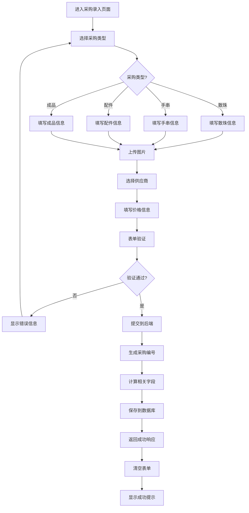
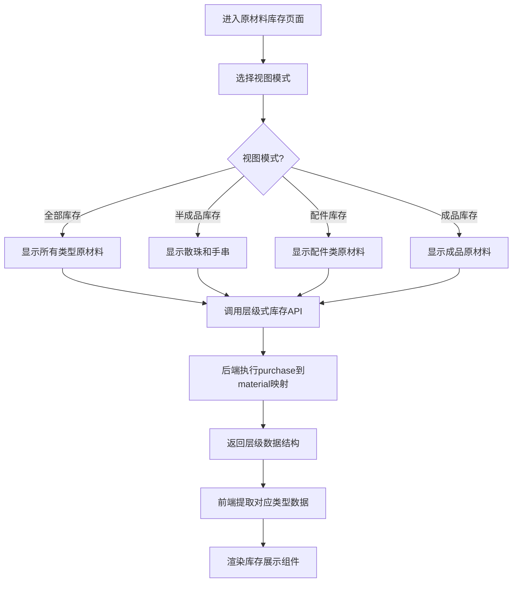

# 文档 05：业务流程详细规范文档

## 一、采购录入业务流程（重要更新）

### 1.1 采购录入完整流程

**流程概述：**


**核心修复内容：**
1. **字段名称统一**：purchase_name替代product_name
2. **类型名称修复**：FINISHED_MATERIAL替代FINISHED
3. **表单验证增强**：按采购类型进行差异化验证
4. **图片处理优化**：支持多文件上传和格式验证
5. **供应商管理**：支持搜索、筛选和创建新供应商
6. **自动计算逻辑**：根据类型自动计算相关字段

### 1.2 采购类型差异化处理

**散珠类型（LOOSE_BEADS）：**
- **必填字段**：purchase_name, price_per_gram, weight, bead_diameter, total_price
- **自动计算**：total_beads = weight × 系数（基于直径）, price_per_bead = total_price / total_beads
- **验证规则**：重量>0, 克价>0, 直径>0
- **单位类型**：PIECES（颗）

**手串类型（BRACELET）：**
- **必填字段**：purchase_name, price_per_gram, weight, bead_diameter, beads_per_string, total_price
- **自动计算**：price_per_bead = total_price / (weight × 系数)
- **验证规则**：重量>0, 克价>0, 直径>0, 每串颗数>0
- **单位类型**：STRINGS（串）

**配件类型（ACCESSORIES）：**
- **必填字段**：purchase_name, piece_count, total_price
- **自动计算**：price_per_piece = total_price / piece_count
- **验证规则**：片数>0, 总价>0
- **单位类型**：SLICES（片）或ITEMS（件）

**成品类型（FINISHED_MATERIAL）：**
- **必填字段**：purchase_name, piece_count, total_price
- **自动计算**：price_per_piece = total_price / piece_count
- **验证规则**：件数>0, 总价>0
- **单位类型**：ITEMS（件）

### 1.3 图片上传处理流程

**上传流程：**


**图片处理规范：**
- **支持格式**：JPEG, PNG, WebP
- **文件大小**：单个文件最大10MB
- **数量限制**：最多5张图片
- **存储格式**：数据库中以JSON数组存储URL
- **URL处理**：使用fixImageUrl函数处理跨域问题

## 二、采购管理业务流程（重要更新）

### 2.1 采购录入流程

**流程步骤：**
1. **基础信息录入**
   - 产品名称（必填）
   - 产品类型选择（散珠/手串/配件/成品）
   - 供应商选择（支持新建）
   - 品质等级选择

2. **规格信息录入**
   - 散珠：珠子直径、克价、重量
   - 手串：珠子直径、内径、每串颗数、克价、重量
   - 配件：规格描述、片数/件数、单价
   - 成品：规格描述、件数、单价

3. **图片上传**
   - 支持拖拽上传
   - 最多5张图片
   - 自动压缩和格式转换

4. **AI智能识别（可选）**
   - 自然语言描述输入
   - AI自动解析产品信息
   - 用户确认和修正

5. **数据验证和提交**
   - 前端表单验证
   - 后端数据校验
   - 采购编号自动生成
   - 数据库存储

### 2.2 采购列表管理流程（完整更新版）

**核心功能流程：**

1. **多维度搜索流程**
   - **产品名称搜索**：实时搜索，500ms防抖处理
   - **采购编号搜索**：精确匹配和模糊匹配
   - **组合搜索**：支持同时使用多种搜索条件

2. **高级筛选流程**
   - **表头筛选器**：点击列头筛选图标打开筛选面板
   - **多选筛选**：品质、产品类型、供应商支持多选
   - **范围筛选**：珠径、规格、价格支持最小值-最大值筛选
   - **日期筛选**：采购日期范围筛选
   - **筛选应用**：实时应用筛选条件，自动刷新列表

3. **智能排序流程**
   - **多字段排序**：支持按日期、编号、名称、价格等排序
   - **规格动态排序**：根据产品类型自动选择对应规格字段
   - **升序/降序切换**：点击列头切换排序方向

4. **分页管理流程**
   - **自定义分页**：支持10/20/50/100条每页
   - **页码跳转**：支持直接跳转到指定页码
   - **响应式分页**：手机端和桌面端不同的分页显示

5. **权限控制流程**
   - **角色检查**：根据用户角色显示不同内容
   - **敏感数据过滤**：EMPLOYEE角色自动隐藏价格信息
   - **操作权限**：编辑和删除按钮根据权限显示

6. **数据导出流程**
   - **Excel导出**：支持当前筛选结果导出
   - **格式化处理**：自动格式化日期、价格等字段
   - **错误处理**：导出失败时显示友好提示

**业务规则：**
- 采购列表按采购日期倒序排列（最新的在前）
- 筛选条件保持在URL参数中，支持书签和分享
- 搜索和筛选结果实时更新，无需手动刷新
- 移动端优化：提供专门的移动端筛选界面
- 数据缓存：相同筛选条件下避免重复请求

### 1.1 采购列表查询流程（新增搜索功能）

**流程概述：**


**核心功能更新：**
1. **采购编号搜索**：支持采购编号的模糊匹配搜索
2. **产品名称搜索**：原有的产品名称搜索功能
3. **组合搜索**：支持同时使用多种搜索条件
4. **实时搜索**：输入时实时显示搜索建议
5. **搜索历史**：记录用户常用的搜索条件

**搜索功能详细规范：**

| 搜索类型 | 字段名 | 匹配方式 | 示例 | 说明 |
|----------|--------|----------|------|------|
| 采购编号搜索 | purchase_code_search | 模糊匹配 | "PUR2024" | 支持部分编号搜索 |
| 产品名称搜索 | search | 模糊匹配 | "紫水晶" | 搜索产品名称关键词 |
| 品质筛选 | quality | 精确匹配 | "AA" | 按品质等级筛选 |
| 产品类型筛选 | product_type | 精确匹配 | "LOOSE_BEADS" | 按产品类型筛选 |
| 供应商筛选 | supplier_id | 精确匹配 | "supplier_001" | 按供应商筛选 |

**前端实现要点：**
```typescript
// 搜索状态管理
interface SearchState {
  productNameSearch: string    // 产品名称搜索
  purchaseCodeSearch: string   // 采购编号搜索（新增）
  qualityFilter: string        // 品质筛选
  typeFilter: string          // 类型筛选
  supplierFilter: string      // 供应商筛选
}

// 搜索API调用
const performSearch = async (searchParams: SearchState) => {
  const params = {
    search: searchParams.productNameSearch,
    purchase_code_search: searchParams.purchaseCodeSearch, // 新增参数
    quality: searchParams.qualityFilter,
    product_type: searchParams.typeFilter,
    supplier_id: searchParams.supplierFilter
  }
  
  const response = await purchaseApi.list(params)
  return response.data.purchases
}
```

### 1.2 采购编号生成规则

**编号格式：** `PUR + YYYYMMDD + 001`

**生成流程：**


**业务规则：**
- 每日序号从001开始递增
- 支持跨日期的连续编号
- 删除记录不影响序号连续性
- 编号一旦生成不可修改

## 二、拼音排序业务流程（新增功能）

### 2.1 拼音排序应用场景

**适用组件：**
1. **ProductEntry组件**：散珠和手串的A-Z排序
2. **AccessoriesProductGrid组件**：配饰原材料的A-Z排序
3. **FinishedProductGrid组件**：成品列表的A-Z排序
4. **供应商选择组件**：供应商名称的A-Z排序

**排序流程：**


### 2.2 拼音映射表维护

**核心字符映射（已完善）：**
```typescript
const PINYIN_MAPPINGS = {
  // 水晶类
  '紫': 'Z', '水': 'S', '晶': 'J', '玛': 'M', '瑙': 'N',
  '翡': 'F', '翠': 'C', '和': 'H', '田': 'T', '玉': 'Y',
  
  // 有机宝石类（重要更新）
  '蜜': 'M', // 修复蜜蜡排序问题
  '蜡': 'L', '琥': 'H', '珀': 'P', '珊': 'S', '瑚': 'H',
  
  // 金属类（重要更新）
  '镀': 'D', // 修复镀金排序问题
  '金': 'J', '银': 'Y', '铜': 'T', '铁': 'T', '钢': 'G'
}
```

**维护规则：**
- 新增产品时检查首字符是否在映射表中
- 缺失字符自动使用字符本身的大写形式
- 定期审查和完善映射表
- 支持多音字的主要读音映射

### 2.3 排序一致性保证

**问题解决：**
- **问题**：蜜蜡隔珠排在镀金隔片前面
- **原因**：缺少"蜜"和"镀"字的拼音映射
- **解决**：添加映射 "蜜"→"M"，"镀"→"D"
- **结果**：镀金隔片(D)正确排在蜜蜡隔珠(M)前面

**验证流程：**


## 三、成品制作业务流程

### 3.1 成品制作成本计算业务规则（重要更新）

**成本计算核心公式：**
```
原材料成本 = Σ(使用数量 × 单位成本)
总成本 = 原材料成本 + 人工成本 + 工艺成本
利润率 = (销售价格 - 总成本) / 销售价格 × 100%
```

**原材料成本计算规则：**
1. **散珠/手串**：使用颗数 × 每颗价格 (pricePerBead)
2. **配件/成品**：使用片数/件数 × 每片/每件价格 (pricePerPiece)
3. **备选方案**：如果专用价格字段为空，使用unitPrice或totalPrice

**成本计算流程：**


**业务验证规则：**
- 原材料库存充足性验证
- 成本字段非负数验证
- 销售价格必须大于0
- 利润率建议范围：10%-50%
- 低于10%利润率显示警告

**CG编码映射规则：**
```typescript
const PRODUCT_TYPE_MAPPING = {
  'LOOSE_BEADS': {
    cgCode: 'LB',
    displayName: '散珠',
    unitType: 'PIECES',
    costCalculation: 'per_bead',
    priceField: 'pricePerBead'
  },
  'BRACELET': {
    cgCode: 'BR',
    displayName: '手串',
    unitType: 'STRINGS',
    costCalculation: 'per_string',
    priceField: 'pricePerBead'
  },
  'ACCESSORIES': {
    cgCode: 'AC',
    displayName: '配饰',
    unitType: 'PIECES',
    costCalculation: 'per_piece',
    priceField: 'pricePerPiece'
  },
  'FINISHED_MATERIAL': {
    cgCode: 'FP',
    displayName: '成品原材料',
    unitType: 'ITEMS',
    costCalculation: 'per_item',
    priceField: 'pricePerPiece'
  }
}
```

### 3.2 直接转化模式业务流程

**适用场景：**
- 单一原材料直接转化为销售成品
- 简单加工、包装、品质提升
- 批量处理多个相同类型的原材料

**业务流程：**


**自动化特点：**
- 图片自动继承：不传则使用原材料图片
- 规格自动继承：从beadDiameter或specification推导
- 成本自动计算：根据产品类型选择pricePerBead或pricePerPiece
- 库存自动验证：每个原材料只能转化1件成品

### 3.3 组合制作模式业务流程

**适用场景：**
- 多种原材料组合制作复杂成品
- 需要精确控制每种原材料的使用量
- 复杂工艺、多材料组合

**业务流程：**


**精确控制特点：**
- 使用量精确控制：支持散珠颗数和配件片数混合
- 实时成本预估：调用POST /products/cost接口
- 库存动态验证：根据使用量实时计算最大制作数量
- 手动信息填写：需要手动上传图片和填写规格

## 四、数据类型处理规范

### 4.1 数值类型安全处理

**问题案例：库存消耗分析显示"161"而不是"17"**

**根本原因：**
- 后端reduce计算时发生字符串拼接："16" + "1" = "161"
- 前端未对API返回数据进行类型验证

**解决方案：**
```typescript
// 后端：强制数字类型转换
const totalConsumption = consumptionData.reduce((sum, item) => {
  return sum + Number(item.total_consumed) // 强制转换为数字
}, 0)

// 前端：防护性类型转换
const displayValue = Number(data.total_consumption).toLocaleString()
```

**预防措施：**
1. **后端计算**：所有数值计算使用Number()转换
2. **前端显示**：显示前进行Number()转换
3. **SQL查询**：使用CAST()确保返回正确类型
4. **类型验证**：API接口添加数据类型验证

### 4.2 字段一致性保证

**purchase_code字段添加：**
- **数据库**：添加purchase_code字段和索引
- **API接口**：支持purchase_code_search参数
- **前端类型**：更新所有相关接口定义
- **组件使用**：确保所有组件正确访问字段

**类型定义更新清单：**
```typescript
// 需要添加purchase_code字段的接口
interface Purchase { purchase_code: string }
interface AvailableMaterial { purchase_code?: string }
interface AccessoryProduct { purchase_code?: string }
interface FinishedProduct { purchase_code?: string }
interface BatchData { purchase_code?: string }
```

## 五、错误处理和调试规范

### 5.1 TypeScript错误修复流程


### 5.2 调试最佳实践

**调试原则：**
1. **先查文档**：遇到问题先查看相关文档
2. **字段对齐**：优先检查API、接口、数据库字段是否一致
3. **类型安全**：确保TypeScript类型定义正确
4. **渐进修复**：分步骤修复，避免大范围改动
5. **测试验证**：每次修复后进行功能测试

**常见问题排查：**
- **API连接失败**：检查IP地址是否硬编码
- **数据显示异常**：检查数据类型转换
- **排序不正确**：检查拼音映射表
- **字段访问错误**：检查接口类型定义

## 六、原材料库存查询业务流程（重要更新）

### 6.1 库存查询核心业务流程

**流程概述：**


### 6.2 purchase到material映射业务规则

**映射核心原理：**
1. **数据源统一**：所有库存数据来源于purchases表
2. **字段语义转换**：purchase_*字段映射为material_*字段
3. **前端一致性**：前端统一使用material_*字段名
4. **业务逻辑增强**：自动计算库存状态、使用率等业务字段

**映射业务规则：**
| 业务概念 | 采购阶段字段 | 库存阶段字段 | 业务含义 |
|----------|-------------|-------------|----------|
| 产品名称 | purchase_name | material_name | 原材料名称 |
| 产品类型 | purchase_type | material_type | 原材料类型 |
| 产品编号 | purchase_code | material_code | 原材料编号 |
| 采购日期 | purchase_date | material_date | 入库日期 |
| 采购ID | purchase_id | material_id | 原材料ID |

**业务状态计算：**
```typescript
// 库存状态业务规则
interface MaterialBusinessRules {
  inventory_unit: string        // 库存单位（颗/片/件）
  usage_rate: number           // 使用率 = used_quantity / original_quantity * 100%
  remaining_rate: number       // 剩余率 = 100% - usage_rate
  stock_status: 'sufficient' | 'low' | 'out'  // 库存状态
}

// 库存状态判断规则
if (remaining_quantity <= 0) {
  stock_status = 'out'  // 缺货
} else if (min_stock_alert && remaining_quantity <= min_stock_alert) {
  stock_status = 'low'  // 低库存
} else {
  stock_status = 'sufficient'  // 库存充足
}
```

### 6.3 半成品库存业务流程

**半成品定义：**
- **散珠（LOOSE_BEADS）**：单颗珠子，按颗计量
- **手串（BRACELET）**：串装珠子，按颗计量

**半成品库存矩阵展示：**


**业务特点：**
- **矩阵展示**：产品名称 × 珠径规格 × 品相的三维矩阵
- **库存状态**：颜色编码显示库存充足/低库存/缺货状态
- **拼音排序**：产品名称按拼音首字母排序
- **权限控制**：EMPLOYEE角色隐藏价格信息

### 6.4 配件库存业务流程

**配件定义：**
- **配件（ACCESSORIES）**：吊坠、挂件、饰品等，按片计量

**配件库存卡片展示：**


**业务特点：**
- **卡片展示**：每个配件一张卡片，显示图片、规格、库存
- **规格显示**：显示配件的具体规格信息
- **库存预警**：低库存配件特殊标识
- **图片展示**：支持多图片轮播

### 6.5 成品原材料库存业务流程

**成品原材料定义：**
- **成品原材料（FINISHED_MATERIAL）**：可直接销售的成品，按件计量

**成品库存卡片展示：**


**业务特点：**
- **成品展示**：显示成品的完整信息，包括规格、价格、库存
- **价格显示**：BOSS角色可查看单价和总价
- **库存管理**：支持低库存筛选和预警
- **销售准备**：为后续销售环节提供数据基础

### 6.6 数据类型安全业务规则

**业务背景：**
- 解决库存消耗分析显示"161"而不是"17"的问题
- 确保所有数值计算的准确性

**业务规则：**
1. **后端计算**：所有数值字段使用Number()强制类型转换
2. **前端显示**：显示前进行防护性Number()转换
3. **数据传输**：API返回数据确保类型正确
4. **用户体验**：避免因数据类型问题导致的显示错误

**实施标准：**
```typescript
// 业务数据处理标准
const process_business_data = (raw_data: any) => {
  return {
    total_consumption: Number(raw_data.total_consumption) || 0,
    remaining_quantity: Number(raw_data.remaining_quantity) || 0,
    price_per_unit: Number(raw_data.price_per_unit) || 0,
    usage_rate: Math.round(Number(raw_data.usage_rate) || 0)
  }
}
```

## 七、系统维护和优化

### 7.1 文档同步机制

**三位一体原则：**
- **文档**：业务规范和技术规范
- **代码**：前后端实现代码
- **数据库**：表结构和数据

**同步流程：**


### 6.2 持续改进机制

**改进方向：**
1. **性能优化**：查询效率、响应速度
2. **用户体验**：界面友好性、操作便捷性
3. **数据准确性**：计算精度、类型安全
4. **功能完善**：业务覆盖度、异常处理
5. **代码质量**：可维护性、可扩展性

## 2. SKU数据结构

### 2.1 核心字段
- **图片**：JSON数组格式存储多张图片URL
- **编号**：SKU编号（SKU+YYYYMMDD+3位序号）
- **名称**：SKU名称
- **数量**：总数量和可售数量
- **规格**：直径等规格信息
- **成本价**：原材料成本、人工成本、工艺成本
- **售价**：销售价格
- **利润率**：自动计算的利润率
- **创建日期**：SKU创建时间
- **销售日期**：最后销售时间
- **溯源信息**：关联的原材料和采购记录

## 3. SKU业务流程

### 3.1 SKU创建流程


### 3.2 SKU销售确认流程


**业务规则：**
- 销售数量不能超过可售数量
- 支持部分销售（数量可小于总库存）
- 自动更新最后销售日期
- 记录买家信息和销售渠道

### 3.3 SKU销毁流程


**业务规则：**
- 销毁数量不能超过可售数量
- 支持选择是否退回原材料库存
- 退回原材料按比例计算
- 记录详细的销毁原因

### 3.4 SKU库存调整流程


**业务规则：**
- 只有管理员可以进行库存调整
- 必须提供调整原因
- 记录调整前后的数量变化

## 4. SKU溯源管理

### 4.1 溯源数据结构
- **SKU信息**：基本信息和当前状态
- **原材料使用记录**：每种原材料的使用数量和成本
- **采购记录关联**：关联的采购记录详情
- **供应商信息**：原材料供应商信息

### 4.2 溯源查询流程


## 5. 权限控制

### 5.1 角色权限矩阵

| 操作 | BOSS | EMPLOYEE |
|------|------|----------|
| 查看SKU列表 | ✅ | ✅ |
| 查看SKU详情 | ✅ | ✅ |
| 查看价格信息 | ✅ | ❌ |
| 销售确认 | ✅ | ❌ |
| 销毁操作 | ✅ | ❌ |
| 库存调整 | ✅ | ❌ |
| 查看溯源信息 | ✅ | ✅ |

### 5.2 数据过滤规则
- **EMPLOYEE角色**：隐藏成本价、售价、利润率等敏感信息
- **BOSS角色**：可查看所有信息
- **操作权限**：只有BOSS可以进行销售和销毁操作

## 6. 数据完整性约束

### 6.1 库存一致性
- SKU总数量 = 可售数量 + 已售数量
- 销售操作后自动更新可售数量
- 销毁操作后同时减少总数量和可售数量

### 6.2 溯源完整性
- 每个SKU必须有对应的原材料使用记录
- 原材料使用记录必须关联有效的采购记录
- 删除采购记录时检查SKU关联

### 6.3 成本计算规则
- 总成本 = 原材料成本 + 人工成本 + 工艺成本
- 利润率 = (售价 - 总成本) / 售价 × 100%
- 成本信息在SKU创建时计算并存储

## 7. 异常处理

### 7.1 库存异常
- **库存不足**：销售数量超过可售数量
- **负库存**：调整后库存为负数
- **数据不一致**：总数量与明细不匹配

### 7.2 溯源异常
- **溯源缺失**：SKU没有对应的原材料记录
- **采购记录删除**：关联的采购记录被删除
- **数据损坏**：溯源数据格式错误

### 7.3 操作异常
- **权限不足**：用户无权限进行操作
- **并发冲突**：多用户同时操作同一SKU
- **参数错误**：输入参数格式或范围错误

## 8. 性能优化

### 8.1 查询优化
- 使用索引优化SKU列表查询
- 分页查询避免大数据量加载
- 缓存热门SKU信息

### 8.2 操作优化
- 使用数据库事务保证操作原子性
- 批量操作减少数据库访问次数
- 异步处理非关键操作

## 9. 监控和日志

### 9.1 操作日志
- 记录所有SKU操作的详细信息
- 包括操作用户、时间、参数、结果
- 支持按时间、用户、操作类型查询

### 9.2 业务监控
- 监控SKU库存变化趋势
- 统计销售和销毁操作频率
- 预警低库存和异常操作

## 10. 系统集成

### 10.1 与成品系统集成
- 成品创建时自动生成或更新SKU
- 成品状态变更同步到SKU
- 支持从成品页面跳转到SKU详情

### 10.2 与采购系统集成
- SKU溯源信息关联采购记录
- 采购记录变更影响SKU成本计算
- 支持从SKU页面查看原材料采购历史