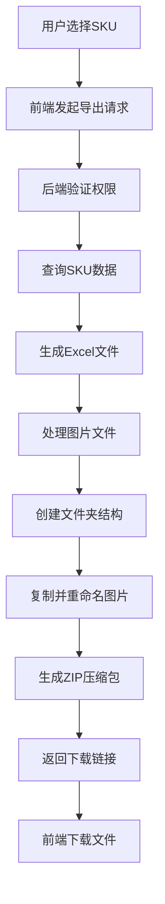

# 文档 11：SKU管理ZIP导出功能规范文档

## 一、功能概述

### 1.1 功能定位
SKU管理ZIP导出功能是为电商平台一键上架而设计的复杂导出系统，支持选择性导出SKU数据，包含完整的产品信息Excel表格和标准化的图片文件结构。

### 1.2 核心价值
- **电商对接**：标准化的导出格式，适配主流电商平台上架需求
- **批量处理**：支持多SKU同时导出，提高上架效率
- **图片标准化**：统一的图片命名和文件夹结构，便于批量处理
- **数据完整性**：包含SKU的完整信息，满足电商平台数据要求

## 二、导出格式详细规范

### 2.1 压缩包整体结构
```
{导出日期}.zip
├── SKU导出数据.xlsx                    # Excel表格文件
├── {SKU编码1}/                         # SKU文件夹（以SKU编码命名）
│   ├── 原色/                          # 原色图片文件夹
│   │   └── 1.{图片格式}               # 原色图片（命名为"1"）
│   ├── 电脑版商品详情图/               # 详情图文件夹
│   │   └── 1.{图片格式}               # 详情图（命名为"1"）
│   └── 商品图片/                      # 商品图片文件夹
│       └── 1.{图片格式}               # 商品图片（命名为"1"）
├── {SKU编码2}/                         # 第二个SKU文件夹
│   ├── 原色/
│   │   └── 1.{图片格式}
│   ├── 电脑版商品详情图/
│   │   └── 1.{图片格式}
│   └── 商品图片/
│       └── 1.{图片格式}
└── ...                                # 更多SKU文件夹
```

### 2.2 压缩包命名规范
- **格式**：`YYYYMMDD.zip`
- **示例**：`20250127.zip`（2025年1月27日导出）
- **说明**：使用导出当日的日期作为压缩包名称

### 2.3 SKU文件夹命名规范
- **格式**：直接使用SKU编码作为文件夹名称
- **示例**：`SKU20250127001`、`SKU20250127002`
- **说明**：确保文件夹名称与数据库中的SKU编码完全一致

### 2.4 图片文件夹结构
每个SKU文件夹内必须包含以下三个子文件夹：

| 文件夹名称 | 用途说明 | 图片要求 |
|------------|----------|----------|
| 原色 | 存放SKU的原色展示图片 | 1张，命名为"1" |
| 电脑版商品详情图 | 存放适用于电脑端展示的详情图 | 1张，命名为"1" |
| 商品图片 | 存放标准商品展示图片 | 1张，命名为"1" |

### 2.5 图片命名规范
- **统一命名**：所有图片文件名均为"1"
- **格式保持**：保持原始图片的文件格式（jpg、png、webp等）
- **示例**：`1.jpg`、`1.png`、`1.webp`

## 三、Excel表格内容规范

### 3.1 表格文件命名
- **文件名**：`SKU导出数据.xlsx`
- **位置**：压缩包根目录

### 3.2 表格字段定义

| 字段名称 | 数据库字段 | 数据类型 | 说明 | 示例 |
|----------|------------|----------|------|------|
| 产品名称 | sku_name | 文本 | SKU的完整名称 | "紫水晶手串 12mm AA级" |
| SKU编号 | sku_code | 文本 | 唯一的SKU编码 | "SKU20250127001" |
| 售价 | selling_price | 数值 | SKU的销售价格（元） | 299.00 |
| 规格 | specification | 文本 | 产品规格信息 | "直径12mm" |
| SKU库存数量 | available_quantity | 整数 | 当前可售库存数量 | 15 |

### 3.3 数据格式要求
- **价格格式**：保留两位小数，如 299.00
- **数量格式**：整数，如 15
- **文本格式**：UTF-8编码，支持中文
- **表头格式**：第一行为字段名称，加粗显示

## 四、技术实现方案

### 4.1 技术架构概述


### 4.2 核心技术挑战

#### 4.2.1 文件结构复杂性
- **挑战**：需要创建多层嵌套的文件夹结构
- **解决方案**：使用Node.js的fs模块递归创建目录
- **技术要点**：确保文件夹创建的原子性和错误处理

#### 4.2.2 图片处理与复制
- **挑战**：需要将同一张图片复制到3个不同文件夹
- **解决方案**：使用流式复制，避免内存占用过大
- **技术要点**：处理不同图片格式，保持原始质量

#### 4.2.3 图片重命名逻辑
- **挑战**：将原始图片名称统一改为"1"
- **解决方案**：提取原始文件扩展名，重新组合文件名
- **技术要点**：正确处理各种图片格式的扩展名

#### 4.2.4 选择性导出
- **挑战**：用户可能选择部分SKU进行导出
- **解决方案**：前端传递SKU ID数组，后端按需查询
- **技术要点**：优化数据库查询性能，支持批量操作

#### 4.2.5 ZIP压缩处理
- **挑战**：动态生成大容量ZIP文件
- **解决方案**：使用流式压缩，边生成边压缩
- **技术要点**：内存管理和压缩效率优化

#### 4.2.6 电商平台适配
- **挑战**：不同电商平台可能有不同的格式要求
- **解决方案**：设计可配置的导出模板系统
- **技术要点**：预留扩展接口，支持多种导出格式

### 4.3 数据库查询优化

#### 4.3.1 SKU数据查询
```sql
SELECT 
  id,
  sku_code,
  sku_name,
  selling_price,
  specification,
  available_quantity,
  photos
FROM product_skus 
WHERE id IN (?) 
AND status = 'ACTIVE'
ORDER BY sku_code
```

#### 4.3.2 图片数据处理
- **photos字段**：JSON数组格式，包含图片URL列表
- **图片获取**：从photos数组中提取第一张图片作为导出图片
- **容错处理**：如果没有图片，使用默认占位图片

### 4.4 前端实现要点

#### 4.4.1 SKU选择界面
- **表格布局**：从卡片式改为表格式，便于批量选择
- **复选框**：支持单选、多选、全选功能
- **筛选功能**：支持按名称、编码、状态筛选
- **分页处理**：支持大量SKU的分页显示

#### 4.4.2 导出进度显示
- **进度条**：显示导出进度百分比
- **状态提示**：显示当前处理阶段（查询数据、生成Excel、处理图片、创建ZIP）
- **错误处理**：显示详细的错误信息和重试选项

### 4.5 后端API设计

#### 4.5.1 导出接口
```typescript
// POST /api/skus/export/zip
interface ExportRequest {
  sku_ids: string[]  // 选中的SKU ID数组
  export_options?: {
    include_images: boolean    // 是否包含图片（默认true）
    image_quality: 'high' | 'medium' | 'low'  // 图片质量
  }
}

interface ExportResponse {
  success: boolean
  download_url?: string  // 下载链接
  file_name: string     // 文件名
  file_size: number     // 文件大小（字节）
  export_count: number  // 导出的SKU数量
  error?: string       // 错误信息
}
```

#### 4.5.2 进度查询接口
```typescript
// GET /api/skus/export/progress/:task_id
interface ProgressResponse {
  task_id: string
  status: 'pending' | 'processing' | 'completed' | 'failed'
  progress: number     // 进度百分比 0-100
  current_step: string  // 当前处理步骤
  total_steps: number   // 总步骤数
  completed_steps: number // 已完成步骤数
  error?: string       // 错误信息
}
```

## 五、实现步骤规划

### 5.1 第一阶段：基础功能实现
1. **SKU表格布局改造**：将卡片式布局改为表格式
2. **选择功能实现**：添加复选框和批量选择功能
3. **基础导出API**：实现简单的Excel导出功能

### 5.2 第二阶段：图片处理功能
1. **图片文件夹创建**：实现多层文件夹结构创建
2. **图片复制重命名**：实现图片的复制和重命名逻辑
3. **图片格式处理**：支持多种图片格式的处理

### 5.3 第三阶段：ZIP压缩功能
1. **ZIP生成逻辑**：实现动态ZIP文件生成
2. **流式处理**：优化内存使用和处理效率
3. **下载功能**：实现文件下载和清理机制

### 5.4 第四阶段：优化和扩展
1. **进度显示**：添加导出进度显示功能
2. **错误处理**：完善错误处理和用户提示
3. **性能优化**：优化大批量导出的性能
4. **扩展功能**：支持自定义导出模板

## 六、测试验证方案

### 6.1 功能测试
- **单SKU导出**：验证单个SKU的完整导出流程
- **多SKU导出**：验证批量SKU的导出功能
- **边界测试**：测试大量SKU（100+）的导出性能
- **异常测试**：测试无图片SKU、损坏图片等异常情况

### 6.2 格式验证
- **文件结构**：验证生成的ZIP文件结构是否符合规范
- **图片质量**：验证图片复制后的质量和格式
- **Excel格式**：验证Excel文件的格式和数据准确性
- **命名规范**：验证所有文件和文件夹的命名是否正确

### 6.3 性能测试
- **导出速度**：测试不同数量SKU的导出耗时
- **内存使用**：监控导出过程中的内存占用
- **并发处理**：测试多用户同时导出的性能
- **文件大小**：验证生成的ZIP文件大小是否合理

## 七、风险评估与应对

### 7.1 技术风险
- **内存溢出**：大量图片处理可能导致内存不足
  - **应对**：使用流式处理，分批处理图片
- **磁盘空间**：临时文件可能占用大量磁盘空间
  - **应对**：及时清理临时文件，设置磁盘空间监控
- **网络超时**：大文件下载可能超时
  - **应对**：设置合理的超时时间，支持断点续传

### 7.2 业务风险
- **数据一致性**：导出过程中SKU数据可能发生变化
  - **应对**：使用快照机制，确保导出数据的一致性
- **权限控制**：确保只有授权用户可以导出数据
  - **应对**：严格的权限验证和操作日志记录

### 7.3 用户体验风险
- **导出时间过长**：用户可能等待时间过长
  - **应对**：提供进度显示和预估时间
- **操作复杂性**：功能过于复杂可能影响用户体验
  - **应对**：简化操作流程，提供操作指南

## 八、后续扩展方向

### 8.1 功能扩展
- **多平台模板**：支持不同电商平台的导出模板
- **自定义字段**：允许用户自定义导出字段
- **批量编辑**：支持导出前的批量数据编辑
- **定时导出**：支持定时自动导出功能

### 8.2 技术优化
- **云存储集成**：支持直接导出到云存储
- **API集成**：支持与电商平台API直接对接
- **数据同步**：实现与电商平台的数据同步
- **智能推荐**：基于历史数据推荐导出配置

## 九、文档维护说明

本文档将随着功能的开发和完善持续更新，主要更新内容包括：
- 技术实现细节的补充
- 测试结果和性能数据
- 用户反馈和优化建议
- 新增功能的规范定义

最后更新时间：2025年1月27日
更新人：SOLO Coding
版本：v1.0