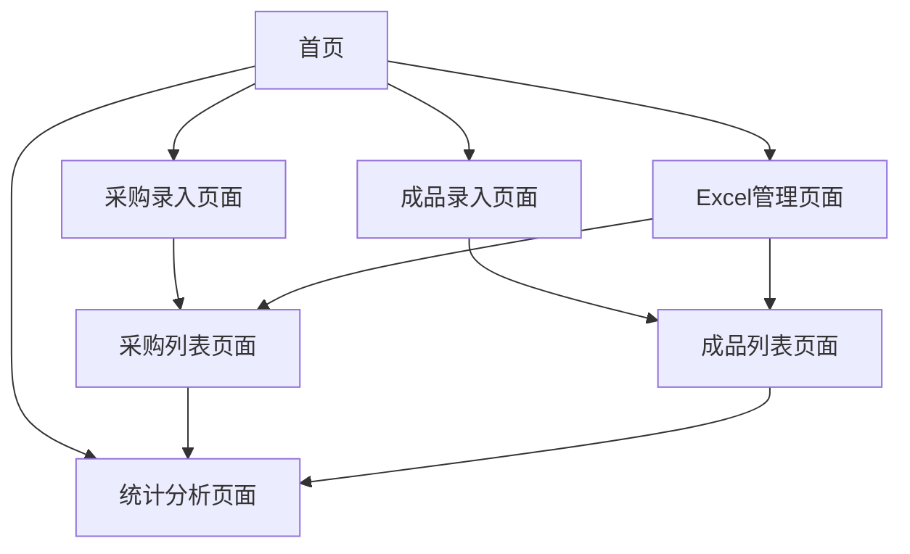

# 水晶销售管理系统产品需求文档

## 1. 产品概述

本系统是为水晶销售公司设计的简化内部管理系统，主要解决小团队在采购原材料、制作成品、销售跟踪等环节的数据记录和统计分析问题。
系统通过移动端友好的H5技术实现，支持拍照录入、语音输入等便捷操作，帮助用户快速记录业务数据并进行成本利润分析。
目标是提升小团队的工作效率，实现业务数据的数字化管理和精准的财务统计。

## 2. 核心功能

### 2.1 用户角色

| 角色 | 注册方式 | 核心权限 |
|------|----------|----------|
| 管理员 | 系统预设账号 | 可访问所有功能，管理用户权限 |
| 普通用户 | 管理员邀请注册 | 可进行采购录入、成品录入、查看统计 |

### 2.2 功能模块

我们的水晶销售管理系统包含以下主要页面：
1. **首页**：快捷操作入口，显示关键统计数据
2. **采购录入页面**：拍照录入，语音/文字输入，数据确认
3. **采购列表页面**：采购记录展示，搜索筛选功能
4. **成品录入页面**：成品拍照录入，成本售价计算
5. **成品列表页面**：成品管理，销售状态跟踪
6. **统计分析页面**：采购统计，成品统计，财务报表
7. **Excel管理页面**：数据导入导出功能

### 2.3 页面详情

| 页面名称 | 模块名称 | 功能描述 |
|----------|----------|----------|
| 首页 | 快捷操作区 | 显示"采购录入"、"成品录入"、"查看统计"、"Excel管理"四个大按钮 |
| 首页 | 关键数据展示 | 显示本月采购金额、成品数量、销售收入等关键指标 |
| 采购录入页面 | 拍照模块 | 调用相机拍摄原材料照片，支持多张照片上传 |
| 采购录入页面 | 语音录入模块 | 语音转文字功能，智能解析产品信息（名称、规格、克价、重量等） |
| 采购录入页面 | 数据确认模块 | 显示解析后的结构化数据，支持手动修改，自动计算总价 |
| 采购列表页面 | 列表展示模块 | 卡片式展示采购记录，包含照片、名称、总价、日期 |
| 采购列表页面 | 搜索筛选模块 | 按产品名称搜索，按日期范围、价格范围筛选 |
| 成品录入页面 | 成品拍照模块 | 拍摄成品照片，支持多角度展示 |
| 成品录入页面 | 成本计算模块 | 输入使用材料和成本，自动计算毛利率 |
| 成品列表页面 | 成品管理模块 | 展示成品信息，一键切换销售状态（已售/未售） |
| 统计分析页面 | 采购统计模块 | 总采购金额、平均克价、采购趋势图表 |
| 统计分析页面 | 成品统计模块 | 制作数量、销售数量、平均毛利率、收入统计 |
| 统计分析页面 | 财务报表模块 | 本月盈亏、库存价值、利润分析 |
| Excel管理页面 | 导入模块 | 支持Excel文件上传，数据预览和验证 |
| Excel管理页面 | 导出模块 | 生成采购清单、成品清单、统计报表的Excel文件 |

## 3. 核心流程

**采购录入流程：**
用户进入采购录入页面 → 拍摄原材料照片 → 语音描述产品信息 → 系统智能解析数据 → 用户确认并修改 → 保存到采购列表

**成品制作流程：**
用户进入成品录入页面 → 拍摄成品照片 → 输入使用材料和成本信息 → 设置售价 → 系统自动计算毛利 → 保存到成品列表

**销售管理流程：**
用户在成品列表中找到已售商品 → 点击切换销售状态 → 系统更新统计数据

**数据分析流程：**
用户进入统计页面 → 查看采购和成品统计 → 分析财务数据 → 导出Excel报表

## 4. 用户界面设计

### 4.1 设计风格

- **主色调**：深蓝色(#2563eb)作为主色，浅蓝色(#dbeafe)作为辅助色
- **按钮风格**：圆角矩形按钮，3D阴影效果，大尺寸适合触摸操作
- **字体**：系统默认字体，标题18px，正文16px，关键数据20px
- **布局风格**：卡片式布局，顶部导航栏，底部快捷操作栏
- **图标风格**：使用简洁的线性图标，配合适当的彩色强调

### 4.2 页面设计概览

| 页面名称 | 模块名称 | UI元素 |
|----------|----------|--------|
| 首页 | 快捷操作区 | 四个大按钮，蓝色背景，白色文字，圆角设计，带图标 |
| 首页 | 数据展示区 | 卡片式布局，白色背景，数字用大字体突出显示 |
| 采购录入页面 | 拍照区域 | 大尺寸拍照按钮，预览图片网格布局 |
| 采购录入页面 | 语音输入区 | 圆形录音按钮，波形动画效果，文字实时显示 |
| 列表页面 | 卡片列表 | 左侧缩略图，右侧信息文字，底部操作按钮 |
| 统计页面 | 图表区域 | 柱状图和饼图，蓝色主题，清晰的数据标签 |

### 4.3 响应式设计

系统采用移动端优先的响应式设计，支持手机、平板和桌面端访问。在移动端优化触摸交互，在桌面端提供更丰富的数据展示。