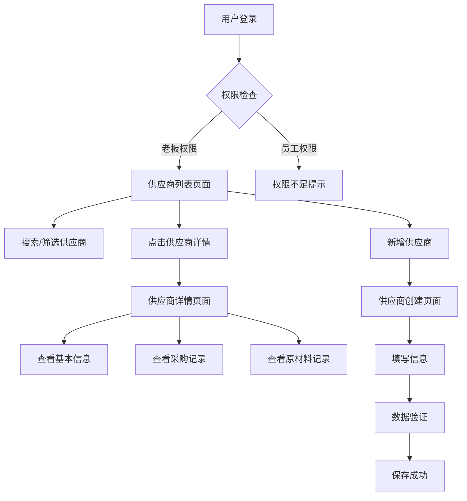

# 供应商管理系统产品需求文档

## 1. 产品概述

供应商管理系统是水晶ERP系统的核心模块之一，为企业提供完整的供应商信息管理和采购记录追踪功能。系统采用类似Excel的表格界面，让用户能够直观地管理供应商信息，并快速查看与每个供应商的业务往来记录。

该系统解决了企业在供应商管理中的信息分散、查询困难、关系追踪复杂等问题，帮助管理者更好地维护供应商关系，优化采购决策。

## 2. 核心功能

### 2.1 用户角色

| 角色 | 访问权限 | 核心权限 |
|------|----------|----------|
| 老板(BOSS) | 完全访问权限 | 查看、创建、编辑、删除供应商；查看所有采购记录 |
| 员工(USER) | 无访问权限 | 系统提示权限不足 |

### 2.2 功能模块

我们的供应商管理系统包含以下主要页面：

1. **供应商列表页面**：Excel风格的表格展示，供应商信息管理，搜索筛选功能
2. **供应商详情页面**：详细信息展示，采购记录查看，业务关系分析
3. **供应商创建/编辑页面**：表单式信息录入，数据验证，重复检查

### 2.3 页面详情

| 页面名称 | 模块名称 | 功能描述 |
|----------|----------|----------|
| 供应商列表页面 | 表格展示模块 | 以Excel风格展示所有供应商信息，包含排序、搜索、分页功能 |
| 供应商列表页面 | 操作工具栏 | 提供新增供应商、批量操作、导出数据等功能按钮 |
| 供应商列表页面 | 搜索筛选模块 | 支持按名称、联系人、电话等字段进行实时搜索 |
| 供应商详情页面 | 基本信息展示 | 显示供应商的详细信息：名称、联系方式、地址等 |
| 供应商详情页面 | 采购记录列表 | 展示从该供应商采购的所有物品，包括采购时间、数量、金额 |
| 供应商详情页面 | 原材料记录列表 | 展示该供应商提供的原材料记录，支持按类型筛选 |
| 供应商详情页面 | 统计分析模块 | 显示采购总额、采购次数、主要采购品类等统计信息 |
| 供应商创建/编辑页面 | 信息录入表单 | 提供供应商基本信息的录入和编辑功能 |
| 供应商创建/编辑页面 | 数据验证模块 | 实时验证输入数据的格式和唯一性 |

## 3. 核心流程

### 老板操作流程

1. **查看供应商列表**：老板登录系统 → 访问供应商管理页面 → 查看Excel风格的供应商列表
2. **搜索供应商**：在搜索框输入关键词 → 系统实时筛选显示匹配的供应商
3. **查看供应商详情**：点击供应商行 → 进入详情页面 → 查看基本信息和采购记录
4. **创建新供应商**：点击"新增供应商"按钮 → 填写供应商信息 → 提交保存
5. **编辑供应商信息**：在详情页面点击编辑 → 修改信息 → 保存更新

### 员工访问流程

1. **尝试访问**：员工登录系统 → 访问供应商管理页面 → 系统显示权限不足提示

## 4. 用户界面设计

### 4.1 设计风格

- **主色调**：水晶蓝 (#3B82F6) 作为主色，灰色 (#6B7280) 作为辅助色
- **按钮样式**：圆角按钮，悬停效果，阴影设计
- **字体**：系统默认字体，标题使用 16-20px，正文使用 14px
- **布局风格**：卡片式布局，顶部导航，Excel风格的表格设计
- **图标风格**：使用 Lucide React 图标库，简洁现代的线性图标

### 4.2 页面设计概览

| 页面名称 | 模块名称 | UI元素 |
|----------|----------|---------|
| 供应商列表页面 | 页面标题区 | 水晶蓝色图标，大标题，面包屑导航 |
| 供应商列表页面 | 工具栏区域 | 搜索框，新增按钮，筛选按钮，导出按钮 |
| 供应商列表页面 | 表格区域 | Excel风格表格，斑马纹行，悬停高亮，排序图标 |
| 供应商列表页面 | 分页区域 | 页码导航，每页条数选择，总数显示 |
| 供应商详情页面 | 信息卡片 | 白色背景卡片，分组显示基本信息 |
| 供应商详情页面 | 采购记录表格 | 时间轴式展示，金额高亮，类型标签 |
| 供应商详情页面 | 统计图表 | 饼图显示采购分布，柱状图显示月度趋势 |

### 4.3 响应式设计

- **桌面优先**：主要针对桌面端设计，表格展示为主
- **移动端适配**：小屏幕下表格转换为卡片式布局
- **触摸优化**：按钮和链接区域增大，支持触摸操作

## 5. 数据结构说明

### 5.1 供应商表结构 (suppliers)

- **id**: 主键，UUID格式
- **name**: 供应商名称，唯一约束
- **contact**: 联系人姓名
- **phone**: 联系电话
- **email**: 邮箱地址
- **address**: 详细地址
- **description**: 备注描述
- **is_active**: 状态标识
- **created_at**: 创建时间
- **updated_at**: 更新时间

### 5.2 关联关系

- **suppliers → purchases**: 一对多关系，通过 supplier_name 字段关联
- **suppliers → materials**: 一对多关系，通过 supplier_id 字段关联

### 5.3 查询逻辑

- **采购记录查询**: 根据 supplier_name 匹配 purchases 表
- **原材料记录查询**: 根据 supplier_id 匹配 materials 表
- **统计分析**: 汇总采购金额、数量、频次等指标