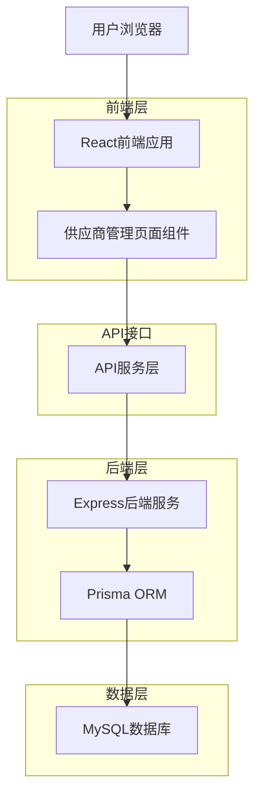
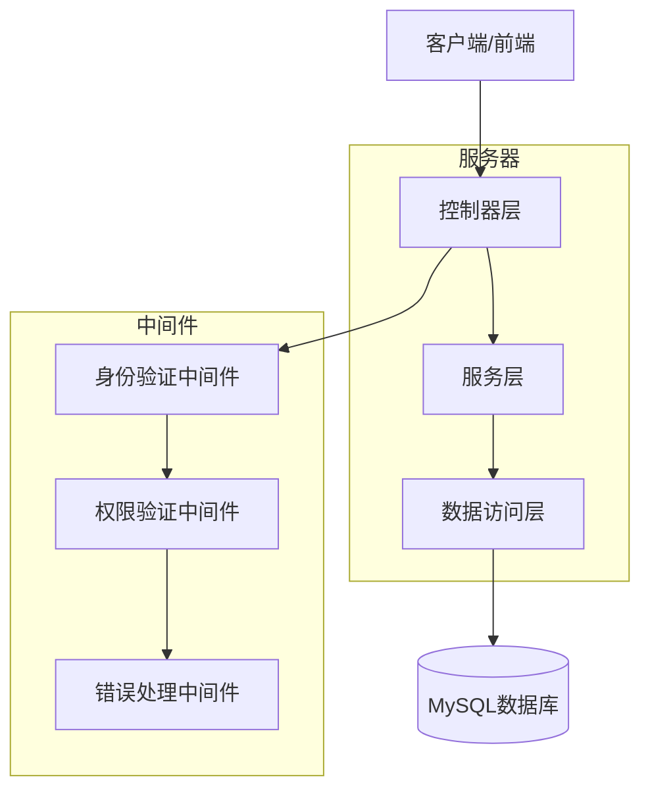
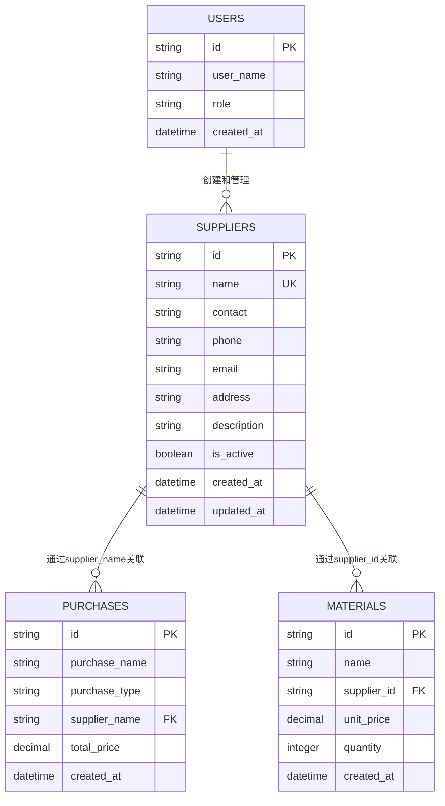

# 供应商管理系统技术架构文档

## 1. 架构设计



## 2. 技术描述

- **前端**: React@18 + TypeScript + Tailwind CSS + Vite
- **后端**: Express@4 + TypeScript + Prisma ORM
- **数据库**: MySQL (通过Prisma管理)
- **状态管理**: React Hooks (useState, useEffect)
- **UI组件**: Lucide React图标库 + 自定义组件
- **权限控制**: JWT Token + 角色验证中间件

## 3. 路由定义

| 路由 | 用途 |
|------|------|
| /supplier-management | 供应商管理主页面，显示供应商列表和操作界面 |
| /supplier-management/:id | 供应商详情页面，显示特定供应商信息和采购记录 |
| /supplier-management/create | 新建供应商页面，提供供应商信息录入表单 |
| /supplier-management/edit/:id | 编辑供应商页面，修改现有供应商信息 |

## 4. API定义

### 4.1 核心API

#### 供应商管理相关

```
GET /api/v1/suppliers
```

获取供应商列表

请求参数:
| 参数名称 | 参数类型 | 是否必需 | 描述 |
|----------|----------|----------|------|
| page | number | false | 页码，默认1 |
| limit | number | false | 每页条数，默认1000 |
| search | string | false | 搜索关键词 |

响应:
| 参数名称 | 参数类型 | 描述 |
|----------|----------|------|
| success | boolean | 请求状态 |
| data | object | 包含suppliers数组和pagination信息 |

示例:
```json
{
  "success": true,
  "data": {
    "suppliers": [
      {
        "id": "uuid",
        "name": "供应商名称",
        "contact": "联系人",
        "phone": "电话",
        "email": "邮箱",
        "address": "地址",
        "description": "描述",
        "is_active": true,
        "created_at": "2024-01-01T00:00:00Z",
        "updated_at": "2024-01-01T00:00:00Z"
      }
    ],
    "pagination": {
      "page": 1,
      "limit": 1000,
      "total": 10,
      "pages": 1
    }
  }
}
```

```
POST /api/v1/suppliers
```

创建新供应商

请求:
| 参数名称 | 参数类型 | 是否必需 | 描述 |
|----------|----------|----------|------|
| name | string | true | 供应商名称 |
| contact | string | false | 联系人姓名 |
| phone | string | false | 联系电话 |
| email | string | false | 邮箱地址 |
| address | string | false | 详细地址 |
| description | string | false | 备注描述 |

```
PUT /api/v1/suppliers/:id
```

更新供应商信息

```
GET /api/v1/suppliers/:id/purchases
```

获取供应商采购记录

请求参数:
| 参数名称 | 参数类型 | 是否必需 | 描述 |
|----------|----------|----------|------|
| page | number | false | 页码，默认1 |
| limit | number | false | 每页条数，默认50 |
| type | string | false | 记录类型：purchases或materials |

响应:
| 参数名称 | 参数类型 | 描述 |
|----------|----------|------|
| success | boolean | 请求状态 |
| data | object | 包含采购记录数组和统计信息 |

示例:
```json
{
  "success": true,
  "data": {
    "purchases": [
      {
        "id": "uuid",
        "purchase_name": "商品名称",
        "purchase_type": "LOOSE_BEADS",
        "quantity": 100,
        "total_price": 1000,
        "created_at": "2024-01-01T00:00:00Z"
      }
    ],
    "materials": [
      {
        "id": "uuid",
        "name": "原材料名称",
        "quantity": 50,
        "unit_price": 20,
        "created_at": "2024-01-01T00:00:00Z"
      }
    ],
    "statistics": {
      "total_purchases": 10,
      "total_amount": 50000,
      "total_materials": 5,
      "first_purchase_date": "2024-01-01T00:00:00Z",
      "last_purchase_date": "2024-12-01T00:00:00Z"
    }
  }
}
```

## 5. 服务器架构图



## 6. 数据模型

### 6.1 数据模型定义



### 6.2 数据定义语言

#### 供应商表 (suppliers)

```sql
-- 表结构已存在，无需创建
-- 主要字段说明：
-- id: 主键，UUID格式
-- name: 供应商名称，具有唯一约束
-- contact: 联系人姓名，可选
-- phone: 联系电话，可选
-- email: 邮箱地址，可选
-- address: 详细地址，可选
-- description: 备注描述，可选
-- is_active: 状态标识，默认true
-- created_at: 创建时间，自动生成
-- updated_at: 更新时间，自动更新

-- 创建索引
CREATE INDEX idx_suppliers_name ON suppliers(name);
CREATE INDEX idx_suppliers_is_active ON suppliers(is_active);
CREATE INDEX idx_suppliers_created_at ON suppliers(created_at DESC);

-- 初始化测试数据（如果需要）
INSERT INTO suppliers (id, name, contact, phone, email, address, description, is_active)
VALUES 
  (UUID(), '北京水晶供应商', '张经理', '13800138001', 'zhang@crystal.com', '北京市朝阳区水晶大厦', '主要供应天然水晶原石', true),
  (UUID(), '广州珠宝批发商', '李总', '13800138002', 'li@jewelry.com', '广州市荔湾区珠宝城', '专业珠宝配件批发', true),
  (UUID(), '义乌小商品供应商', '王老板', '13800138003', 'wang@yiwu.com', '义乌市国际商贸城', '各类饰品配件供应', true);
```

## 7. 组件架构

### 7.1 前端组件结构

```
src/pages/SupplierManagement.tsx          # 主页面组件
├── components/
│   ├── SupplierTable.tsx                 # 供应商表格组件
│   ├── SupplierDetailModal.tsx           # 供应商详情弹窗
│   ├── SupplierCreateModal.tsx           # 创建供应商弹窗
│   ├── SupplierEditModal.tsx             # 编辑供应商弹窗
│   ├── PurchaseRecordTable.tsx           # 采购记录表格
│   ├── MaterialRecordTable.tsx           # 原材料记录表格
│   └── SupplierStatistics.tsx            # 供应商统计组件
```

### 7.2 状态管理

```typescript
// 主要状态结构
interface SupplierManagementState {
  suppliers: Supplier[]
  loading: boolean
  error: string | null
  pagination: {
    page: number
    limit: number
    total: number
    pages: number
  }
  filters: {
    search: string
    active_only: boolean
  }
  selected_supplier: Supplier | null
  modals: {
    detail_open: boolean
    create_open: boolean
    edit_open: boolean
  }
}
```

### 7.3 API集成

```typescript
// 供应商API服务
export const supplier_service = {
  // 获取供应商列表
  get_list: (params: SupplierListParams) => supplier_api.list(params),
  
  // 创建供应商
  create: (data: CreateSupplierData) => supplier_api.create(data),
  
  // 更新供应商
  update: (id: string, data: UpdateSupplierData) => supplier_api.update(id, data),
  
  // 获取供应商采购记录
  get_purchase_records: (id: string, params: PurchaseRecordParams) => 
    apiClient.get(`/suppliers/${id}/purchases`, { params }),
  
  // 获取供应商统计信息
  get_statistics: (id: string) => 
    apiClient.get(`/suppliers/${id}/statistics`)
}
```

## 8. 安全和权限

### 8.1 权限控制

- **路由级权限**: 仅BOSS角色可访问供应商管理页面
- **API级权限**: 后端中间件验证用户角色
- **操作级权限**: 前端组件根据用户角色显示/隐藏功能

### 8.2 数据验证

- **前端验证**: 表单输入实时验证，用户体验优化
- **后端验证**: 使用Zod库进行严格的数据类型和格式验证
- **数据库约束**: 唯一性约束、非空约束等数据库级别验证

### 8.3 错误处理

- **网络错误**: 统一的错误提示和重试机制
- **权限错误**: 友好的权限不足提示页面
- **数据错误**: 详细的表单验证错误信息