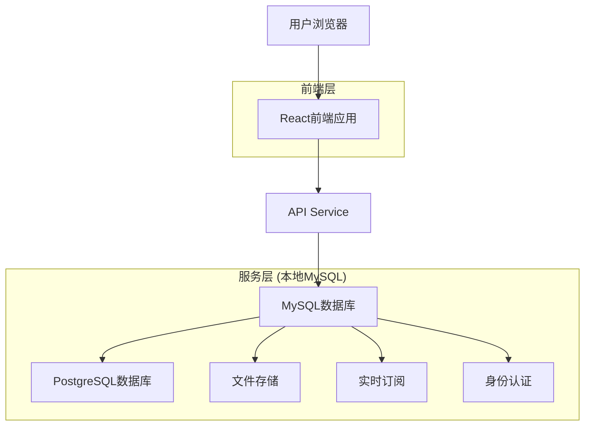
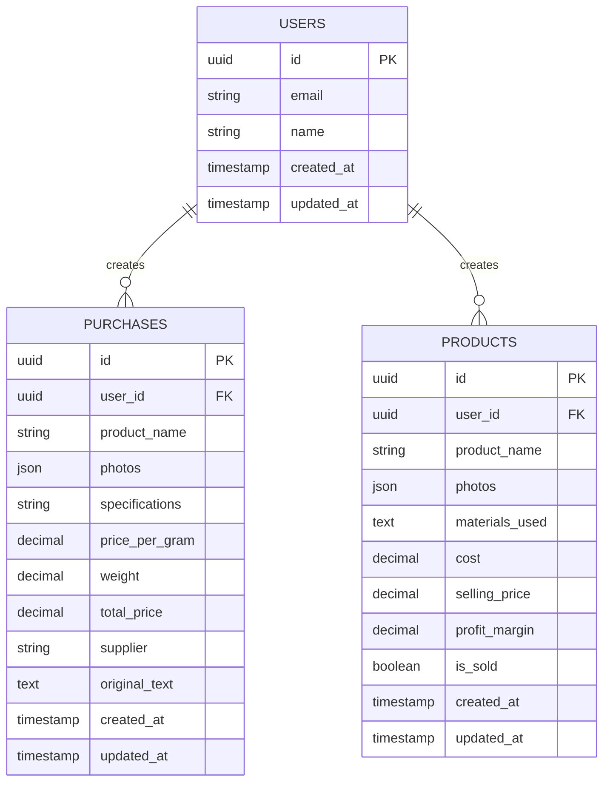

# 水晶销售管理系统技术架构文档

## 1. 架构设计



## 2. 技术描述

* **前端**: React\@18 + TypeScript + Tailwind CSS\@3 + Vite

* **后端**: Node.js + Express + MySQL (数据库 + API + 身份认证 + 文件存储)

* **部署**: 宝塔面板 (前端 + 后端 + MySQL)

## 3. 路由定义

| 路由             | 用途                 |
| -------------- | ------------------ |
| /              | 首页，显示快捷操作和关键统计数据   |
| /login         | 登录页面，用户身份认证        |
| /purchase/add  | 采购录入页面，拍照和语音录入功能   |
| /purchase/list | 采购列表页面，展示和管理采购记录   |
| /product/add   | 成品录入页面，成品信息录入      |
| /product/list  | 成品列表页面，成品管理和销售状态   |
| /statistics    | 统计分析页面，数据可视化和报表    |
| /excel         | Excel管理页面，数据导入导出功能 |

## 4. API定义

### 4.1 核心API

**用户认证相关**

```
POST /auth/v1/token
```

请求:

| 参数名      | 参数类型   | 是否必需 | 描述   |
| -------- | ------ | ---- | ---- |
| email    | string | true | 用户邮箱 |
| password | string | true | 用户密码 |

响应:

| 参数名           | 参数类型   | 描述   |
| ------------- | ------ | ---- |
| access\_token | string | 访问令牌 |
| user          | object | 用户信息 |

**采购数据相关**

```
POST /rest/v1/purchases
```

请求:

| 参数名              | 参数类型   | 是否必需  | 描述        |
| ---------------- | ------ | ----- | --------- |
| product\_name    | string | true  | 产品名称      |
| photos           | array  | true  | 产品照片URL数组 |
| specifications   | string | false | 产品规格      |
| price\_per\_gram | number | true  | 克价(元)     |
| weight           | number | true  | 重量(克)     |
| total\_price     | number | true  | 总价(元)     |
| supplier         | string | false | 供应商       |
| original\_text   | string | false | 原始语音/文字输入 |

响应:

| 参数名         | 参数类型   | 描述     |
| ----------- | ------ | ------ |
| id          | string | 采购记录ID |
| created\_at | string | 创建时间   |

**成品数据相关**

```
POST /rest/v1/products
```

请求:

| 参数名             | 参数类型    | 是否必需  | 描述        |
| --------------- | ------- | ----- | --------- |
| product\_name   | string  | true  | 成品名称      |
| photos          | array   | true  | 成品照片URL数组 |
| materials\_used | string  | false | 使用材料描述    |
| cost            | number  | true  | 成本(元)     |
| selling\_price  | number  | true  | 售价(元)     |
| profit\_margin  | number  | true  | 毛利(元)     |
| is\_sold        | boolean | false | 是否已售      |

## 5. 数据模型

### 5.1 数据模型定义



### 5.2 数据定义语言

**用户表 (users)**

```sql
-- 用户表由本地MySQL管理
-- 扩展用户信息表
CREATE TABLE user_profiles (
    id UUID PRIMARY KEY DEFAULT gen_random_uuid(),
    user_id UUID REFERENCES auth.users(id) ON DELETE CASCADE,
    name VARCHAR(100) NOT NULL,
    created_at TIMESTAMP WITH TIME ZONE DEFAULT NOW(),
    updated_at TIMESTAMP WITH TIME ZONE DEFAULT NOW()
);

-- 创建索引
CREATE INDEX idx_user_profiles_user_id ON user_profiles(user_id);

-- 权限设置
GRANT SELECT ON user_profiles TO anon;
GRANT ALL PRIVILEGES ON user_profiles TO authenticated;
```

**采购表 (purchases)**

```sql
-- 创建采购表
CREATE TABLE purchases (
    id UUID PRIMARY KEY DEFAULT gen_random_uuid(),
    user_id UUID REFERENCES auth.users(id) ON DELETE CASCADE,
    product_name VARCHAR(255) NOT NULL,
    photos JSONB DEFAULT '[]'::jsonb,
    specifications TEXT,
    price_per_gram DECIMAL(10,2) NOT NULL,
    weight DECIMAL(10,2) NOT NULL,
    total_price DECIMAL(10,2) NOT NULL,
    supplier VARCHAR(255),
    original_text TEXT,
    created_at TIMESTAMP WITH TIME ZONE DEFAULT NOW(),
    updated_at TIMESTAMP WITH TIME ZONE DEFAULT NOW()
);

-- 创建索引
CREATE INDEX idx_purchases_user_id ON purchases(user_id);
CREATE INDEX idx_purchases_created_at ON purchases(created_at DESC);
CREATE INDEX idx_purchases_product_name ON purchases(product_name);

-- 权限设置
GRANT SELECT ON purchases TO anon;
GRANT ALL PRIVILEGES ON purchases TO authenticated;

-- 初始化示例数据（可选）
-- INSERT INTO purchases (user_id, product_name, price_per_gram, weight, total_price, supplier)
-- VALUES 
-- ('00000000-0000-0000-0000-000000000000', '示例产品A', 15.00, 20.00, 300.00, '供应商A'),
-- ('00000000-0000-0000-0000-000000000000', '示例产品B', 8.00, 15.00, 120.00, '供应商B');
```

**成品表 (products)**

```sql
-- 创建成品表
CREATE TABLE products (
    id UUID PRIMARY KEY DEFAULT gen_random_uuid(),
    user_id UUID REFERENCES auth.users(id) ON DELETE CASCADE,
    product_name VARCHAR(255) NOT NULL,
    photos JSONB DEFAULT '[]'::jsonb,
    materials_used TEXT,
    cost DECIMAL(10,2) NOT NULL,
    selling_price DECIMAL(10,2) NOT NULL,
    profit_margin DECIMAL(10,2) NOT NULL,
    is_sold BOOLEAN DEFAULT FALSE,
    created_at TIMESTAMP WITH TIME ZONE DEFAULT NOW(),
    updated_at TIMESTAMP WITH TIME ZONE DEFAULT NOW()
);

-- 创建索引
CREATE INDEX idx_products_user_id ON products(user_id);
CREATE INDEX idx_products_created_at ON products(created_at DESC);
CREATE INDEX idx_products_is_sold ON products(is_sold);
CREATE INDEX idx_products_product_name ON products(product_name);

-- 权限设置
GRANT SELECT ON products TO anon;
GRANT ALL PRIVILEGES ON products TO authenticated;

-- 初始化示例数据（可选）
-- INSERT INTO products (user_id, product_name, materials_used, cost, selling_price, profit_margin, is_sold)
-- VALUES 
-- ('00000000-0000-0000-0000-000000000000', '示例成品A', '示例材料描述', 50.00, 120.00, 70.00, false),
-- ('00000000-0000-0000-0000-000000000000', '示例成品B', '示例材料描述', 35.00, 88.00, 53.00, true);
```

**文件存储桶设置**

```sql
-- 创建照片存储桶
INSERT INTO storage.buckets (id, name, public)
VALUES ('photos', 'photos', true);

-- 设置存储权限
CREATE POLICY "用户可以上传照片" ON storage.objects
FOR INSERT WITH CHECK (bucket_id = 'photos' AND auth.role() = 'authenticated');

CREATE POLICY "所有人可以查看照片" ON storage.objects
FOR SELECT USING (bucket_id = '
```

