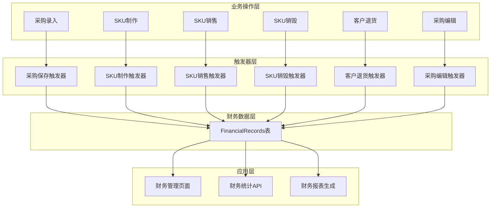
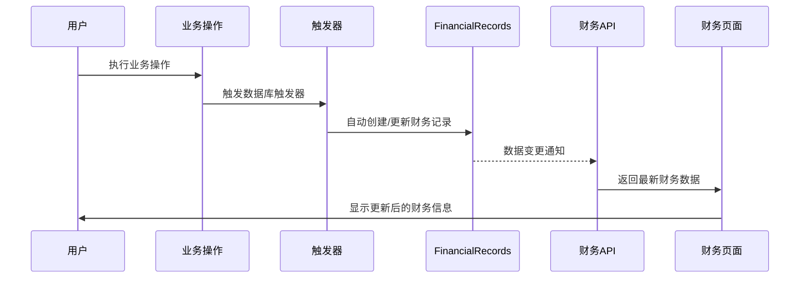

# 财务管理系统重构技术架构文档

## 一、重构概述

### 1.1 重构目标

**核心理念：**
- 财务管理页面所有数据直接读取自 `FinancialRecords` 表
- `FinancialRecords` 表数据完全来源于业务操作，不允许手动添加删除
- 通过触发器机制实现业务操作与财务数据的自动同步
- 确保财务数据的准确性、完整性和可追溯性

**重构原则：**
1. **数据源唯一性**：财务页面只从 `FinancialRecords` 表读取数据
2. **业务驱动性**：财务数据完全由业务操作自动生成
3. **实时同步性**：业务操作立即触发财务数据同步
4. **数据完整性**：确保所有财务相关业务都有对应的财务记录
5. **可追溯性**：每条财务记录都能追溯到具体的业务操作

### 1.2 当前架构问题分析

**现有问题：**
- 财务数据分散在多个表中（`CustomerPurchases`、`Purchases`、`FinancialRecords`）
- 财务统计需要跨表查询，计算复杂且容易出错
- 部分财务数据硬编码（如 `total_refund = 0`）
- 缺乏统一的财务数据管理机制
- 业务操作与财务记录不同步

**重构收益：**
- 简化财务数据查询逻辑
- 提高财务数据准确性
- 实现财务数据的实时同步
- 便于财务报表生成和分析
- 降低系统维护复杂度

## 二、财务数据流转架构设计

### 2.1 整体架构图



### 2.2 数据流转规则

**业务操作 → 财务记录映射关系：**

| 业务操作 | 财务记录类型 | 金额来源 | 描述格式 | 引用类型 |
|----------|-------------|----------|----------|----------|
| 采购录入保存 | EXPENSE | total_price | "采购支出 - {purchase_name}" | PURCHASE |
| 采购编辑保存 | EXPENSE | price_difference | "采购调整 - {purchase_name}" | PURCHASE |
| SKU制作（原材料） | EXPENSE | material_cost | "原材料成本 - {sku_name}" | MANUAL |
| SKU制作（人工费） | EXPENSE | labor_cost | "人工费 - {sku_name}" | MANUAL |
| SKU制作（工艺费） | EXPENSE | craft_cost | "工艺费 - {sku_name}" | MANUAL |
| SKU销售 | INCOME | actual_price | "销售收入 - {sku_name}" | SALE |
| SKU销毁（原材料损耗） | LOSS | material_loss_amount | "原材料损耗 - {sku_name}拆散重做" | MANUAL |
| 客户退货 | REFUND | refund_amount | "客户退货退款 - {customer_name}" | REFUND |

### 2.3 财务记录生命周期



## 三、FinancialRecords表结构优化

### 3.1 优化后的表结构

```sql
CREATE TABLE financial_records (
  id VARCHAR(36) PRIMARY KEY DEFAULT (UUID()),
  
  -- 财务记录基本信息
  record_type ENUM('INCOME', 'EXPENSE', 'REFUND', 'LOSS') NOT NULL COMMENT '记录类型',
  amount DECIMAL(12,2) NOT NULL COMMENT '金额',
  description VARCHAR(255) NOT NULL COMMENT '描述',
  category VARCHAR(100) COMMENT '分类',
  notes TEXT COMMENT '备注',
  
  -- 业务关联信息
  reference_type ENUM('PURCHASE', 'SALE', 'REFUND', 'MANUAL', 'SKU_MAKE', 'SKU_DESTROY') NOT NULL COMMENT '引用类型',
  reference_id VARCHAR(36) COMMENT '引用ID',
  business_operation VARCHAR(100) NOT NULL COMMENT '业务操作类型',
  
  -- 时间信息
  transaction_date DATE NOT NULL COMMENT '交易日期',
  business_date DATE NOT NULL COMMENT '业务发生日期',
  
  -- 扩展信息
  metadata JSON COMMENT '元数据（存储业务相关的额外信息）',
  
  -- 审计字段
  created_at TIMESTAMP DEFAULT CURRENT_TIMESTAMP,
  updated_at TIMESTAMP DEFAULT CURRENT_TIMESTAMP ON UPDATE CURRENT_TIMESTAMP,
  created_by VARCHAR(36) NOT NULL COMMENT '创建人',
  
  -- 外键约束
  FOREIGN KEY (created_by) REFERENCES users(id),
  
  -- 索引设计
  INDEX idx_financial_record_type (record_type),
  INDEX idx_financial_reference (reference_type, reference_id),
  INDEX idx_financial_transaction_date (transaction_date DESC),
  INDEX idx_financial_business_date (business_date DESC),
  INDEX idx_financial_amount (amount),
  INDEX idx_financial_category (category),
  INDEX idx_financial_operation (business_operation),
  INDEX idx_financial_created_at (created_at DESC),
  INDEX idx_financial_search (description, category),
  INDEX idx_financial_filter (record_type, transaction_date, amount)
) ENGINE=InnoDB DEFAULT CHARSET=utf8mb4 COLLATE=utf8mb4_unicode_ci;
```

### 3.2 新增字段说明

**核心字段：**
- `business_operation`: 业务操作类型（如：PURCHASE_CREATE、SKU_MAKE、SKU_SELL等）
- `business_date`: 业务实际发生日期（可能与transaction_date不同）
- `metadata`: JSON格式的元数据，存储业务相关的额外信息

**元数据示例：**
```json
{
  "purchase_info": {
    "purchase_code": "P20250115001",
    "supplier_name": "供应商A",
    "material_type": "LOOSE_BEADS"
  },
  "sku_info": {
    "sku_code": "SKU20250115001",
    "material_cost": 100.00,
    "labor_cost": 20.00,
    "craft_cost": 30.00
  },
  "customer_info": {
    "customer_name": "张三",
    "customer_phone": "13800138000"
  }
}
```

## 四、各业务环节触发器设计

### 4.1 采购录入触发器

```sql
-- 采购录入保存后触发器
DELIMITER //
CREATE TRIGGER tr_purchase_create_financial
AFTER INSERT ON purchases
FOR EACH ROW
BEGIN
  INSERT INTO financial_records (
    record_type, amount, description, category, notes,
    reference_type, reference_id, business_operation,
    transaction_date, business_date, metadata, created_by
  ) VALUES (
    'EXPENSE',
    NEW.total_price,
    CONCAT('采购支出 - ', NEW.purchase_name),
    '原材料采购',
    NEW.notes,
    'PURCHASE',
    NEW.id,
    'PURCHASE_CREATE',
    CURDATE(),
    NEW.purchase_date,
    JSON_OBJECT(
      'purchase_info', JSON_OBJECT(
        'purchase_code', NEW.purchase_code,
        'supplier_id', NEW.supplier_id,
        'material_type', NEW.purchase_type,
        'quality', NEW.quality,
        'weight', NEW.weight,
        'piece_count', NEW.piece_count
      )
    ),
    NEW.user_id
  );
END//
DELIMITER ;
```

### 4.2 采购编辑触发器

```sql
-- 采购编辑保存后触发器
DELIMITER //
CREATE TRIGGER tr_purchase_update_financial
AFTER UPDATE ON purchases
FOR EACH ROW
BEGIN
  DECLARE price_diff DECIMAL(12,2);
  SET price_diff = NEW.total_price - OLD.total_price;
  
  -- 如果价格有变化，记录调整
  IF price_diff != 0 THEN
    INSERT INTO financial_records (
      record_type, amount, description, category, notes,
      reference_type, reference_id, business_operation,
      transaction_date, business_date, metadata, created_by
    ) VALUES (
      IF(price_diff > 0, 'EXPENSE', 'INCOME'),
      ABS(price_diff),
      CONCAT('采购调整 - ', NEW.purchase_name, ' (', IF(price_diff > 0, '增加', '减少'), ')'),
      '采购调整',
      CONCAT('原价格: ', OLD.total_price, ', 新价格: ', NEW.total_price),
      'PURCHASE',
      NEW.id,
      'PURCHASE_UPDATE',
      CURDATE(),
      NEW.purchase_date,
      JSON_OBJECT(
        'purchase_info', JSON_OBJECT(
          'purchase_code', NEW.purchase_code,
          'old_price', OLD.total_price,
          'new_price', NEW.total_price,
          'price_diff', price_diff
        )
      ),
      NEW.user_id
    );
  END IF;
END//
DELIMITER ;
```

### 4.3 SKU制作触发器

```sql
-- SKU制作触发器
DELIMITER //
CREATE TRIGGER tr_sku_create_financial
AFTER INSERT ON product_skus
FOR EACH ROW
BEGIN
  DECLARE total_make_cost DECIMAL(12,2);
  SET total_make_cost = NEW.labor_cost + NEW.craft_cost;
  
  -- 记录原材料成本
  IF NEW.material_cost > 0 THEN
    INSERT INTO financial_records (
      record_type, amount, description, category, notes,
      reference_type, reference_id, business_operation,
      transaction_date, business_date, metadata, created_by
    ) VALUES (
      'EXPENSE',
      NEW.material_cost,
      CONCAT('原材料成本 - ', NEW.sku_name),
      'SKU制作',
      CONCAT('原材料成本: ', NEW.material_cost),
      'MANUAL',
      NEW.id,
      'SKU_MAKE_MATERIAL',
      CURDATE(),
      CURDATE(),
      JSON_OBJECT(
        'sku_info', JSON_OBJECT(
          'sku_code', NEW.sku_code,
          'sku_name', NEW.sku_name,
          'material_cost', NEW.material_cost,
          'cost_type', 'MATERIAL'
        )
      ),
      NEW.created_by
    );
  END IF;
  
  -- 记录人工费
  IF NEW.labor_cost > 0 THEN
    INSERT INTO financial_records (
      record_type, amount, description, category, notes,
      reference_type, reference_id, business_operation,
      transaction_date, business_date, metadata, created_by
    ) VALUES (
      'EXPENSE',
      NEW.labor_cost,
      CONCAT('人工费 - ', NEW.sku_name),
      'SKU制作',
      CONCAT('人工费: ', NEW.labor_cost),
      'MANUAL',
      NEW.id,
      'SKU_MAKE_LABOR',
      CURDATE(),
      CURDATE(),
      JSON_OBJECT(
        'sku_info', JSON_OBJECT(
          'sku_code', NEW.sku_code,
          'sku_name', NEW.sku_name,
          'labor_cost', NEW.labor_cost,
          'cost_type', 'LABOR'
        )
      ),
      NEW.created_by
    );
  END IF;
  
  -- 记录工艺费
  IF NEW.craft_cost > 0 THEN
    INSERT INTO financial_records (
      record_type, amount, description, category, notes,
      reference_type, reference_id, business_operation,
      transaction_date, business_date, metadata, created_by
    ) VALUES (
      'EXPENSE',
      NEW.craft_cost,
      CONCAT('工艺费 - ', NEW.sku_name),
      'SKU制作',
      CONCAT('工艺费: ', NEW.craft_cost),
      'MANUAL',
      NEW.id,
      'SKU_MAKE_CRAFT',
      CURDATE(),
      CURDATE(),
      JSON_OBJECT(
        'sku_info', JSON_OBJECT(
          'sku_code', NEW.sku_code,
          'sku_name', NEW.sku_name,
          'craft_cost', NEW.craft_cost,
          'cost_type', 'CRAFT'
        )
      ),
      NEW.created_by
    );
  END IF;
END//
DELIMITER ;
```

### 4.4 SKU销售触发器

```sql
-- SKU销售触发器
DELIMITER //
CREATE TRIGGER tr_sku_sale_financial
AFTER INSERT ON customer_purchases
FOR EACH ROW
BEGIN
  INSERT INTO financial_records (
    record_type, amount, description, category, notes,
    reference_type, reference_id, business_operation,
    transaction_date, business_date, metadata, created_by
  ) VALUES (
    'INCOME',
    NEW.actual_price,
    CONCAT('销售收入 - ', (SELECT sku_name FROM product_skus WHERE id = NEW.sku_id)),
    'SKU销售',
    CONCAT('客户: ', NEW.customer_name, ', 数量: ', NEW.quantity),
    'SALE',
    NEW.id,
    'SKU_SELL',
    CURDATE(),
    NEW.purchase_date,
    JSON_OBJECT(
      'sale_info', JSON_OBJECT(
        'sku_id', NEW.sku_id,
        'customer_name', NEW.customer_name,
        'customer_phone', NEW.customer_phone,
        'quantity', NEW.quantity,
        'unit_price', NEW.unit_price,
        'actual_price', NEW.actual_price
      )
    ),
    NEW.user_id
  );
END//
DELIMITER ;
```

### 4.5 SKU销毁触发器

```sql
-- SKU销毁触发器（处理原材料损耗）
DELIMITER //
CREATE TRIGGER tr_sku_destroy_financial
AFTER INSERT ON sku_inventory_logs
FOR EACH ROW
BEGIN
  DECLARE material_loss_amount DECIMAL(12,2) DEFAULT 0;
  DECLARE sku_material_cost DECIMAL(12,2) DEFAULT 0;
  DECLARE returned_materials_value DECIMAL(12,2) DEFAULT 0;
  DECLARE sku_total_cost DECIMAL(12,2) DEFAULT 0;
  
  -- 只处理销毁操作
  IF NEW.action = 'DESTROY' THEN
    -- 获取SKU的原材料成本和总成本
    SELECT material_cost, total_cost INTO sku_material_cost, sku_total_cost
    FROM product_skus 
    WHERE id = NEW.sku_id;
    
    -- 从notes字段解析返还原材料价值
    -- 假设notes中包含JSON格式的返还原材料信息：{"returned_materials_value": 100.00}
    -- 如果没有提供，则默认为0（表示完全损耗）
    IF NEW.notes IS NOT NULL AND JSON_VALID(NEW.notes) THEN
      SET returned_materials_value = COALESCE(
        JSON_UNQUOTE(JSON_EXTRACT(NEW.notes, '$.returned_materials_value')), 
        0
      );
    END IF;
    
    -- 计算原材料损耗金额 = (销毁数量 * 单位原材料成本) - 可退回原材料价值
    SET material_loss_amount = (NEW.quantity_change * sku_material_cost) - returned_materials_value;
    
    -- 如果有原材料损耗，记录损耗
    IF material_loss_amount > 0 THEN
      INSERT INTO financial_records (
        record_type, amount, description, category, notes,
        reference_type, reference_id, business_operation,
        transaction_date, business_date, metadata, created_by
      ) VALUES (
        'LOSS',
        material_loss_amount,
        CONCAT('原材料损耗 - ', (SELECT sku_name FROM product_skus WHERE id = NEW.sku_id), '拆散重做'),
        'SKU销毁',
        CONCAT('拆散重做，原材料损耗: ', material_loss_amount),
        'MANUAL',
        NEW.id,
        'SKU_DESTROY',
        CURDATE(),
        CURDATE(),
        JSON_OBJECT(
          'destroy_info', JSON_OBJECT(
            'sku_id', NEW.sku_id,
            'sku_name', (SELECT sku_name FROM product_skus WHERE id = NEW.sku_id),
            'destroy_quantity', NEW.quantity_change,
            'original_material_cost', sku_material_cost,
            'total_material_cost', NEW.quantity_change * sku_material_cost,
            'returned_materials_value', returned_materials_value,
            'material_loss_amount', material_loss_amount,
            'business_logic', 'SKU拆散重做，损失未退回的原材料部分'
          )
        ),
        NEW.user_id
      );
    END IF;
  END IF;
END//
DELIMITER ;
```

### 4.6 客户退货触发器

```sql
-- 客户退货触发器
DELIMITER //
CREATE TRIGGER tr_customer_refund_financial
AFTER UPDATE ON customer_purchases
FOR EACH ROW
BEGIN
  -- 检查是否是退货操作（status从其他状态变为REFUNDED）
  IF OLD.status != 'REFUNDED' AND NEW.status = 'REFUNDED' THEN
    INSERT INTO financial_records (
      record_type, amount, description, category, notes,
      reference_type, reference_id, business_operation,
      transaction_date, business_date, metadata, created_by
    ) VALUES (
      'REFUND',
      NEW.refund_amount,
      CONCAT('客户退货退款 - ', NEW.customer_name),
      '客户退货',
      NEW.refund_reason,
      'REFUND',
      NEW.id,
      'CUSTOMER_REFUND',
      CURDATE(),
      NEW.refund_date,
      JSON_OBJECT(
        'refund_info', JSON_OBJECT(
          'customer_name', NEW.customer_name,
          'customer_phone', NEW.customer_phone,
          'sku_id', NEW.sku_id,
          'original_amount', NEW.actual_price,
          'refund_amount', NEW.refund_amount,
          'refund_reason', NEW.refund_reason
        )
      ),
      NEW.user_id
    );
  END IF;
END//
DELIMITER ;
```

## 五、数据同步机制设计

### 5.1 同步策略

**实时同步：**
- 使用数据库触发器实现业务操作的实时同步
- 确保业务操作与财务记录的原子性
- 支持事务回滚，保证数据一致性

**批量同步（备用方案）：**
- 定时任务检查并同步遗漏的财务记录
- 数据修复和一致性检查
- 历史数据迁移

### 5.2 同步监控

```sql
-- 创建同步监控表
CREATE TABLE financial_sync_logs (
  id VARCHAR(36) PRIMARY KEY DEFAULT (UUID()),
  business_table VARCHAR(100) NOT NULL COMMENT '业务表名',
  business_id VARCHAR(36) NOT NULL COMMENT '业务记录ID',
  operation_type ENUM('INSERT', 'UPDATE', 'DELETE') NOT NULL COMMENT '操作类型',
  financial_record_id VARCHAR(36) COMMENT '生成的财务记录ID',
  sync_status ENUM('SUCCESS', 'FAILED', 'PENDING') NOT NULL COMMENT '同步状态',
  error_message TEXT COMMENT '错误信息',
  created_at TIMESTAMP DEFAULT CURRENT_TIMESTAMP,
  
  INDEX idx_sync_logs_business (business_table, business_id),
  INDEX idx_sync_logs_status (sync_status),
  INDEX idx_sync_logs_created_at (created_at DESC)
) ENGINE=InnoDB DEFAULT CHARSET=utf8mb4 COLLATE=utf8mb4_unicode_ci;
```

### 5.3 数据一致性检查

```sql
-- 数据一致性检查存储过程
DELIMITER //
CREATE PROCEDURE CheckFinancialConsistency()
BEGIN
  DECLARE done INT DEFAULT FALSE;
  DECLARE inconsistency_count INT DEFAULT 0;
  
  -- 检查采购记录是否都有对应的财务记录
  SELECT COUNT(*) INTO inconsistency_count
  FROM purchases p
  LEFT JOIN financial_records fr ON fr.reference_type = 'PURCHASE' AND fr.reference_id = p.id
  WHERE fr.id IS NULL;
  
  IF inconsistency_count > 0 THEN
    SELECT CONCAT('发现 ', inconsistency_count, ' 条采购记录缺少财务记录') AS warning;
  END IF;
  
  -- 检查SKU销售记录是否都有对应的财务记录
  SELECT COUNT(*) INTO inconsistency_count
  FROM customer_purchases cp
  LEFT JOIN financial_records fr ON fr.reference_type = 'SALE' AND fr.reference_id = cp.id
  WHERE fr.id IS NULL;
  
  IF inconsistency_count > 0 THEN
    SELECT CONCAT('发现 ', inconsistency_count, ' 条销售记录缺少财务记录') AS warning;
  END IF;
  
  SELECT '数据一致性检查完成' AS result;
END//
DELIMITER ;
```

## 六、API接口设计

### 6.1 财务统计API重构

```typescript
// 财务统计API - 重构版
router.get('/statistics', async (req: Request, res: Response) => {
  try {
    const { start_date, end_date, group_by = 'day' } = req.query;
    
    // 构建时间过滤条件
    const timeWhere: any = {};
    if (start_date) timeWhere.gte = new Date(start_date as string);
    if (end_date) timeWhere.lte = new Date(end_date as string);
    
    // 直接从financial_records表获取所有财务数据
    const financialRecords = await prisma.financial_records.findMany({
      where: {
        ...(Object.keys(timeWhere).length > 0 ? { transaction_date: timeWhere } : {})
      },
      orderBy: { transaction_date: 'desc' }
    });
    
    // 按日期分组统计
    const groupedData = new Map<string, {
      date: string;
      income: number;
      expense: number;
      refund: number;
      loss: number;
    }>();
    
    financialRecords.forEach(record => {
      const dateKey = formatDateByGroupBy(record.transaction_date, group_by as string);
      
      if (!groupedData.has(dateKey)) {
        groupedData.set(dateKey, {
          date: dateKey,
          income: 0,
          expense: 0,
          refund: 0,
          loss: 0
        });
      }
      
      const group = groupedData.get(dateKey)!;
      const amount = Number(record.amount);
      
      switch (record.record_type) {
        case 'INCOME':
          group.income += amount;
          break;
        case 'EXPENSE':
          group.expense += amount;
          break;
        case 'REFUND':
          group.refund += amount;
          break;
        case 'LOSS':
          group.loss += amount;
          break;
      }
    });
    
    // 转换为数组并计算毛利和净利润
    const trendData = Array.from(groupedData.values()).map(item => {
      // 从财务记录中分离各种成本
      const materialCostRecords = financialRecords.filter(record => 
        record.business_operation === 'SKU_MAKE_MATERIAL' &&
        formatDateByGroupBy(record.transaction_date, group_by as string) === item.date
      );
      const laborCostRecords = financialRecords.filter(record => 
        record.business_operation === 'SKU_MAKE_LABOR' &&
        formatDateByGroupBy(record.transaction_date, group_by as string) === item.date
      );
      const craftCostRecords = financialRecords.filter(record => 
        record.business_operation === 'SKU_MAKE_CRAFT' &&
        formatDateByGroupBy(record.transaction_date, group_by as string) === item.date
      );
      
      const materialCost = materialCostRecords.reduce((sum, record) => sum + Number(record.amount), 0);
      const laborCost = laborCostRecords.reduce((sum, record) => sum + Number(record.amount), 0);
      const craftCost = craftCostRecords.reduce((sum, record) => sum + Number(record.amount), 0);
      
      // 毛利 = 销售收入 - 原材料成本
      const grossProfit = item.income - materialCost;
      
      // 净利润 = 销售收入 - 所有支出 - 退款 - 损耗
      const netProfit = item.income - item.expense - item.refund - item.loss;
      
      return {
        ...item,
        material_cost: materialCost,
        gross_profit: grossProfit,
        net_profit: netProfit,
        profit: netProfit // 保持向后兼容
      };
    });
    
    // 计算总计
    const totals = {
      total_income: trendData.reduce((sum, item) => sum + item.income, 0),
      total_expense: trendData.reduce((sum, item) => sum + item.expense, 0),
      total_refund: trendData.reduce((sum, item) => sum + item.refund, 0),
      total_loss: trendData.reduce((sum, item) => sum + item.loss, 0),
      total_material_cost: trendData.reduce((sum, item) => sum + item.material_cost, 0)
    };
    
    const total_gross_profit = totals.total_income - totals.total_material_cost;
    const total_net_profit = totals.total_income - totals.total_expense - totals.total_refund - totals.total_loss;
    
    res.json({
      success: true,
      data: {
        trend_data: trendData,
        summary: {
          ...totals,
          total_gross_profit,
          total_net_profit,
          total_profit: total_net_profit // 保持向后兼容
        }
      }
    });
    
  } catch (error) {
    console.error('财务统计查询失败:', error);
    res.status(500).json({
      success: false,
      message: '财务统计查询失败',
      error: error instanceof Error ? error.message : '未知错误'
    });
  }
});
```

### 6.2 财务流水API重构

```typescript
// 财务流水API - 重构版
router.get('/transactions', async (req: Request, res: Response) => {
  try {
    const { 
      page = 1, 
      limit = 20, 
      record_type, 
      start_date, 
      end_date,
      search,
      category
    } = req.query;
    
    // 构建查询条件
    const where: any = {};
    
    if (record_type) {
      where.record_type = record_type;
    }
    
    if (start_date || end_date) {
      where.transaction_date = {};
      if (start_date) where.transaction_date.gte = new Date(start_date as string);
      if (end_date) where.transaction_date.lte = new Date(end_date as string);
    }
    
    if (search) {
      where.OR = [
        { description: { contains: search as string } },
        { category: { contains: search as string } },
        { notes: { contains: search as string } }
      ];
    }
    
    if (category) {
      where.category = category;
    }
    
    // 查询财务记录
    const [records, total] = await Promise.all([
      prisma.financial_records.findMany({
        where,
        include: {
          users: {
            select: { id: true, user_name: true, name: true }
          }
        },
        orderBy: { created_at: 'desc' },
        skip: (Number(page) - 1) * Number(limit),
        take: Number(limit)
      }),
      prisma.financial_records.count({ where })
    ]);
    
    res.json({
      success: true,
      data: {
        records: records.map(record => ({
          id: record.id,
          record_type: record.record_type,
          amount: Number(record.amount),
          description: record.description,
          category: record.category,
          reference_type: record.reference_type,
          reference_id: record.reference_id,
          business_operation: record.business_operation,
          transaction_date: record.transaction_date.toISOString().split('T')[0],
          business_date: record.business_date?.toISOString().split('T')[0],
          notes: record.notes,
          metadata: record.metadata,
          created_at: record.created_at.toISOString(),
          created_by: record.users?.name || '未知'
        })),
        pagination: {
          page: Number(page),
          limit: Number(limit),
          total,
          total_pages: Math.ceil(total / Number(limit))
        }
      }
    });
    
  } catch (error) {
    console.error('财务流水查询失败:', error);
    res.status(500).json({
      success: false,
      message: '财务流水查询失败',
      error: error instanceof Error ? error.message : '未知错误'
    });
  }
});
```

## 七、前端财务页面重构方案

### 7.1 财务概览页面重构

```typescript
// 财务概览页面组件 - 重构版
import React, { useState, useEffect } from 'react';
import { Card, DatePicker, Select, Spin, message } from 'antd';
import { Line, Column } from '@ant-design/plots';
import { financialApi } from '../api/financial';

interface FinancialOverviewProps {}

const FinancialOverview: React.FC<FinancialOverviewProps> = () => {
  const [loading, setLoading] = useState(false);
  const [statisticsData, setStatisticsData] = useState<any>(null);
  const [dateRange, setDateRange] = useState<[string, string]>(['', '']);
  const [groupBy, setGroupBy] = useState<'day' | 'week' | 'month'>('day');
  
  // 获取财务统计数据
  const fetchStatistics = async () => {
    try {
      setLoading(true);
      const params: any = { group_by: groupBy };
      if (dateRange[0]) params.start_date = dateRange[0];
      if (dateRange[1]) params.end_date = dateRange[1];
      
      const response = await financialApi.getStatistics(params);
      if (response.success) {
        setStatisticsData(response.data);
      } else {
        message.error('获取财务统计失败');
      }
    } catch (error) {
      console.error('获取财务统计失败:', error);
      message.error('获取财务统计失败');
    } finally {
      setLoading(false);
    }
  };
  
  useEffect(() => {
    fetchStatistics();
  }, [dateRange, groupBy]);
  
  // 趋势图配置
  const trendConfig = {
    data: statisticsData?.trend_data || [],
    xField: 'date',
    yField: 'value',
    seriesField: 'type',
    smooth: true,
    animation: {
      appear: {
        animation: 'path-in',
        duration: 1000,
      },
    },
  };
  
  // 柱状图配置
  const columnConfig = {
    data: statisticsData?.trend_data?.map((item: any) => [
      { date: item.date, type: '收入', value: item.income },
      { date: item.date, type: '原材料成本', value: item.material_cost },
      { date: item.date, type: '其他支出', value: item.expense - item.material_cost },
      { date: item.date, type: '退款', value: item.refund },
      { date: item.date, type: '损耗', value: item.loss },
    ]).flat() || [],
    xField: 'date',
    yField: 'value',
    seriesField: 'type',
    isGroup: true,
    columnStyle: {
      radius: [2, 2, 0, 0],
    },
  };
  
  // 利润趋势图配置
  const profitConfig = {
    data: statisticsData?.trend_data?.map((item: any) => [
      { date: item.date, type: '毛利润', value: item.gross_profit },
      { date: item.date, type: '净利润', value: item.net_profit },
    ]).flat() || [],
    xField: 'date',
    yField: 'value',
    seriesField: 'type',
    smooth: true,
    animation: {
      appear: {
        animation: 'path-in',
        duration: 1000,
      },
    },
  };
  
  return (
    <div className="financial-overview">
      <div className="mb-6">
        <h1 className="text-2xl font-bold mb-4">财务概览</h1>
        
        {/* 控制面板 */}
        <div className="flex gap-4 mb-6">
          <DatePicker.RangePicker
            value={dateRange as any}
            onChange={(dates) => {
              if (dates) {
                setDateRange([dates[0]?.format('YYYY-MM-DD') || '', dates[1]?.format('YYYY-MM-DD') || '']);
              } else {
                setDateRange(['', '']);
              }
            }}
            placeholder={['开始日期', '结束日期']}
          />
          
          <Select
            value={groupBy}
            onChange={setGroupBy}
            style={{ width: 120 }}
            options={[
              { label: '按日', value: 'day' },
              { label: '按周', value: 'week' },
              { label: '按月', value: 'month' },
            ]}
          />
        </div>
      </div>
      
      <Spin spinning={loading}>
        {/* 统计卡片 */}
        <div className="grid grid-cols-1 md:grid-cols-2 lg:grid-cols-7 gap-4 mb-6">
          <Card>
            <div className="text-center">
              <div className="text-2xl font-bold text-green-600">
                ¥{Number(statisticsData?.summary?.total_income || 0).toLocaleString()}
              </div>
              <div className="text-gray-500">总收入</div>
            </div>
          </Card>
          
          <Card>
            <div className="text-center">
              <div className="text-2xl font-bold text-purple-600">
                ¥{Number(statisticsData?.summary?.total_material_cost || 0).toLocaleString()}
              </div>
              <div className="text-gray-500">原材料成本</div>
            </div>
          </Card>
          
          <Card>
            <div className="text-center">
              <div className="text-2xl font-bold text-red-600">
                ¥{Number(statisticsData?.summary?.total_expense || 0).toLocaleString()}
              </div>
              <div className="text-gray-500">总支出</div>
            </div>
          </Card>
          
          <Card>
            <div className="text-center">
              <div className="text-2xl font-bold text-orange-600">
                ¥{Number(statisticsData?.summary?.total_refund || 0).toLocaleString()}
              </div>
              <div className="text-gray-500">总退款</div>
            </div>
          </Card>
          
          <Card>
            <div className="text-center">
              <div className="text-2xl font-bold text-gray-600">
                ¥{Number(statisticsData?.summary?.total_loss || 0).toLocaleString()}
              </div>
              <div className="text-gray-500">总损耗</div>
            </div>
          </Card>
          
          <Card>
            <div className="text-center">
              <div className={`text-2xl font-bold ${
                (statisticsData?.summary?.total_gross_profit || 0) >= 0 ? 'text-cyan-600' : 'text-red-600'
              }`}>
                ¥{Number(statisticsData?.summary?.total_gross_profit || 0).toLocaleString()}
              </div>
              <div className="text-gray-500">毛利润</div>
            </div>
          </Card>
          
          <Card>
            <div className="text-center">
              <div className={`text-2xl font-bold ${
                (statisticsData?.summary?.total_net_profit || 0) >= 0 ? 'text-blue-600' : 'text-red-600'
              }`}>
                ¥{Number(statisticsData?.summary?.total_net_profit || 0).toLocaleString()}
              </div>
              <div className="text-gray-500">净利润</div>
            </div>
          </Card>
        </div>
        
        {/* 图表 */}
        <div className="grid grid-cols-1 lg:grid-cols-3 gap-6">
          <Card title="财务趋势图">
            <Line {...trendConfig} />
          </Card>
          
          <Card title="收支对比图">
            <Column {...columnConfig} />
          </Card>
          
          <Card title="利润趋势图">
            <Line {...profitConfig} />
          </Card>
        </div>
      </Spin>
    </div>
  );
};

export default FinancialOverview;
```

### 7.2 财务流水页面重构

```typescript
// 财务流水页面组件 - 重构版
import React, { useState, useEffect } from 'react';
import { Table, Card, Input, Select, DatePicker, Tag, Button, Space, message } from 'antd';
import { SearchOutlined, ReloadOutlined } from '@ant-design/icons';
import { financialApi } from '../api/financial';

const FinancialTransactions: React.FC = () => {
  const [loading, setLoading] = useState(false);
  const [transactions, setTransactions] = useState<any[]>([]);
  const [pagination, setPagination] = useState({
    current: 1,
    pageSize: 20,
    total: 0
  });
  const [filters, setFilters] = useState({
    record_type: '',
    start_date: '',
    end_date: '',
    search: '',
    category: ''
  });
  
  // 获取财务流水数据
  const fetchTransactions = async (page = 1) => {
    try {
      setLoading(true);
      const params = {
        page,
        limit: pagination.pageSize,
        ...filters
      };
      
      // 过滤空值
      Object.keys(params).forEach(key => {
        if (!params[key as keyof typeof params]) {
          delete params[key as keyof typeof params];
        }
      });
      
      const response = await financialApi.getTransactions(params);
      if (response.success) {
        setTransactions(response.data.records);
        setPagination(prev => ({
          ...prev,
          current: response.data.pagination.page,
          total: response.data.pagination.total
        }));
      } else {
        message.error('获取财务流水失败');
      }
    } catch (error) {
      console.error('获取财务流水失败:', error);
      message.error('获取财务流水失败');
    } finally {
      setLoading(false);
    }
  };
  
  useEffect(() => {
    fetchTransactions();
  }, []);
  
  // 记录类型标签颜色
  const getRecordTypeColor = (type: string) => {
    switch (type) {
      case 'INCOME': return 'green';
      case 'EXPENSE': return 'red';
      case 'REFUND': return 'orange';
      case 'LOSS': return 'gray';
      default: return 'default';
    }
  };
  
  // 记录类型标签文本
  const getRecordTypeText = (type: string) => {
    switch (type) {
      case 'INCOME': return '收入';
      case 'EXPENSE': return '支出';
      case 'REFUND': return '退款';
      case 'LOSS': return '损耗';
      default: return type;
    }
  };
  
  // 表格列定义
  const columns = [
    {
      title: '交易日期',
      dataIndex: 'transaction_date',
      key: 'transaction_date',
      width: 120,
      sorter: true
    },
    {
      title: '类型',
      dataIndex: 'record_type',
      key: 'record_type',
      width: 80,
      render: (type: string) => (
        <Tag color={getRecordTypeColor(type)}>
          {getRecordTypeText(type)}
        </Tag>
      )
    },
    {
      title: '金额',
      dataIndex: 'amount',
      key: 'amount',
      width: 120,
      render: (amount: number, record: any) => (
        <span className={`font-bold ${
          record.record_type === 'INCOME' ? 'text-green-600' : 'text-red-600'
        }`}>
          {record.record_type === 'INCOME' ? '+' : '-'}¥{amount.toLocaleString()}
        </span>
      )
    },
    {
      title: '描述',
      dataIndex: 'description',
      key: 'description',
      ellipsis: true
    },
    {
      title: '分类',
      dataIndex: 'category',
      key: 'category',
      width: 100,
      render: (category: string) => category ? <Tag>{category}</Tag> : '-'
    },
    {
      title: '业务操作',
      dataIndex: 'business_operation',
      key: 'business_operation',
      width: 120,
      render: (operation: string) => operation ? <Tag color="blue">{operation}</Tag> : '-'
    },
    {
      title: '创建时间',
      dataIndex: 'created_at',
      key: 'created_at',
      width: 160,
      render: (time: string) => new Date(time).toLocaleString()
    },
    {
      title: '创建人',
      dataIndex: 'created_by',
      key: 'created_by',
      width: 100
    }
  ];
  
  return (
    <div className="financial-transactions">
      <Card>
        <div className="mb-4">
          <h1 className="text-2xl font-bold mb-4">财务流水</h1>
          
          {/* 筛选条件 */}
          <div className="grid grid-cols-1 md:grid-cols-2 lg:grid-cols-6 gap-4 mb-4">
            <Select
              placeholder="记录类型"
              value={filters.record_type || undefined}
              onChange={(value) => setFilters(prev => ({ ...prev, record_type: value || '' }))}
              allowClear
              options={[
                { label: '收入', value: 'INCOME' },
                { label: '支出', value: 'EXPENSE' },
                { label: '退款', value: 'REFUND' },
                { label: '损耗', value: 'LOSS' }
              ]}
            />
            
            <DatePicker
              placeholder="开始日期"
              value={filters.start_date ? moment(filters.start_date) : null}
              onChange={(date) => setFilters(prev => ({ 
                ...prev, 
                start_date: date ? date.format('YYYY-MM-DD') : '' 
              }))}
            />
            
            <DatePicker
              placeholder="结束日期"
              value={filters.end_date ? moment(filters.end_date) : null}
              onChange={(date) => setFilters(prev => ({ 
                ...prev, 
                end_date: date ? date.format('YYYY-MM-DD') : '' 
              }))}
            />
            
            <Input
              placeholder="搜索描述/分类/备注"
              value={filters.search}
              onChange={(e) => setFilters(prev => ({ ...prev, search: e.target.value }))}
              prefix={<SearchOutlined />}
            />
            
            <Input
              placeholder="分类"
              value={filters.category}
              onChange={(e) => setFilters(prev => ({ ...prev, category: e.target.value }))}
            />
            
            <Space>
              <Button 
                type="primary" 
                icon={<SearchOutlined />}
                onClick={() => fetchTransactions(1)}
              >
                搜索
              </Button>
              <Button 
                icon={<ReloadOutlined />}
                onClick={() => {
                  setFilters({
                    record_type: '',
                    start_date: '',
                    end_date: '',
                    search: '',
                    category: ''
                  });
                  fetchTransactions(1);
                }}
              >
                重置
              </Button>
            </Space>
          </div>
        </div>
        
        {/* 财务流水表格 */}
        <Table
          columns={columns}
          dataSource={transactions}
          rowKey="id"
          loading={loading}
          pagination={{
            ...pagination,
            showSizeChanger: true,
            showQuickJumper: true,
            showTotal: (total, range) => `第 ${range[0]}-${range[1]} 条，共 ${total} 条`,
            onChange: (page, pageSize) => {
              setPagination(prev => ({ ...prev, pageSize: pageSize || 20 }));
              fetchTransactions(page);
            }
          }}
          scroll={{ x: 1200 }}
        />
      </Card>
    </div>
  );
};

export default FinancialTransactions;
```

## 八、实施计划

### 8.1 实施阶段

**第一阶段：数据库结构调整（1-2天）**
1. 优化 `FinancialRecords` 表结构
2. 创建同步监控表
3. 备份现有财务数据

**第二阶段：触发器开发（2-3天）**
1. 开发各业务环节的触发器
2. 测试触发器功能
3. 数据一致性验证

**第三阶段：API接口重构（1-2天）**
1. 重构财务统计API
2. 重构财务流水API
3. API测试和优化

**第四阶段：前端页面重构（2-3天）**
1. 重构财务概览页面
2. 重构财务流水页面
3. 前端测试和优化

**第五阶段：数据迁移和测试（1-2天）**
1. 历史数据迁移
2. 全面功能测试
3. 性能测试和优化

### 8.2 风险控制

**数据安全：**
- 实施前完整备份数据库
- 分阶段实施，每阶段验证数据完整性
- 保留回滚方案

**业务连续性：**
- 在低峰期实施
- 保持现有功能正常运行
- 准备应急预案

**测试验证：**
- 单元测试覆盖所有触发器
- 集成测试验证业务流程
- 压力测试验证性能

### 8.3 成功标准

**功能标准：**
- 所有业务操作都能正确同步财务数据
- 财务统计数据准确无误
- 财务流水完整可追溯

**性能标准：**
- 财务页面加载时间 < 2秒
- 触发器执行时间 < 100ms
- 数据库查询响应时间 < 500ms

**稳定性标准：**
- 系统运行7天无财务数据同步错误
- 数据一致性检查100%通过
- 无业务操作失败或回滚

## 九、总结

本财务管理系统重构方案通过建立独立的财务管理表和完善的触发器机制，实现了财务数据与业务操作的自动同步，确保了财务数据的准确性和完整性。重构后的系统具有以下优势：

1. **数据统一性**：所有财务数据集中在 `FinancialRecords` 表中
2. **自动化程度高**：业务操作自动触发财务记录生成
3. **可追溯性强**：每条财务记录都能追溯到具体业务操作
4. **维护成本低**：简化了财务数据查询和统计逻辑
5. **扩展性好**：支持新的业务类型和财务记录类型

通过严格按照实施计划执行，可以确保重构工作的顺利完成，为企业提供更加准确、高效的财务管理系统。