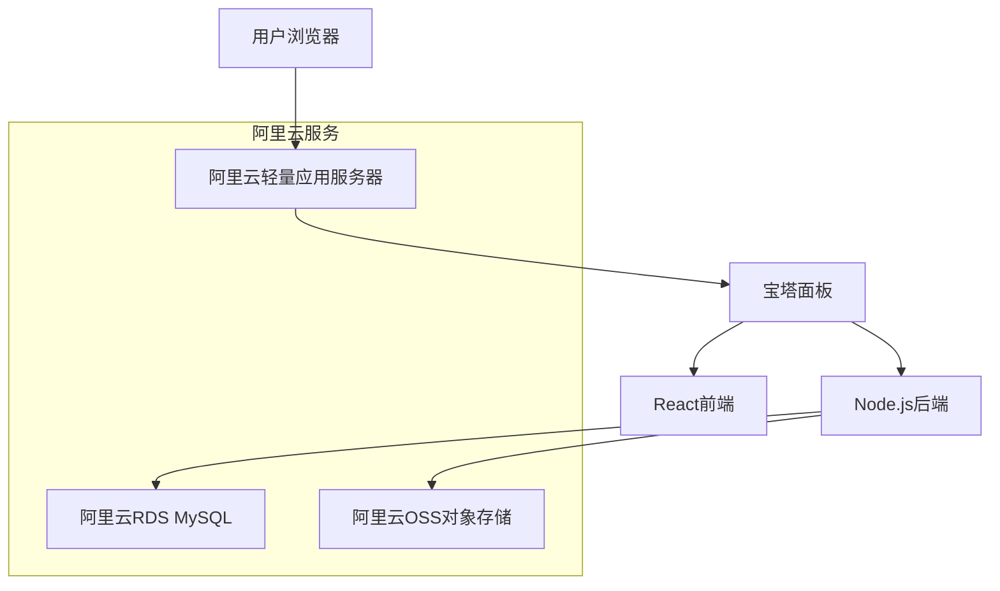

# 水晶ERP系统 - 阿里云迁移方案

## 📋 迁移概述

本文档详细说明如何将水晶ERP系统从Supabase完全迁移到阿里云平台，包括服务器配置、数据库迁移、文件存储迁移和代码重构等全流程指南。

## 🎯 迁移目标

- ✅ 彻底摆脱Supabase依赖
- ✅ 提升系统性能和响应速度
- ✅ 降低网络延迟问题
- ✅ 获得更好的数据控制权
- ✅ 适应国内网络环境

## 🏗️ 目标架构



## 📝 第一阶段：阿里云服务器配置

### 1.1 登录阿里云控制台

1. **访问阿里云官网**：https://www.aliyun.com
2. **登录账号**：使用您购买服务器时的账号登录
3. **进入控制台**：点击右上角"控制台"按钮

### 1.2 轻量应用服务器配置

#### 步骤1：找到您的服务器
1. 在控制台首页，搜索"轻量应用服务器"
2. 点击进入轻量应用服务器控制台
3. 查看您已购买的服务器实例

#### 步骤2：配置服务器
```bash
# 推荐配置
CPU: 2核
内存: 4GB
存储: 40GB SSD
带宽: 3-5M
操作系统: CentOS 7.6 或 Ubuntu 20.04
应用镜像: 宝塔Linux面板
```

#### 步骤3：安全组配置
需要开放以下端口：
- **22**：SSH远程连接
- **80**：HTTP访问
- **443**：HTTPS访问
- **8888**：宝塔面板（或随机端口）
- **3000**：Node.js应用端口
- **3306**：MySQL数据库端口（如果使用本地数据库）

### 1.3 宝塔面板配置

#### 步骤1：获取宝塔面板信息
1. 在轻量应用服务器控制台，点击您的服务器
2. 查看"应用信息"，获取宝塔面板登录地址和密码
3. 记录下面板地址、用户名和密码

#### 步骤2：登录宝塔面板
1. 在浏览器中访问宝塔面板地址
2. 使用获取的用户名和密码登录
3. 首次登录会要求安装运行环境

#### 步骤3：安装运行环境
推荐安装以下组件：
- **Nginx** 1.20+
- **MySQL** 8.0
- **PHP** 8.0+（备用）
- **Node.js** 18+
- **PM2**（Node.js进程管理）

## 📊 第二阶段：数据库迁移方案

### 2.1 数据导出（从Supabase）

#### 方法1：使用Supabase Dashboard
1. 登录Supabase控制台
2. 进入您的项目
3. 点击"Settings" → "Database"
4. 使用"Database URL"连接到数据库
5. 导出数据为SQL文件

#### 方法2：使用pg_dump命令
```bash
# 安装PostgreSQL客户端工具
npm install -g pg_dump

# 导出数据
pg_dump "postgresql://[username]:[password]@[host]:[port]/[database]" > supabase_backup.sql
```

### 2.2 MySQL数据库设置

#### 在宝塔面板中创建数据库
1. 登录宝塔面板
2. 点击"数据库" → "MySQL"
3. 创建新数据库：
   - 数据库名：`shuijing_erp`
   - 用户名：`erp_user`
   - 密码：设置强密码

#### 数据表结构转换
由于从PostgreSQL迁移到MySQL，需要调整数据表结构：

```sql
-- 用户配置表
CREATE TABLE user_profiles (
    id VARCHAR(36) PRIMARY KEY,
    username VARCHAR(50) UNIQUE NOT NULL,
    email VARCHAR(100) UNIQUE NOT NULL,
    full_name VARCHAR(100),
    role ENUM('admin', 'user') DEFAULT 'user',
    password_hash VARCHAR(255) NOT NULL,
    created_at TIMESTAMP DEFAULT CURRENT_TIMESTAMP,
    updated_at TIMESTAMP DEFAULT CURRENT_TIMESTAMP ON UPDATE CURRENT_TIMESTAMP
);

-- 采购记录表
CREATE TABLE purchases (
    id VARCHAR(36) PRIMARY KEY,
    supplier VARCHAR(100) NOT NULL,
    crystal_type VARCHAR(100) NOT NULL,
    weight DECIMAL(10,3) NOT NULL,
    price DECIMAL(10,2) NOT NULL,
    quality VARCHAR(50) DEFAULT '未知',
    notes TEXT,
    photos JSON,
    quantity INT,
    size VARCHAR(50),
    unit_price DECIMAL(10,2),
    bead_price DECIMAL(10,2),
    estimated_bead_count INT,
    user_id VARCHAR(36),
    created_by VARCHAR(50),
    created_at TIMESTAMP DEFAULT CURRENT_TIMESTAMP,
    updated_at TIMESTAMP DEFAULT CURRENT_TIMESTAMP ON UPDATE CURRENT_TIMESTAMP,
    INDEX idx_user_id (user_id),
    INDEX idx_created_at (created_at)
);

-- 产品记录表
CREATE TABLE products (
    id VARCHAR(36) PRIMARY KEY,
    product_name VARCHAR(100) NOT NULL,
    category VARCHAR(50),
    raw_material VARCHAR(100),
    weight DECIMAL(10,3),
    size VARCHAR(50),
    craft_time INT,
    cost DECIMAL(10,2),
    selling_price DECIMAL(10,2),
    description TEXT,
    photos JSON,
    status VARCHAR(20) DEFAULT '制作中',
    user_id VARCHAR(36),
    created_at TIMESTAMP DEFAULT CURRENT_TIMESTAMP,
    updated_at TIMESTAMP DEFAULT CURRENT_TIMESTAMP ON UPDATE CURRENT_TIMESTAMP
);
```

## 📁 第三阶段：文件存储迁移

### 3.1 阿里云OSS配置

#### 步骤1：开通OSS服务
1. 在阿里云控制台搜索"对象存储OSS"
2. 点击"立即开通"
3. 选择合适的套餐（按量付费即可）

#### 步骤2：创建Bucket
1. 进入OSS控制台
2. 点击"创建Bucket"
3. 配置信息：
   - Bucket名称：`shuijing-erp-files`
   - 地域：选择与服务器相同地域
   - 存储类型：标准存储
   - 读写权限：私有

#### 步骤3：获取访问密钥
1. 点击右上角头像 → "AccessKey管理"
2. 创建AccessKey
3. 记录AccessKey ID和AccessKey Secret

### 3.2 文件迁移脚本

```javascript
// 文件迁移工具
const OSS = require('ali-oss');
const { createClient } = require('@supabase/supabase-js');

// 配置
const ossClient = new OSS({
  region: 'oss-cn-hangzhou', // 您的OSS地域
  accessKeyId: 'YOUR_ACCESS_KEY_ID',
  accessKeySecret: 'YOUR_ACCESS_KEY_SECRET',
  bucket: 'shuijing-erp-files'
});

const supabase = createClient(
  'YOUR_SUPABASE_URL',
  'YOUR_SUPABASE_ANON_KEY'
);

// 迁移函数
async function migrateFiles() {
  // 1. 从Supabase获取文件列表
  const { data: files } = await supabase.storage
    .from('purchase-photos')
    .list();
  
  // 2. 下载并上传到OSS
  for (const file of files) {
    const { data } = await supabase.storage
      .from('purchase-photos')
      .download(file.